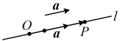
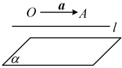

## 知识点 3：共线向量与共面向量

### 1. 直线的方向向量

如图，O 是直线 l 上一点，在直线 l 上取非零向量  $ \boldsymbol{a} $，则对于直线 l 上任意一点 P，由数乘向量的定义及向量共线的充要条件可知，存在实数  $ \lambda $，使得  $ \overrightarrow{OP} = \lambda \boldsymbol{a} $。我们把与向量  $ \boldsymbol{a} $ 平行的非零向量称为直线 l 的方向向量。直线可以由直线上一点和它的方向向量确定。

注：①零向量不能作为直线的方向向量；

②根据方向向量的定义，求任一直线 l 的方向向量，

可在直线 l 上选取两个不同的点 A 和 B，那么与  $ \overrightarrow{AB} $ 平行的

非零向量就是直线 l 的方向向量.

### 2. 共面向量

向量平行于直线：如图，若表示向量  $ a $ 的有向线段  $ \overrightarrow{OA} $ 所在的直线  $ OA $ 与直线  $ l $ 平行或重合，则称  $ a \parallel l $。

向量平行于平面：如图，若直线 OA 平行于平面  $ \alpha $ 或在平面  $ \alpha $ 内，那么称向量 a 平行于平面  $ \alpha $.

共面向量：平行于同一个平面的向量，叫做共面向量.

### 3. 共线向量与共面向量的对比

<table border=1 style='margin: auto; word-wrap: break-word;'><tr><td style='text-align: center; word-wrap: break-word;'></td><td style='text-align: center; word-wrap: break-word;'>共线（平行）向量</td><td style='text-align: center; word-wrap: break-word;'>共面向量</td></tr><tr><td style='text-align: center; word-wrap: break-word;'>定义</td><td style='text-align: center; word-wrap: break-word;'>表示若干空间向量的有向线段所在的直线互相平行或重合（规定零向量与任意向量共线）</td><td style='text-align: center; word-wrap: break-word;'>平行于同一个平面的向量</td></tr><tr><td style='text-align: center; word-wrap: break-word;'>充要条件</td><td style='text-align: center; word-wrap: break-word;'>共线向量定理：对任意两个空间向量  $ a, b (b \neq \emptyset) $， $ a \parallel b $ 的充要条件是存在实数  $ \lambda $，使  $ a = \lambda b $</td><td style='text-align: center; word-wrap: break-word;'>共面向量定理：向量  $ p $ 与两个不共线向量  $ a, b $ 共面的充要条件是存在唯一的有序实数对  $ (x, y) $，使  $ p = x a + y b $</td></tr><tr><td style='text-align: center; word-wrap: break-word;'>推论</td><td style='text-align: center; word-wrap: break-word;'>三点共线系数和结论：设  $ O, A, B $ 不共线，已知  $ \overrightarrow{OP} = x\overrightarrow{OA} + y\overrightarrow{OB} $，则  $ A, P $，</td><td style='text-align: center; word-wrap: break-word;'>四点共面系数和结论：设  $ O, A, B, C $ 不共面，若  $ \overrightarrow{OP} = x\overrightarrow{OA} + y\overrightarrow{OB} + z\overrightarrow{OC} $，则  $ P, A, B $，</td></tr></table>

共线， $ \vec{b} $ 与  $ \vec{c} $ 共线，则  $ \vec{a} $ 与  $ \vec{c} $ 共线

B．若两个非零向量  $ \overrightarrow{AB} $ 与  $ \overrightarrow{CD} $ 满足  $ \overrightarrow{AB} + \overrightarrow{CD} = \overrightarrow{0} $，则  $ \overrightarrow{AB} \parallel \overrightarrow{CD} $

C. 零向量与任何向量都共线

D．两个单位向量一定是相等向量

解析：A项，涉及向量共线的分析，别忘了考虑零向量的特殊性，

当 $ \vec{b}=\vec{0} $时，满足 $ \vec{a} $与 $ \vec{b} $共线， $ \vec{b} $与 $ \vec{c} $共线，但无法得到 $ \vec{a} $与 $ \vec{c} $共线，故A项错误；

B项，由 $ \overrightarrow{AB}+\overrightarrow{CD}=\overrightarrow{0} $可得 $ \overrightarrow{AB}=-\overrightarrow{CD} $，所以 $ \overrightarrow{AB} $与 $ \overrightarrow{CD} $为相反向量，

满足 $ \overrightarrow{AB}\parallel\overrightarrow{CD} $，故B项正确；

C项，零向量与任意向量都共线，故C项正确；

D项，单位向量指的是模长为1的向量，并没有规定方向，所以两个单位向量的方向不一定相同，它们不一定是相等向量，故D项错误。

答案：BC

【例5】若a，b，c是空间中一组不共面的向量，则下列各项中，一定不共面的一组向量是（）

A. a-b, b+c, c+a

B.  $ -a+c $,  $ -b-c $,  $ a+b $

C.  $ a+b $, b-c, a+c

D.  $ a+b $, a-b, c

解析：由于 $a, b, c$ 不共面，故可想象，所给的每组向量中，任意两个向量都不共线，故要判断三个向量是否共面，就看其中一个向量能否用另外两个向量表示，

A 项，$c + a = (a - b) + (b + c)$，由共面向量定理可知本组三个向量共面，故 A 项错误；

B 项，$-a + c = -(-b - c) - (a + b)$，所以本组三个向量共面，故 B 项错误；

C 项，$a + b = (b - c) + (a + c)$，所以本组三个向量共面，故 C 项错误；

D 项，单选题已排除 A、B、C 三个选项，到此已可得出 D 项正确，下面我们也详细