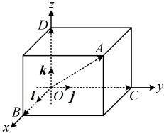
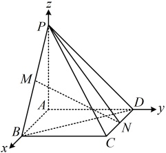

面，依次交x轴、y轴、z轴于点B，C，D，则 $ \overrightarrow{OA} $在x轴、y轴、z轴上的投影向量分别为 $ \overrightarrow{OB} $， $ \overrightarrow{OC} $， $ \overrightarrow{OD} $，且 $ \overrightarrow{OA}=\overrightarrow{OB}+\overrightarrow{OC}+\overrightarrow{OD} $，设B，C，D在x轴、y轴、z轴上的坐标分别是x，y，z，则向量 $ \overrightarrow{OA} $（即点A）的坐标为 $ (x,y,z) $。

②向量法：当向量的起点是原点时，向量的终点坐标即为向量的坐标.

③在坐标轴与坐标平面上的点的坐标规律：

<table border=1 style='margin: auto; word-wrap: break-word;'><tr><td style='text-align: center; word-wrap: break-word;'>点的位置</td><td style='text-align: center; word-wrap: break-word;'>坐标</td><td style='text-align: center; word-wrap: break-word;'>坐标特点</td></tr><tr><td style='text-align: center; word-wrap: break-word;'>x轴上</td><td style='text-align: center; word-wrap: break-word;'>(x,0,0)</td><td style='text-align: center; word-wrap: break-word;'>纵、竖坐标为0</td></tr><tr><td style='text-align: center; word-wrap: break-word;'>y轴上</td><td style='text-align: center; word-wrap: break-word;'>(0,y,0)</td><td style='text-align: center; word-wrap: break-word;'>横、竖坐标为0</td></tr><tr><td style='text-align: center; word-wrap: break-word;'>z轴上</td><td style='text-align: center; word-wrap: break-word;'>(0,0,z)</td><td style='text-align: center; word-wrap: break-word;'>横、纵坐标为0</td></tr><tr><td style='text-align: center; word-wrap: break-word;'>Oxy平面上</td><td style='text-align: center; word-wrap: break-word;'>(x,y,0)</td><td style='text-align: center; word-wrap: break-word;'>竖坐标为0</td></tr><tr><td style='text-align: center; word-wrap: break-word;'>Oyz平面上</td><td style='text-align: center; word-wrap: break-word;'>(0,y,z)</td><td style='text-align: center; word-wrap: break-word;'>横坐标为0</td></tr><tr><td style='text-align: center; word-wrap: break-word;'>Ozx平面上</td><td style='text-align: center; word-wrap: break-word;'>(x,0,z)</td><td style='text-align: center; word-wrap: break-word;'>纵坐标为0</td></tr></table>

④空间中的点 $ M(a,b,c) $关于坐标轴、坐标平面、原点对称的点的坐标：

<table border=1 style='margin: auto; word-wrap: break-word;'><tr><td style='text-align: center; word-wrap: break-word;'>对称轴、对称平面或对称中心</td><td style='text-align: center; word-wrap: break-word;'>对称点坐标</td></tr><tr><td style='text-align: center; word-wrap: break-word;'>x 轴</td><td style='text-align: center; word-wrap: break-word;'>$ (a,-b,-c) $</td></tr><tr><td style='text-align: center; word-wrap: break-word;'>y 轴</td><td style='text-align: center; word-wrap: break-word;'>$ (-a,b,-c) $</td></tr><tr><td style='text-align: center; word-wrap: break-word;'>z 轴</td><td style='text-align: center; word-wrap: break-word;'>$ (-a,-b,c) $</td></tr><tr><td style='text-align: center; word-wrap: break-word;'>Oxy 平面</td><td style='text-align: center; word-wrap: break-word;'>$ (a,b,-c) $</td></tr><tr><td style='text-align: center; word-wrap: break-word;'>Oyz 平面</td><td style='text-align: center; word-wrap: break-word;'>$ (-a,b,c) $</td></tr><tr><td style='text-align: center; word-wrap: break-word;'>Ozx 平面</td><td style='text-align: center; word-wrap: break-word;'>$ (a,-b,c) $</td></tr><tr><td style='text-align: center; word-wrap: break-word;'>坐标原点</td><td style='text-align: center; word-wrap: break-word;'>$ (-a,-b,-c) $</td></tr></table>

知识点 3：空间向量的坐标运算

1. 与空间向量运算有关的坐标表示

设  $ \boldsymbol{a}=(x_{1},y_{1},z_{1}) $， $ \boldsymbol{b}=(x_{2},y_{2},z_{2}) $，则：

①加减法： $ a \pm b = (x_1 \pm x_2, y_1 \pm y_2, z_1 \pm z_2) $；

②数乘： $ \lambda a=(\lambda x_1, \lambda y_1, \lambda z_1) $， $ \lambda \in \mathbb{R} $；

的射影来寻找向量  $ a $ 在平面  $ Oyz $ 上的投影向量。而找一个点在平面  $ Oyz $ 上的射影，只需将该点的横坐标改为 0 即可，设  $ A(1,2,-3) $，则  $ a = \overrightarrow{OA} = (1,2,-3) $，点  $ A $ 在平面  $ Oyz $ 上的射影为  $ A'(0,2,-3) $，所以向量  $ a $ 在坐标平面  $ Oyz $ 上的投影向量为  $ \overrightarrow{OA'} = (0,2,-3) $。

答案：B

## 知识点3

【例4】已知四棱锥P-ABCD的底面ABCD是正方形， $ PA\perp $平面ABCD，PA=AB=2，M，N分别为PB，CD的中点，如图建系，解答下列问题：

（1）求 $ \overrightarrow{DM}+\overrightarrow{BP} $的坐标；

(2) 求  $ \overrightarrow{DM} \cdot \overrightarrow{PC} $;

（3）求MN的长；

（4）判断 MN 与 BD 是否垂直；

（5）求 $ \overrightarrow{BD} $与 $ \overrightarrow{PN} $的夹角余弦值；

(6) 求  $ \triangle PMN $ 的重心 G 的坐标.

解：（1）（DM，BP的坐标可由D，M，B，P的坐标求得，故先写这些点的坐标）

由图可知，D(0,2,0)，B(2,0,0)，P(0,0,2)，

因为M是PB的中点，所以M(1,0,1)，

从而 $ \overrightarrow{DM}=(1-0,0-2,1-0)=(1,-2,1) $，

 $ \overrightarrow{BP}=(0-2,0-0,2-0)=(-2,0,2) $，

故 $ \overrightarrow{DM}+\overrightarrow{BP}=(1,-2,1)+(-2,0,2) $

 $ =(1-2,-2+0,1+2)=(-1,-2,3) $。

（2）由图可知，C(2,2,0)，

所以 $ \overrightarrow{PC}=(2-0,2-0,0-2)=(2,2,-2) $，

故 $ \overrightarrow{DM}\cdot\overrightarrow{PC}=1\times2+(-2)\times2+1\times(-2)=-4 $。