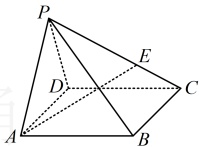

类型 I：空间向量的基底表示

【例 5】如图，空间四边形 $OABC$ 中，$\overrightarrow{OA}=a$，$\overrightarrow{OB}=b$，$\overrightarrow{OC}=c$

则 $\overrightarrow{MN}=$（ ）

A. $-\frac{1}{2}a+\frac{1}{2}b+\frac{1}{2}c$ B. $\frac{1}{2}a+\frac{1}{2}b+\frac{1}{2}c$

C. $\frac{1}{2}a+\frac{1}{2}b-\frac{1}{2}c$ D. $\frac{1}{2}a-\frac{1}{2}b+\frac{1}{2}c$

解析：由 $M$ 到 $N$，与基底关联较强的路径是 $M \to O \to N$，故尝试按此路径将 $\overrightarrow{MN}$ 化为基底表示的结果，由题意，$\overrightarrow{MN}=\overrightarrow{MO}+\overrightarrow{ON}=-\frac{1}{2}\overrightarrow{OA}+\left(\frac{1}{2}\overrightarrow{OB}+\frac{1}{2}\overrightarrow{OC}\right)=-\frac{1}{2}a+\frac{1}{2}b+\frac{1}{2}c$。

答案：A

【反思】将已知向量用基底表示，其核心是选择一条与基底关联较强的路径，再逐步把各向量全部化为基底表示的结果。路径的选择方法不是唯一的，例如，本题也可选择  $ M \to A \to N $，按  $ \overrightarrow{MN} = \overrightarrow{MA} + \overrightarrow{AN} = \frac{1}{2}\overrightarrow{OA} + \frac{1}{2}(\overrightarrow{AB} + \overrightarrow{AC}) = \frac{1}{2}\overrightarrow{OA} + \frac{1}{2}(\overrightarrow{OB} - \overrightarrow{OA} + \overrightarrow{OC} - \overrightarrow{OA}) = -\frac{1}{2}\overrightarrow{OA} + \frac{1}{2}\overrightarrow{OB} + \frac{1}{2}\overrightarrow{OC} $ 将  $ \overrightarrow{MN} $ 化为基底表示的结果。

【变式】如图，四棱锥  $ P-ABCD $ 中，底面  $ ABCD $ 是平行四边形， $ E $ 在棱  $ PC $ 上，且  $ PE = 2EC $，若  $ \overrightarrow{AE} = x\overrightarrow{AB} + y\overrightarrow{AD} + z\overrightarrow{AP} $，则  $ x + y - z = $（ ）

A.  $ \frac{3}{2} $ B.  $ 1 $ C.  $ \frac{5}{2} $ D.  $ 2 $

解析：观察发现只要将  $ \overrightarrow{AE} $ 用  $ \overrightarrow{AB} $， $ \overrightarrow{AD} $， $ \overrightarrow{AP} $ 表示，就能与  $ \overrightarrow{AE} = x\overrightarrow{AB} + y\overrightarrow{AD} + z\overrightarrow{AP} $ 对比，求出  $ x $,  $ y $,  $ z $，从  $ A $ 到  $ E $，与基底  $ \{\overrightarrow{AB}, \overrightarrow{AD}, \overrightarrow{AP}\} $ 关联较强的路径可以选  $ A \to P \to E $，

由题意， $ \overrightarrow{AE} = \overrightarrow{AP} + \overrightarrow{PE} = \overrightarrow{AP} + \frac{2}{3}\overrightarrow{PC} = \overrightarrow{AP} + \frac{2}{3}(\overrightarrow{PA} + \overrightarrow{AD} + \overrightarrow{DC}) = \overrightarrow{AP} + \frac{2}{3}(-\overrightarrow{AP} + \overrightarrow{AD} + \overrightarrow{AB}) = \frac{2}{3}\overrightarrow{AB} + \frac{2}{3}\overrightarrow{AD} + \frac{1}{3}\overrightarrow{AP} $，又 $ \overrightarrow{AE} = x\overrightarrow{AB} + y\overrightarrow{AD} + z\overrightarrow{AP} $，所以 $ x = y = \frac{2}{3} $， $ z = \frac{1}{3} $，故 $ x + y - z = \frac{2}{3} + \frac{2}{3} - \frac{1}{3} = 1 $。

答案：B

类型Ⅱ：空间向量线性运算的坐标表示

【例 6】（1）已知向量  $ \boldsymbol{a} = (1, -3, 2) $， $ \boldsymbol{b} = (1, 1, 0) $，则  $ 2\boldsymbol{a} - 3\boldsymbol{b} = $ ___；

（2）若  $ a = (2,3,5) $， $ b = (3,1,-4) $，则  $ |a-2b|= $___；

（3）平行于向量  $ \boldsymbol{a}=(-1,2,1) $ 的单位向量为 ___.

解析：（1）由题意， $ 2a-3b=2(1,-3,2)-3(1,1,0)=(2,-6,4)-(3,3,0)=(2-3,-6-3,4-0)=(-1,-9,4) $

（2）由题意， $ a - 2b = (2,3,5) - 2(3,1,-4) = (2,3,5) - (6,2,-8) = (2 - 6,3 - 2,5 - (-8)) = (-4,1,13) $，所以 $ |a - 2b| = \sqrt{(-4)^2 + 1^2 + 13^2} = \sqrt{186} $。

（3）与  $ a $ 平行的单位向量是  $ \pm\frac{a}{|a|} $，故先计算  $ |a| $，由题意， $ |a| = \sqrt{(-1)^2 + 2^2 + 1^2} = \sqrt{6} $，