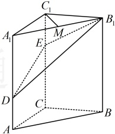
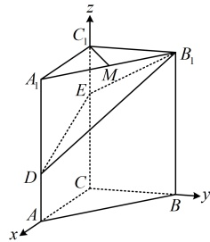

类型IV：用空间向量的坐标运算处理平行、垂直问题

【例 10】（1）已知向量  $ \boldsymbol{a}=(-1,0,-1) $， $ \boldsymbol{b}=(1,x,y) $，且  $ \boldsymbol{a} \parallel \boldsymbol{b} $，则  $ x + y = $ ___.

（2）已知  $ \boldsymbol{a}=(2,-1,3) $， $ \boldsymbol{b}=(-4,2,x) $，且  $ \boldsymbol{a} \perp \boldsymbol{b} $，则  $ x $ 的值为 ___.

解析：（1）涉及空间向量共线，可利用共线向量定理建立坐标之间的方程组，

因为  $ a \parallel b $，且  $ a, b $ 都是非零向量，所以存在实数  $ \lambda $，使  $ b = \lambda a $，即  $ (1, x, y) = \lambda(-1, 0, -1) $，

所以  $ \begin{cases} 1 = -\lambda \\ x = 0 \\ y = -\lambda \end{cases} $，解得： $ x = 0, y = 1 $，故  $ x + y = 1 $。

（2）涉及向量垂直，可考虑用数量积为0来翻译，建立方程求x，因为 $ a \perp b $，所以 $ a \cdot b = 2 \times (-4) + (-1) \times 2 + 3x = 3x - 10 = 0 $，解得： $ x = \frac{10}{3} $

答案：（1）1；（2） $ \frac{10}{3} $

【反思】给出非零空间向量  $ \boldsymbol{a}, \boldsymbol{b} $ 的坐标，要翻译  $ \boldsymbol{a} \parallel \boldsymbol{b} $，常利用  $ \boldsymbol{b} = \lambda \boldsymbol{a} $ 来建立方程组；而要翻译  $ \boldsymbol{a} \perp \boldsymbol{b} $，则常利用  $ \boldsymbol{a} \cdot \boldsymbol{b} = 0 $ 来建立方程。空间向量的平行与垂直在解决立体几何问题中有广泛的应用，我们来看两个变式。

【变式 1】如图，三棱柱  $ \triangle ABC - A_1B_1C_1 $ 中， $ \triangle C_1 \perp $ 平面  $ \triangle ABC $， $ \triangle C_1 \perp BC $， $ \triangle C = BC = 2 $， $ \angle C_1 = 3 $，点  $ D $， $ E $ 分别在棱  $ \triangle A_1A_2 $ 和  $ \triangle C_1C_1 $ 上， $ \angle AD = 1 $， $ CE = 2 $， $ M $ 为棱  $ \triangle A_1B_1 $ 的中点。

（1）证明： $ C_{1}M \perp B_{1}D $；

（2）证明： $ C_{1}M \parallel $ 平面 $ B_{1}DE $

证明：（1）（要证  $ C_1M \perp B_1D $，只需证  $ \overrightarrow{C_1M} \cdot \overrightarrow{B_1D} = 0 $，图形本身就有三条两两垂直的直线，故可直接建系，用坐标计算  $ \overrightarrow{C_1M} \cdot \overrightarrow{B_1D} $）

因为  $ CC_1 \perp $ 平面  $ ABC $，且  $ AC $， $ BC \subset $ 平面  $ ABC $，所以  $ CC_1 \perp AC $， $ CC_1 \perp BC $，

又  $ AC \perp BC $，所以  $ AC, BC, CC_1 $ 两两垂直，以  $ C $ 为原点建立如图所示的空间直角坐标系，

则  $ C_1(0,0,3), A_1(2,0,3), B_1(0,2,3), M(1,1,3), D(2,0,1) $，所以  $ \overrightarrow{C_1M} = (1,1,0), \overrightarrow{B_1D} = (2,-2,-2) $，

所以  $ \overrightarrow{C_1M} \cdot \overrightarrow{B_1D} = 1 \times 2 + 1 \times (-2) + 0 \times (-2) = 0 $，从而  $ \overrightarrow{C_1M} \perp \overrightarrow{B_1D} $，故  $ C_1M \perp B_1D $。

（2）（怎样用向量法证  $ C_1M \parallel $ 平面  $ B_1DE $？若无思路，不妨逆向思考，若结论成立，则  $ \overrightarrow{C_1M} $ 是平面  $ B_1DE $ 内的向量，于是  $ \overrightarrow{C_1M} $ 必定能用该平面的一个基底  $ \{\overrightarrow{ED}, \overrightarrow{EB}\} $ 表示，故可通过寻找该表示方法来证明结论成立）

由图可知， $ E(0,0,2) $，又由（1）知  $ B_1(0,2,3), D(2,0,1) $，所以  $ \overrightarrow{ED} = (2,0,-1), \overrightarrow{EB_1} = (0,2,1) $，

设  $ \overrightarrow{C_1M} = \lambda \overrightarrow{ED} + u \overrightarrow{EB} $，则  $ (1,1,0) = \lambda (2,0,-1) + u (0,2,1) = (2\lambda,2,u,-\lambda) $，

所以  $ \begin{cases} 2\lambda = 1 \\ 2\mu = 1 \\ \mu - \lambda = 0 \end{cases} $，解得： $ \lambda = \mu = \frac{1}{2} $，从而  $ \overrightarrow{C_1M} = \frac{1}{2} \overrightarrow{ED} + \frac{1}{2} \overrightarrow{EB_1} $，

故  $ \overrightarrow{C_1M} $ 是平面  $ B_1DE $ 内的向量，结合  $ C_1M \not\subset $ 平面  $ B_1DE $ 可得  $ C_1M \parallel $ 平面  $ B_1DE $。

【反思】用向量法证线面平行，只需证直线上的一个向量能用该平面的一个基底表示，而基底表示的过程，可以用待定系数法，根据向量的坐标相等来列方程组求解表示的系数。事实上，用向量法证线面平行还有其它方法，下一节我们学习了平面的法向量后，还会涉及。

