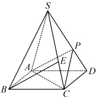
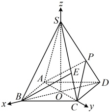

【变式2】如图，四棱锥S-ABCD的底面是正方形，每条侧棱的长都是底面边长的 $ \sqrt{2} $倍，P为侧棱SD上的点.

（1）求证： $ AC \perp SD $；

（2）若  $ SD \perp $ 平面  $ PAC $，则侧棱  $ SC $ 上是否存在点  $ E $，使  $ BE \parallel $ 平面  $ PAC $?

若存在，求  $ SE:EC $ 的值；若不存在，说明理由。

解：（1）（由题意可知  $ S - ABCD $ 为正四棱锥，容易构建三条两两垂直的直线，故可建系，通过向量的坐标运算来证明  $ AC \perp SD $）如图，连接  $ BD $ 交  $ AC $ 于点  $ O $，连接  $ SO $，因为底面  $ ABCD $ 是正方形，所以  $ AC \perp BD $，不妨设  $ AB = 2 $，由题意， $ SA = SB = SC = SD = 2\sqrt{2} $，所以  $ S - ABCD $ 是正四棱锥，故  $ SO \perp $ 平面  $ ABCD $，结合  $ AC $， $ BD \subset $ 平面  $ ABCD $ 可得  $ SO \perp AC $， $ SO \perp BD $，所以  $ OB $， $ OC $， $ OS $ 两两垂直，以  $ O $ 为原点建立如图所示的空间直角坐标系，由  $ AB = 2 $ 可得  $ OA = OB = OC = OD = \sqrt{2} $， $ OS = \sqrt{SB^2 - OB^2} = \sqrt{6} $，所以  $ A(0,-\sqrt{2},0) $， $ C(0,\sqrt{2},0) $， $ S(0,0,\sqrt{6}) $， $ D(-\sqrt{2},0,0) $，从而  $ \overrightarrow{AC} = (0,2\sqrt{2},0) $， $ \overrightarrow{SD} = (-\sqrt{2},0,-\sqrt{6}) $，故  $ \overrightarrow{AC} \cdot \overrightarrow{SD} = 0 \times (-\sqrt{2}) + 2\sqrt{2} \times 0 + 0 \times (-\sqrt{6}) = 0 $，所以  $ \overrightarrow{AC} \perp \overrightarrow{SD} $，故  $ AC \perp SD $。

(2)（题干给出 $SD \perp$ 平面 $PAC$，显然此条件可确定 $P$ 在 $SD$ 上的位置，那如何翻译它呢？第（1）问已证 $SD \perp$ $AC$，故 $SD \perp$ 平面 $PAC$ 等价于 $SD \perp PC$，于是考虑按 $\overrightarrow{SD} \cdot \overrightarrow{PC} = 0$ 来翻译，计算此数量积需要点 $P$ 的坐标，$P$ 在 $SD$ 上，涉及定直线上的动点，常通过设 $\overrightarrow{SP} = \lambda \overrightarrow{SD}$ 来把点 $P$ 的坐标用 $\lambda$ 表示）

设 $P(a, b, c)$，则 $\overrightarrow{SP} = (a, b, c - \sqrt{6})$，设 $\overrightarrow{SP} = \lambda \overrightarrow{SD}$ ($0 \leq \lambda \leq 1$)，则 $(a, b, c - \sqrt{6}) = \lambda (-\sqrt{2}, 0, -\sqrt{6})$，

所以 $\begin{cases} a = -\sqrt{2}\lambda \\ b = 0 \\ c - \sqrt{6} = -\sqrt{6}\lambda \end{cases}$，从而 $\begin{cases} a = -\sqrt{2}\lambda \\ b = 0 \\ c = \sqrt{6} - \sqrt{6}\lambda \end{cases}$，故 $P(-\sqrt{2}\lambda, 0, \sqrt{6} - \sqrt{6}\lambda)$，所以 $\overrightarrow{PC} = (\sqrt{2}\lambda, \sqrt{2}, \sqrt{6}\lambda - \sqrt{6})$，

因为 $SD \perp$ 平面 $PAC$，$PC \subset$ 平面 $PAC$，所以 $SD \perp PC$，故 $\overrightarrow{SD} \cdot \overrightarrow{PC} = -\sqrt{2} \times \sqrt{2}\lambda + 0 \times \sqrt{2} + (-\sqrt{6}) \times (\sqrt{6}\lambda - \sqrt{6})$

= 0，解得：$\lambda = \frac{3}{4}$，所以 $P\left(-\frac{3\sqrt{2}}{4}, 0, \frac{\sqrt{6}}{4}\right)$，（再看怎样能使 $BE \parallel$ 平面 $PAC$，仿照上面变式 1 的做法，可以按 $\overrightarrow{BE} = x\overrightarrow{AP} + y\overrightarrow{AC}$ 建立方程组，确定 $E$ 在 $SC$ 上的位置）

设  $ \overrightarrow{SE} = \mu \overrightarrow{SC} (0 \leq \mu \leq 1) $， $ E(a', b', c') $，则  $ \overrightarrow{SE} = (a', b', c' - \sqrt{6}) $， $ \overrightarrow{SC} = (0, \sqrt{2}, -\sqrt{6}) $，

所以  $ \begin{cases} a' = 0 \\ b' = \sqrt{2}\mu \\ c' - \sqrt{6} = -\sqrt{6}\mu \end{cases} $，解得： $ \begin{cases} a' = 0 \\ b' = \sqrt{2}\mu \\ c' = \sqrt{6} - \sqrt{6}\mu \end{cases} $，故  $ E(0, \sqrt{2}\mu, \sqrt{6} - \sqrt{6}\mu) $，

又  $ B(\sqrt{2}, 0, 0) $，所以  $ \overrightarrow{BE} = (-\sqrt{2}, \sqrt{2}\mu, \sqrt{6} - \sqrt{6}\mu) $，设  $ \overrightarrow{BE} = x \overrightarrow{AP} + y \overrightarrow{AC} $，

因为  $ \overrightarrow{AP} = \left( -\frac{3\sqrt{2}}{4}, \sqrt{2}, \frac{\sqrt{6}}{4} \right) $， $ \overrightarrow{AC} = (0, 2\sqrt{2}, 0) $，

所以  $ (-\sqrt{2}, \sqrt{2}\mu, \sqrt{6} - \sqrt{6}\mu) = x\left( -\frac{3\sqrt{2}}{4}, \sqrt{2}, \frac{\sqrt{6}}{4} \right) + y(0, 2\sqrt{2}, 0) $，从而  $ \begin{cases} -\sqrt{2} = -\frac{3\sqrt{2}}{4} x \\ \sqrt{2}\mu = \sqrt{2} x + 2\sqrt{2} y \\ \sqrt{6} - \sqrt{6}\mu = \frac{\sqrt{6}}{4} x \end{cases} $，解得： $ \begin{cases} \mu = \frac{2}{3} \\ x = \frac{4}{3} \\ y = -\frac{1}{3} \end{cases} $

故 SC 上存在一点 E，使 BE∥平面 PAC，且 SE:EC = 2:1.

【反思】在立体几何问题中，涉及线上动点，以本题的  $ P $ 在  $ SD $ 上为例，常根据共线向量定理，设  $ \overrightarrow{SP} = \lambda \overrightarrow{SD} $，并由此将动点  $ P $ 的坐标表示成关于  $ \lambda $ 的单变量形式，再参与后续的计算。