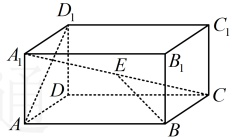
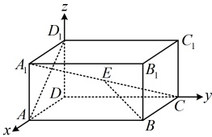

类型V：用空间向量的坐标运算处理夹角、模的问题

【例 11】设  $ y, z \in \mathbb{R} $，向量  $ \boldsymbol{a} = (1, 1, 1) $， $ \boldsymbol{b} = (1, y, 1) $， $ \boldsymbol{c} = (z, -4, 2) $，且  $ \boldsymbol{a} \perp \boldsymbol{b} $， $ \boldsymbol{b} \parallel \boldsymbol{c} $。

（1）求  $ |\boldsymbol{a} + \boldsymbol{b}| $；（2）求向量  $ \boldsymbol{a} + \boldsymbol{b} $ 与  $ \boldsymbol{b} - \boldsymbol{c} $ 的夹角的余弦值。

解：（1）（条件给出  $ a \perp b $， $ b \parallel c $，我们先翻译它们，求出所给向量坐标中的未知数  $ y $ 和  $ z $，由题意， $ a \perp b $，所以  $ a \cdot b = 1 \times 1 + 1 \times y + 1 \times 1 = y + 2 = 0 $，从而  $ y = -2 $，故  $ b = (1, -2, 1) $，又  $ b \parallel c $，所以存在实数  $ \lambda $，使  $ c = \lambda b $，所以  $ \begin{cases} z = \lambda \\ -4 = -2\lambda \end{cases} $，从而  $ z = \lambda = 2 $，故  $ c = (2, -4, 2) $，所以  $ a + b = (2, -1, 2) $，故  $ |a + b| = \sqrt{2^2 + (-1)^2 + 2^2} = 3 $。

(2)（求向量的夹角余弦，考虑夹角余弦公式，还差$(a+b)\cdot(b-c)$和$|b-c|$，下面先计算它们）

由（1）得$b-c=(-1,2,-1)$，所以$(a+b)\cdot(b-c)=2\times(-1)+(-1)\times2+2\times(-1)=-6$，$|b-c|=\sqrt{(-1)^2+2^2+(-1)^2}$

$=\sqrt{6}$，又$|a+b|=3$，所以由夹角余弦公式，$\cos<a+b,b-c>=\frac{(a+b)\cdot(b-c)}{|a+b|\cdot|b-c|}=\frac{-6}{3\times\sqrt{6}}=-\frac{\sqrt{6}}{3}$。

【反思】空间向量的夹角、模的坐标运算方法务必牢记，用空间向量的夹角可以处理异面直线的夹角问题（比如下面的例12和变式），用空间向量的模可以处理长度问题（比如下面的例13）。

【例12】已知长方体 $ABCD-A_1B_1C_1D_1$ 中，$AB=2$，$BC=AA_1=1$，若 $E$ 为 $A_1C$ 的中点，则异面直线 $AD_1$ 与 $BE$ 所成角的余弦值为___。

解析：可以想象，$<\overrightarrow{AD_1},\overrightarrow{BE}>$ 与直线 $AD_1$ 和 $BE$ 所成的角 $\theta$ 有关系（相等或互补），

故可将所求线线的余弦值转化为求 $\cos<\overrightarrow{AD_1},\overrightarrow{BE}>$，而涉及向量的夹角余弦，当

终考虑夹角余弦公式

以 $D$ 为原点建立如图所示的空间直角坐标系，则 $A(1,0,0)$，$D_1(0,0,1)$，$B(1,2,0)$，$A_1(1,0,1)$，$C(0,2,0)$，

因为 $E$ 为 $A_1C$ 的中点，所以 $E\left(\frac{1}{2},1,\frac{1}{2}\right)$，故 $\overrightarrow{AD_1}=(-1,0,1)$，$\overrightarrow{BE}=\left(-\frac{1}{2},-1,\frac{1}{2}\right)$，

设 $AD_1$ 与 $BE$ 所成的角为 $\theta$，则 $\cos\theta=\left|\cos<\overrightarrow{AD_1},\overrightarrow{BE}>\right|=\frac{\left|\overrightarrow{AD_1}\cdot\overrightarrow{BE}\right|}{\left|\overrightarrow{AD_1}\right|\cdot\left|\overrightarrow{BE}\right|}$

$=\frac{\left|-1\times\left(-\frac{1}{2}\right)+0\times(-1)+1\times\frac{1}{2}\right|}{\sqrt{(-1)^2+1^2}\times\sqrt{\left(-\frac{1}{2}\right)^2+(-1)^2+\left(\frac{1}{2}\right)^2}}=\frac{\sqrt{3}}{3}$，

所以直线 $AD_1$ 与 $BE$ 所成角的余弦值为 $\frac{\sqrt{3}}{3}$。

答案： $ \frac{\sqrt{3}}{3} $

【反思】求两条异面直线所成的角$\theta$，可在两直线上各取一个向量$a, b$，按$\cos\theta = |\cos\langle a, b \rangle|$求$\cos\theta$。而要求$\cos\langle a, b \rangle$，又可通过建系，用坐标运算处理。本题的长方体容易建系，我们再来看一个图形更复杂的变式。

【变式】在中国古代数学瑰宝《九章算术》中，记载了一种称为“曲池”的几何体，该几何体为上下底面均为扇环形的柱体（扇环是指圆环被扇形截得的部分）。现有一个如图所示的曲池，其