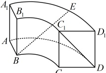
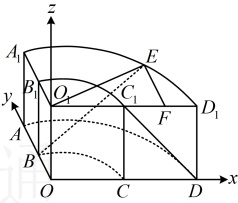
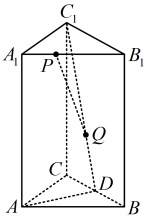
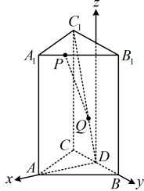

中  $ AA_{1} $ ⊥ 底面 ABCD，底面扇环所对的圆心角为  $ \frac{\pi}{2} $，扇环对应的两个圆的半径之比为 1:2， $ AB = AA_{1} = 1 $，E 在  $ \widehat{A_{1}D_{1}} $ 上且为靠近  $ D_{1} $ 的三等分点，则异面直线 BE 与  $ C_{1}D $ 所成角的余弦值为（ ）

A.  $ \frac{\sqrt{6} - \sqrt{2}}{2} $ B.  $ \frac{\sqrt{2} - \sqrt{6}}{4} $ C.  $ \frac{\sqrt{6} + \sqrt{2}}{4} $ D.  $ \frac{\sqrt{6} - \sqrt{2}}{4} $

解析：可以想象，用几何方法求 BE 与  $ C_{1}D $ 所成角的余弦值不易，可考虑建系处理，

如图，延长  $ AB $，DC 交于点 O，延长  $ A_1B_1 $， $ D_1C_1 $ 交于点  $ O_1 $，以 O 为原点建立如图所示的空间直角坐标系，由题意， $ AB = AA_1 = 1 $，又因为扇环对应的两个圆的半径之比为 1:2，所以  $ OB = OC = 1 $，故  $ B(0,1,0) $， $ C_1(1,0,1) $， $ D(2,0,0) $，

还差 $E$ 的坐标，显然其坐标的 $z$ 分量为 $1$，为了找到 $x$ 分量和 $y$ 分量，可过 $E$ 作 $O_1D_1$ 的垂线，连接 $O_1E$，作 $EF \perp O_1D_1$ 于点 $F$，因为 $E$ 为 $\widehat{A_1D_1}$ 上靠近 $D_1$ 的三等分点，所以 $\angle EO_1F = \frac{1}{3} \angle A_1O_1D_1 = \frac{\pi}{6}$，

 $ \mathcal{U}O_1F = O_1E \cdot \cos \angle EO_1F = \sqrt{3} $， $ EF = O_1E \cdot \sin \angle EO_1F = 1 $

所以 $ E(\sqrt{3},1,1) $，故 $ \overrightarrow{BE}=(\sqrt{3},0,1) $， $ \overrightarrow{C_{1}D}=(1,0,-1) $

设直线 BE 与  $ C_1D $ 所成的角为  $ \theta $，则  $ \cos\theta = |\cos\langle\overrightarrow{BE},\overrightarrow{C_1D}\rangle| $

 $$ =|\overrightarrow{BE}\cdot\overrightarrow{C_1D}|=\frac{|\sqrt{3}\times1+0\times0+1\times(-1)|}{\sqrt{(\sqrt{3})^2+1^2}\times\sqrt{1^2+(-1)^2}}=\frac{\sqrt{6}-\sqrt{2}}{4} $$ 

所以直线 BE 与  $ C_1D $ 所成角的余弦值为  $ \frac{\sqrt{6}-\sqrt{2}}{4} $.

答案：D

【例 13】如图，正三棱柱  $ ABC-A_1B_1C_1 $ 的底面边长为 2，侧棱长为 3， $ D $ 为  $ BC $ 的中点，若  $ \overrightarrow{A_1P}=\lambda\overrightarrow{A_1B_1} $， $ \overrightarrow{DQ}=\lambda\overrightarrow{DC_1}(0\leq\lambda\leq1) $，则  $ |\overrightarrow{PQ}| $ 的最小值是___。

解法1：可以想象，用几何方法求  $ \left|\overrightarrow{PQ}\right| $ 的取值范围不易，正三棱柱建系方便， $ \left|\overrightarrow{PQ}\right| $ 也容易用 P，Q 两点的坐标表示，故考虑建系处理，

如图建系，因为正三棱柱的底面边长为 2，侧棱长为 3，所以  $ BD = CD = 1 $，

 $$ AD=AB\cdot\sin\angle ABD=2\sin\frac{\pi}{3}=\sqrt{3} $$ 

 $$ A_{1}(\sqrt{3},0,3) $$ 

 $$ B_{1}(0,1,3) $$ 

 $$ C_{1}(0,-1,3) $$ 

 $$ P(x_{1},y_{1},z_{1}) $$ 

 $$ \overrightarrow{A_{1}P}=(x_{1}-\sqrt{3},y_{1},z_{1}-3) $$ 

 $$ Q(x_{2},y_{2},z_{2}) $$ 

 $$ \overrightarrow{A_{1}B_{1}}=(-\sqrt{3},1,0) $$ 

因为  $ \overrightarrow{A_1P} = \lambda \overrightarrow{A_1B_1} $，所以  $ \begin{cases} x_1 - \sqrt{3} = -\sqrt{3}\lambda \\ y_1 = \lambda \\ z_1 - 3 = 0 \end{cases} $，从而  $ \begin{cases} x_1 = \sqrt{3} - \sqrt{3}\lambda \\ y_1 = \lambda \\ z_1 = 3 \end{cases} $，故  $ P(\sqrt{3} - \sqrt{3}\lambda, \lambda, 3) $，

又  $ \overrightarrow{DQ} = \lambda \overrightarrow{DC_1} $，所以  $ \begin{cases} x_2 = 0 \\ y_2 = -\lambda \\ z_2 = 3\lambda \end{cases} $，故  $ Q(0, -\lambda, 3\lambda) $，所以  $ \overrightarrow{PQ} = (\sqrt{3}\lambda - \sqrt{3}, -2\lambda, 3\lambda - 3) $，

故  $ \left| \overrightarrow{PQ} \right| = \sqrt{(\sqrt{3}\lambda - \sqrt{3})^2 + (-2\lambda)^2 + (3\lambda - 3)^2} = \sqrt{16\lambda^2 - 24\lambda + 12} = \sqrt{16\left( \lambda - \frac{3}{4} \right)^2 + 3} $，

 $$ \overrightarrow{DQ}=(x_{2},y_{2},z_{2}) $$ 

 $$ \overrightarrow{DC_{1}}=(0,-1,3) $$ 

