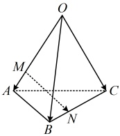

## B 组 强化能力

如图，在三棱锥 $O-ABC$ 中，$\overrightarrow{OA}=\vec{a}$，$\overrightarrow{OB}=\vec{b}$，$\overrightarrow{OC}=\vec{c}$。若点 $M$，$N$ 分别在棱 $OA$，$BC$ 上，且 $\overrightarrow{OM}+3\overrightarrow{AM}=2\overrightarrow{BN}+\overrightarrow{CN}=\vec{0}$，则 $\overrightarrow{MN}=$（ ）

A.  $ -\frac{3}{4}\vec{a}+\frac{2}{3}\vec{b}-\frac{1}{3}\vec{c} $

B.  $ \frac{3}{4}\vec{a}-\frac{2}{3}\vec{b}-\frac{1}{3}\vec{c} $

C.  $ -\frac{3}{4}\vec{a}+\frac{2}{3}\vec{b}+\frac{1}{3}\vec{c} $

D.  $ \frac{3}{4}\vec{a}+\frac{2}{3}\vec{b}+\frac{1}{3}\vec{c} $

一数·高中数学一本通

6. (2025·贵州安顺期中)

设  $ x, y \in \mathbb{R} $，向量  $ \boldsymbol{a} = (x, 1, 1) $， $ \boldsymbol{b} = (1, y, 1) $， $ \boldsymbol{c} = (2, -4, 2) $，且  $ \boldsymbol{a} \perp \boldsymbol{b} $， $ \boldsymbol{b} \parallel \boldsymbol{c} $，则  $ |\boldsymbol{a} + \boldsymbol{b}| = $ （ ）

A.  $ 2\sqrt{2} $ B.  $ \sqrt{10} $ C. 3 D. 4

7.（2025·江苏苏州开学考试）

已知向量  $ \boldsymbol{a} = (0, 1, 0) $， $ \boldsymbol{b} = (0, -1, 1) $，则 b 在 a 上的投影向量为（）

A. a B. -a C. -b D. b