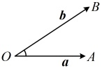

<table border=1 style='margin: auto; word-wrap: break-word;'><tr><td style='text-align: center; word-wrap: break-word;'></td><td style='text-align: center; word-wrap: break-word;'>B 三点共线  $ \Leftrightarrow x + y = 1 $</td><td style='text-align: center; word-wrap: break-word;'>C 四点共面  $ \Leftrightarrow x + y + z = 1 $</td></tr></table>

## 知识点 4：空间向量的数量积运算

### 1. 空间向量的夹角

<table border=1 style='margin: auto; word-wrap: break-word;'><tr><td style='text-align: center; word-wrap: break-word;'>定义</td><td style='text-align: center; word-wrap: break-word;'>如图，已知两个非零向量  $ a, b $，在空间中任取一点  $ O $，作  $ \overrightarrow{OA}=a $， $ \overrightarrow{OB}=b $，则  $ \angle AOB $ 叫做向量  $ a, b $ 的夹角. </td></tr><tr><td style='text-align: center; word-wrap: break-word;'>记法</td><td style='text-align: center; word-wrap: break-word;'>$ &lt;a,b&gt; $</td></tr><tr><td style='text-align: center; word-wrap: break-word;'>范围</td><td style='text-align: center; word-wrap: break-word;'>$ &lt;a,b\rangle\in[0,\pi] $，当  $ &lt;a,b&gt; $= $ \frac{\pi}{2} $ 时， $ a\perp b $</td></tr></table>

注：①当 a 与 b 同向时， $ \langle a,b\rangle=0 $；当 a 与 b 反向时， $ \langle a,b\rangle=\pi $；

②记a与b的夹角为 $ \theta $，则a与-b的夹角为 $ \pi-\theta $；

③只有两个非零向量才有夹角，零向量与任意向量不定义夹角.

### 2. 空间向量的数量积

①定义：已知两个非零向量  $ a, b $，则  $ |a| \cdot |b| \cdot \cos \langle a, b \rangle $

叫做  $ a, b $ 的数量积，记作  $ a \cdot b $，即  $ a \cdot b = |a| \cdot |b| \cdot \cos \langle a, b \rangle $。

特别地，零向量与任意向量的数量积为 0。

②运算律：(i)  $ (\lambda a) \cdot b = \lambda (a \cdot b) $， $ \lambda \in \mathbb{R} $；

(ii) 交换律： $ a \cdot b = b \cdot a $；

(iii) 分配律： $ (a + b) \cdot c = a \cdot c + b \cdot c $。

注：①向量的数量积  $ a \cdot b $ 不能写作  $ a \times b $ 或  $ ab $。

②与平面向量相同，空间向量的线性运算的结果为向量，而两个向量的数量积的运算结果为实数.

③数量积运算不满足结合律，即 $ (a \cdot b) \cdot c \neq a \cdot (b \cdot c) $，由于向量的运算中没有规定除法，因此 $ a \cdot b = b \cdot c \neq a = c $。

④利用数量积我们可以判断两个非零且不共线的向量

a，b 的夹角  $ \theta $ 的锐、直、钝：

(i)  $ \theta $ 为锐角  $ \Leftrightarrow a \cdot b > 0 $;

(ii)  $ \theta $ 为直角  $ \Leftrightarrow a \cdot b = 0 $;

分析一下理由，

记  $ a $， $ b $ 都是平面  $ \alpha $ 内的向量，因为  $ a $， $ b $，

 $ c $ 不共面，所以  $ c $ 不是  $ \alpha $ 内的向量，

又因为  $ a + b $， $ a - b $ 也是  $ \alpha $ 内的向量，所以

 $ a + b $， $ a - b $， $ c $ 不共面，故 D 项正确。

答案：D

## 知识点4

【例6】如图，$ABCD-A_1B_1C_1D_1$为正方体，分别求向量$\overrightarrow{AC}$与向量$\overrightarrow{A_1B_1}$，$\overrightarrow{B_1A_1}$，$\overrightarrow{AD_1}$，$\overrightarrow{CD_1}$，$\overrightarrow{B_1D_1}$的夹角。

解：（要分析同量的夹角，可尝试将两同重平移至同一平面，再用几何方法计算）

由正方体的结构特征， $ \overrightarrow{A_{1}B_{1}} = \overrightarrow{AB} $，

所以  $ \overrightarrow{AC}, \overrightarrow{A_{1}B_{1}} = \overrightarrow{AC}, \overrightarrow{AB} = 45^{\circ} $，

 $ \overrightarrow{AC}, \overrightarrow{B_{1}A_{1}} = \overrightarrow{AC}, \overrightarrow{-AB} > 180^{\circ} - \overrightarrow{AC}, \overrightarrow{AB} = 180^{\circ} - 45^{\circ} = 135^{\circ} $，

由正方体的性质， $ \overrightarrow{AD_{1}} = \overrightarrow{AC} = \overrightarrow{CD_{1}} $，

所以  $ \triangle ACD_{1} $ 为等边三角形，

故  $ \overrightarrow{AC}, \overrightarrow{AD_{1}} = \angle CAD_{1} = 60^{\circ} $，

 $ \overrightarrow{AC}, \overrightarrow{CD_{1}} = \overrightarrow{CD} = \overrightarrow{-CA}, \overrightarrow{CD_{1}} > 180^{\circ} - \overrightarrow{CA}, \overrightarrow{CD_{1}} = 180^{\circ} - \angle ACD_{1} = 180^{\circ} - 60^{\circ} = 120^{\circ} $，

因为  $ \overrightarrow{B_{1}D_{1}} = \overrightarrow{BD} $，所以  $ \overrightarrow{AC}, \overrightarrow{B_{1}D_{1}} = \overrightarrow{AC}, \overrightarrow{BD} > 180^{\circ} = 180^{\circ} = 120^{\circ} $，

由正方体的性质， $ \overrightarrow{AC} \perp \overrightarrow{BD} $，

所以  $ \overrightarrow{AC}, \overrightarrow{B_{1}D_{1}} = \overrightarrow{AC}, \overrightarrow{BD} = 90^{\circ} $。

【例 7】已知正四面体 $ABCD$ 的棱长为 1，E，F 分别是 $AD$，$CD$ 的中点，则 $\overrightarrow{EF} \cdot \overrightarrow{AB} = $___。

解析：如图，正四面体中， $ \overrightarrow{EF}=\frac{1}{2}\overrightarrow{AC} $，容易研究 $ \overrightarrow{AC} $和 $ \overrightarrow{AB} $的长度、夹角，故直接用定义求目标的数量积，