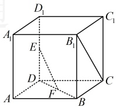

### 12 \. （2025·浙江杭州模拟）

已知向量  $ \boldsymbol{a}=(1,3,-2) $， $ \boldsymbol{b}=(1,0,2) $， $ \boldsymbol{c}=(m,n,-4) $。

（1）若  $ a \parallel c $，求  $ \left|b + c\right| $ 的值；

（2）若 $ b \perp c $， $ |c|=9 $，求 $ a \cdot c $的值.

### 13 \.（2025·内蒙古通辽期末）

如图，在棱长为4的正方体中，E，F分别为 $ DD_{1} $，BD的中点.

（1）求证： $ EF \perp B_{1}C $；

（2）求 EF 与 DC 所成角的余弦值.

