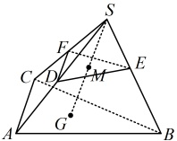

## C组 拓展提升

### 14. （2025·福建南平期末）

如图，在三棱锥 S-ABC 中，点 G 为  $ \triangle ABC $ 的重心，点 M 是线段 SG 的中点，过点 M 的平面分别交 SA，SB，SC 于点 D，E，F，若  $ \overrightarrow{SD}=k\overrightarrow{SA} $， $ \overrightarrow{SE}=m\overrightarrow{SB} $， $ \overrightarrow{SF}=n\overrightarrow{SC} $，则  $ \frac{1}{k}+\frac{1}{m}+\frac{1}{n}= $（ ）

A. 3

B. 6

C. 9

D. 12

### 15. （2025·上海期末）

若  $ a $， $ b $ 是空间互相垂直的单位向量，且  $ |c|=8 $， $ c \cdot a = c \cdot b = 2\sqrt{6} $，则  $ |c - ma - nb| $ 的最小值是___。

### 16. （2025·河南模拟）

在棱长为 3 的正方体  $ ABCD-A_1B_1C_1D_1 $ 中， $ E $， $ F $ 为线段  $ BD_1 $ 的三等分点（ $ E $ 在  $ B $， $ F $ 之间），一动点  $ P $ 满足  $ PF = 2PE $，则  $ (\overrightarrow{PA} + \overrightarrow{PA_1}) \cdot (\overrightarrow{PC} + \overrightarrow{PC_1}) $ 的取值范围是___。