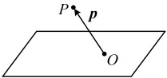
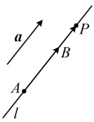
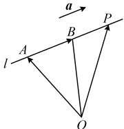

# 1.4 空间向量的应用

习题：P1

## 知识梳理

## 知识点 1：空间中点、直线和平面的向量表示

### 1. 点的位置向量

在空间中，我们取一定点 O 作为基点，那么空间中任意一点 P 就可以用向量  $ \overrightarrow{OP} $ 来表示。我们把向量  $ \overrightarrow{OP} $ 称为点 P 的位置向量。

### 2. 直线的向量表示

用向量表示直线 $l$，就是利用点 $A$ 和直线 $l$ 的方向向量

表示直线上的任意一点。如图 1，$a$ 是直线 $l$ 的方向向量，

在直线 $l$ 上取 $\overrightarrow{AB} = a$，设 $P$ 是直线 $l$ 上的任意一点，由向

量共线的条件可知，点 $P$ 在直线 $l$ 上的充要条件是存在实

数 $t$，使得 $\overrightarrow{AP} = t\boldsymbol{a}$，即 $\overrightarrow{AP} = t\overrightarrow{AB}$。进一步地，如图 2，取

定空间中的任意一点 $O$，可以得到点 $P$ 在直线 $l$ 上的充要

条件是存在实数 $t$，使 $\overrightarrow{OP} = \overrightarrow{OA} + t\boldsymbol{a}$ (i)，

将  $ \overrightarrow{AB} = \boldsymbol{a} $ 代入式(i)得  $ \overrightarrow{OP} = \overrightarrow{OA} + t\overrightarrow{AB} $ (ii),

式(i)和式(ii)都称为空间直线的向量表达式.

图1

图2

注：由此可知，空间任意直线都可由直线上一点及直线的方向向量唯一确定，反之只要确定了直线上某点的位置和直线的方向向量就可以唯一确定空间中的直线。

### 3. 空间平面的向量表示

如图1，设平面 $ \alpha $内的两条直线相交于点O，它们的

## 知识点1

【例 1】（多选）已知点 A(-1,0,4)，B(3,2,-1)，则直线 AB 的方向向量可以为（）

A. $ (-4,-2,5) $ B. $ (8,4,-10) $ C. $ (6,3,-7) $ D. $ (-3,5,4) $

解析：所有与 $ \overrightarrow{AB} $共线的非零向量，都可以作为直线AB的方向向量，故先求 $ \overrightarrow{AB} $， $ \overrightarrow{AB}=(3-(-1),2-0,-1-4)=(4,2,-5) $，A项， $ (-4,-2,5)=-(4,2,-5)=-\overrightarrow{AB} $，所以 $ (-4,-2,5) $是直线AB的一个方向向量，故A项正确；B项， $ (8,4,-10)=2(4,2,-5)=2\overrightarrow{AB} $，所以 $ (8,4,-10) $是直线AB的一个方向向量，故B项正确；C项， $ \frac{6}{4}=\frac{3}{2}\neq\frac{-7}{-5} $，所以 $ (6,3,-7) $与 $ \overrightarrow{AB} $不共线，不能作为直线AB的方向向量，故C项错误；D项， $ \frac{-3}{4}\neq\frac{5}{2}\neq\frac{4}{-5} $，所以 $ (-3,5,4) $与 $ \overrightarrow{AB} $不共线，不能作为直线AB的方向向量，故D项错误.

答案：AB

【例2】若点P位于平面ABC内，点O是平面外一点，证明：存在实数x，y，z，使得 $ \overrightarrow{OP}=x\overrightarrow{OA}+y\overrightarrow{OB}+z\overrightarrow{OC} $，且 $ x+y+z=1 $。

证明：因为点 $P$ 在平面 $ABC$ 内，所以由知识点1第3点空间平面的向量表示可知存在实数 $a$，$b$，使 $\overrightarrow{OP} = \overrightarrow{OA} + a\overrightarrow{AB} + b\overrightarrow{AC} = \overrightarrow{OA} + a(\overrightarrow{OB} - \overrightarrow{OA}) + b(\overrightarrow{OC} - \overrightarrow{OA})$

$(1 - a - b)\overrightarrow{OA} + a\overrightarrow{OB} + b\overrightarrow{OC}$ ①，

令 $x = 1 - a - b$，$y = a$，$z = b$，