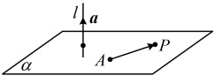

方向向量分别为  $ \boldsymbol{a} $ 和  $ \boldsymbol{b} $， $ P $ 为平面  $ \alpha $ 内任意一点，由平面向量基本定理可知，存在唯一的有序实数对  $ (x,y) $，使得  $ \overrightarrow{OP} = x\boldsymbol{a} + y\boldsymbol{b} $。这样，点  $ O $ 与向量  $ \boldsymbol{a} $， $ \boldsymbol{b} $ 不仅可以确定平面  $ \alpha $，还可以具体表示出  $ \alpha $ 内的任意一点。

如图2，取定空间任意一点O，可以得到空间一点P位于平面ABC内的充要条件是存在实数x，y，使 $ \overrightarrow{OP} = \overrightarrow{OA} + x\overrightarrow{AB} + y\overrightarrow{AC} $。我们把此式称为空间平面ABC的向量表示式。由此可知，空间中任意平面由空间一点及两个不共线的向量唯一确定。

图1

图2

## 知识点2：平面的法向量

### 1. 平面法向量的定义

如图，直线  $ l \perp \alpha $，取直线  $ l $ 的方向向量  $ \boldsymbol{a} $，我们称向量  $ \boldsymbol{a} $ 为平面  $ \alpha $ 的法向量。给定一个点  $ A $ 和一个向量  $ \boldsymbol{a} $，那么过点  $ A $，且以向量  $ \boldsymbol{a} $ 为法向量的平面完全确定，可以表示为集合  $ \{P \mid \boldsymbol{a} \cdot \overrightarrow{AP} = 0\} $。

2. 平面法向量的性质

①平面 $ \alpha $的一个法向量垂直于平面 $ \alpha $内的所有向量；

②一个平面的法向量有无数个，这些法向量互相平行.

注：由于零向量的方向不确定，因此零向量不能作为直线的方向向量和平面的法向量.

3. 平面法向量的求法

①直接寻找：可以看看有没有已知直线与要求法向量的平面是互相垂直的，若有，则任取该直线的一个方向向量，即为平面的一个法向量；

②待定系数法：

则式①可改写为  $ \overrightarrow{OP} = x\overrightarrow{OA} + y\overrightarrow{OB} + z\overrightarrow{OC} $，

且  $ x + y + z = 1 - a - b + a + b = 1 $。

## 知识点2

【例3】正方体 $ ABCD-A_{1}B_{1}C_{1}D_{1} $的棱长为1，以A为坐标原点，建立如图所示的空间直角坐标系，分别求平面ABCD与平面 $ BDA_{1} $的一个法向量.

解：（由正方体的性质容易找到平面ABCD的垂线，所以该平面的法向量无需计算，可直接写出）

由题意， $ AA_1 \perp $ 平面ABCD，所以 $ \overrightarrow{AA_1} = (0,0,1) $是平面ABCD的一个法向量，（再求平面 $ BDA_1 $的法向量m，需先写出该平面内两个不共线的向量，不妨选取 $ \overrightarrow{BD} $和 $ \overrightarrow{A_1D} $，由 $ \begin{cases} m \cdot \overrightarrow{BD} = 0 \\ m \cdot \overrightarrow{A_1D} = 0 \end{cases} $求m）

由图可知， $ B(0,1,0) $， $ D(1,0,0) $， $ A_1(0,0,1) $，所以 $ \overrightarrow{BD} = (1,-1,0) $， $ \overrightarrow{A_1D} = (1,0,-1) $，

设平面 $ BDA_1 $的法向量为 $ m = (x,y,z) $，

则 $ \begin{cases} m \cdot \overrightarrow{BD} = x - y = 0 \\ m \cdot \overrightarrow{A_1D} = x - z = 0 \end{cases} $，令 $ x=1 $，则 $ \begin{cases} y = 1 \\ z = 1 \end{cases} $，

所以 $ m = (1,1,1) $是平面 $ BDA_1 $的一个法向量。

【反思】求平面法向量时，先写出该平面内两个不共线的向量，再由法向量与此二向量数量积分别为0建立方程组，最后通过对法向量的一个未知数赋非零值，求出所得方程组的一组非零解，即得平面的一个法向量。

## 知识点3

【例4】设平面 $ \alpha $和平面 $ \beta $的法向量分别为 $ \boldsymbol{m}=(1,2,-3) $， $ \boldsymbol{n}=(-2,k,6) $，若