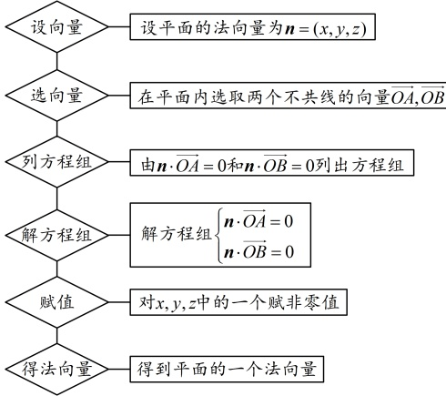
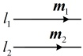
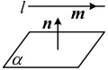
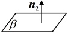
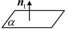
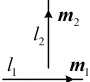
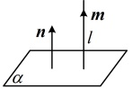
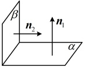

## 知识点 3：向量方法在立体几何中的应用

1\. 利用向量方法判断立体几何中的位置关系

直线的方向向量和平面的法向量对于确定空间中的直线和平面起了关键作用，所以我们可以利用直线的方向向量和平面的法向量来表示空间中直线、平面间的平行、垂直等位置关系.

 $ \alpha \parallel \beta $，则k=（ ）

A. 4 B. -4

C. 10 D. -10

<table border=1 style='margin: auto; word-wrap: break-word;'><tr><td style='text-align: center; word-wrap: break-word;'>位置关系</td><td style='text-align: center; word-wrap: break-word;'>符号表示</td><td style='text-align: center; word-wrap: break-word;'>图形表示</td></tr><tr><td style='text-align: center; word-wrap: break-word;'>线线平行</td><td style='text-align: center; word-wrap: break-word;'>$ l_1 \parallel l_2 \Leftrightarrow m_1 \parallel m_2 \Leftrightarrow \exists \lambda \in \mathbb{R} $，使得 $ m_1 = \lambda m_2 $</td><td style='text-align: center; word-wrap: break-word;'></td></tr><tr><td style='text-align: center; word-wrap: break-word;'>线面平行</td><td style='text-align: center; word-wrap: break-word;'>若 $ l \subset \alpha $，则 $ l \parallel \alpha \Leftrightarrow m \perp n \Leftrightarrow m \cdot n = 0 $</td><td style='text-align: center; word-wrap: break-word;'></td></tr><tr><td style='text-align: center; word-wrap: break-word;'>面面平行</td><td style='text-align: center; word-wrap: break-word;'>$ \alpha \parallel \beta \Leftrightarrow n_1 \parallel n_2 \Leftrightarrow \exists \lambda \in \mathbb{R} $，使得 $ n_1 = \lambda n_2 $</td><td style='text-align: center; word-wrap: break-word;'></td></tr><tr><td style='text-align: center; word-wrap: break-word;'>线线垂直</td><td style='text-align: center; word-wrap: break-word;'>$ l_1 \perp l_2 \Leftrightarrow m_1 \perp m_2 \Leftrightarrow m_1 \cdot m_2 = 0 $</td><td style='text-align: center; word-wrap: break-word;'></td></tr><tr><td style='text-align: center; word-wrap: break-word;'>线面垂直</td><td style='text-align: center; word-wrap: break-word;'>$ l \perp \alpha \Leftrightarrow m \parallel n \Leftrightarrow \exists \lambda \in \mathbb{R} $，使得 $ m = \lambda n $</td><td style='text-align: center; word-wrap: break-word;'>$ \alpha \nparallel n_1 \nparallel m_1 \nparallel n_2 \nparallel n_1 \nparallel n_2 \nparallel \alpha $</td></tr><tr><td style='text-align: center; word-wrap: break-word;'>面面垂直</td><td style='text-align: center; word-wrap: break-word;'>$ \alpha \perp \beta \Leftrightarrow n_1 \perp n_2 \Leftrightarrow n_1 \cdot n_2 = 0 $</td><td style='text-align: center; word-wrap: break-word;'>$ \beta \nparallel n_2 \nparallel n_1 \nparallel n_2 \nparallel n_1 \nparallel n_2 $</td></tr></table>

解析：因为 $ \alpha \parallel \beta $，所以 $ m \parallel n $，

故 $ \frac{1}{-2} = \frac{2}{k} = \frac{-3}{6} $，解得：k = -4。

答案：B

【例 5】（多选）已知直线  $ l $ 的一个方向向量为  $ \boldsymbol{a} = (m, 1, 3) $，平面  $ \alpha $ 的一个法向量为  $ \boldsymbol{b} = (-2, n, 1) $，则（ ）

A. 若  $ l \parallel \alpha $，则  $ 2m - n = 3 $

B. 若  $ l \perp \alpha $，则  $ 2m - n = 3 $

C. 若  $ l \parallel \alpha $，则  $ mn + 2 = 0 $

D. 若  $ l \perp \alpha $，则  $ mn + 2 = 0 $

解析：若  $ l \parallel \alpha $，则  $ a \perp b $，

所以  $ a \cdot b = m \times (-2) + 1 \times n + 3 \times 1 = 0 $，

整理得： $ 2m - n = 3 $，

故 A 项正确，C 项错误；

若  $ l \perp \alpha $，则  $ a \parallel b $，所以  $ \frac{m}{-2} = \frac{1}{n} = \frac{3}{1} $，

解得： $ m = -6 $， $ n = \frac{1}{3} $，

所以  $ mn + 2 = 0 $，故 B 项错误，D 项正确。

答案：AD

【例 6】已知直线  $ l_{1} $ 的方向向量  $ \vec{s_{1}} = (1,0,1) $，直线  $ l_{2} $ 的方向向量  $ \vec{s_{2}} = (-1,2,-2) $，则  $ l_{1} $ 和  $ l_{2} $ 夹角的余弦值为（）

A.  $ \frac{\sqrt{2}}{4} $ B.  $ \frac{1}{2} $

C.  $ \frac{\sqrt{2}}{2} $ D.  $ \frac{\sqrt{3}}{2} $

解析：设 $ l_1 $与 $ l_2 $所成角为 $ \theta $，则 $ \cos\theta = \frac{|\vec{s}_1 \cdot \vec{s}_2|}{|\vec{s}_1| \cdot |\vec{s}_2|} = \frac{|1 \times (-1) + 0 \times 2 + 1 \times (-2)|}{\sqrt{1^2 + 0^2 + 1^2} \cdot \sqrt{(-1)^2 + 2^2 + (-2)^2}} = \frac{\sqrt{2}}{2} $，所以 $ l_1 $和 $ l_2 $夹角的余弦值为 $ \frac{\sqrt{2}}{2} $。