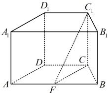
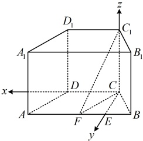
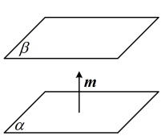

则  $ (-1,4,-1)=\lambda(-2,0,2)+\mu(-2,4,0) $，所以  $ \begin{cases} 4\mu=4 \\ 2\lambda=-1 \end{cases} $，解得： $ \lambda=-\frac{1}{2} $， $ \mu=1 $，

所以  $ \overrightarrow{A_1P}=-\frac{1}{2}\overrightarrow{AD_1}+\overrightarrow{AC} $，故  $ \overrightarrow{A_1P} $ 是平面  $ ACD_1 $ 内的向量，又  $ A_1P\not\subset $ 平面  $ ACD_1 $，所以  $ A_1P\parallel $ 平面  $ ACD_1 $。

证法 2：（由知识点 3 第 1 点的表格，要证  $ A_1P\parallel $ 平面  $ ACD_1 $，也可转化为证  $ \overrightarrow{A_1P} $ 与平面  $ ACD_1 $ 的法向量垂直）

求  $ \overrightarrow{A_1P} $， $ \overrightarrow{AD_1} $， $ \overrightarrow{AC} $ 坐标的过程同解法 1，此处不再赘述，设平面  $ ACD_1 $ 的法向量为  $ \boldsymbol{m}=(x,y,z) $，

则  $ \begin{cases} \boldsymbol{m}\cdot\overrightarrow{AD_1}=-2x+2z=0 \\ \boldsymbol{m}\cdot\overrightarrow{AC}=-2x+4y=0 \end{cases} $，令  $ x=2 $ 得  $ y=1 $， $ z=2 $，所以  $ \boldsymbol{m}=(2,1,2) $ 是平面  $ ACD_1 $ 的一个法向量，

因为  $ \overrightarrow{A_1P}\cdot\boldsymbol{m}=-1\times2+4\times1+(-1)\times2=0 $，所以  $ \overrightarrow{A_1P}\perp\boldsymbol{m} $，结合  $ A_1P\not\subset $ 平面  $ ACD_1 $ 可得  $ A_1P\parallel $ 平面  $ ACD_1 $。

【反思】上面的两个证法都能证明线面平行，但证法2通过证明直线上的一个向量与平面的法向量垂直来证线面平行，计算量稍小一些，所以后续有关问题中，我们都采用证法2来证线面平行。

【例12】在直四棱柱 $ABCD-A_1B_1C_1D_1$ 中，底面 $ABCD$ 为等腰梯形，$AB$

$\parallel CD$，$AB=4$，$BC=CD=AA_1=2$，$F$ 是棱 $AB$ 的中点，用向量的方法

证明：平面 $ADD_1A_1$ // 平面 $FCC_1$。

证明：（既然要求用向量的方法证明平面  $ ADD_1A_1 $ // 平面  $ FCC_1 $，那么先建系）

由题意可知， $ CD = AF = 2 $，且  $ CD \parallel AF $，所以四边形 AFCD 是平行四边形，故  $ CF = AD = 2 $，

又  $ BC = BF = 2 $，所以  $ \triangle BCF $ 是正三角形，取 BF 中点  $ E $，连接  $ CE $，则  $ CE \perp BF $，

因为  $ CD \parallel AB $，所以  $ CE \perp CD $，因为  $ ABCD - A_1B_1C_1D_1 $ 是直四棱柱，所以  $ CC_1 \perp $ 平面  $ ABCD $，

又  $ CD $， $ CE \subset $ 平面  $ ABCD $，所以  $ CC_1 \perp CD $， $ CC_1 \perp CE $，

故  $ CC_1 $， $ CD $， $ CE $ 两两垂直，以  $ C $ 为原点建立如图 1 所示的空间直角坐标系，

（怎样用向量的方法证明平面  $ ADD_1A_1 $ // 平面  $ FCC_1 $？如图 2，可以想象，若两个平面互相平行，则其中一个平面  $ \alpha $ 的法向量应与另一个平面  $ \beta $ 垂直，即它也是平面  $ \beta $ 的法向量，故按此证明）

由图 1 可知， $ CE = BC \cdot \sin \angle CBE = 2\sin 60^\circ = \sqrt{3} $， $ BE = \frac{1}{2}BF = 1 $， $ AE = AB - BE = 3 $，

所以  $ A(3, \sqrt{3}, 0) $， $ D(2, 0, 0) $， $ D_1(2, 0, 2) $， $ F(1, \sqrt{3}, 0) $， $ C(0, 0, 0) $， $ C_1(0, 0, 2) $，

故  $ \overrightarrow{DA} = (1, \sqrt{3}, 0) $， $ \overrightarrow{DD_1} = (0, 0, 2) $， $ \overrightarrow{CF} = (1, \sqrt{3}, 0) $， $ \overrightarrow{CC_1} = (0, 0, 2) $，

设平面  $ ADD_1A_1 $ 的法向量为  $ \boldsymbol{m} = (x, y, z) $，则  $ \begin{cases} \boldsymbol{m} \cdot \overrightarrow{DA} = x + \sqrt{3}y = 0 \\ \boldsymbol{m} \cdot \overrightarrow{DD_1} = 2z = 0 \end{cases} $，

令  $ x = \sqrt{3} $，则  $ y = -1 $， $ z = 0 $，所以  $ \boldsymbol{m} = (\sqrt{3}, -1, 0) $ 是平面  $ ADD_1A_1 $ 的一个法向量，

因为  $ \begin{cases} \boldsymbol{m} \cdot \overrightarrow{CF} = \sqrt{3} \times 1 + (-1) \times \sqrt{3} + 0 \times 0 = 0 \\ \boldsymbol{m} \cdot \overrightarrow{CC_1} = \sqrt{3} \times 0 + (-1) \times 0 + 0 \times 2 = 0 \end{cases} $，所以  $ \boldsymbol{m} $ 也是平面  $ FCC_1 $ 的一个法向量，故平面  $ ADD_1A_1 $ // 平面  $ FCC_1 $。

图1

图2

