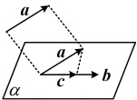
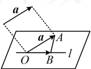
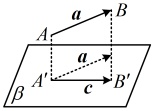

(iii)  $ \theta $ 为钝角  $ \Leftrightarrow a \cdot b < 0 $

### 3. 空间向量数量积的性质

<table border=1 style='margin: auto; word-wrap: break-word;'><tr><td style='text-align: center; word-wrap: break-word;'>性质</td><td style='text-align: center; word-wrap: break-word;'>作用</td></tr><tr><td style='text-align: center; word-wrap: break-word;'>若 a, b 为非零向量，则  $ a \perp b \Leftrightarrow a \cdot b = 0 $</td><td style='text-align: center; word-wrap: break-word;'>用于翻译或证明两向量垂直</td></tr><tr><td style='text-align: center; word-wrap: break-word;'>$ a \cdot a = |a|^2 $</td><td rowspan="2">用于求空间中线段的长度</td></tr><tr><td style='text-align: center; word-wrap: break-word;'>$ |a| = \sqrt{a \cdot a} = \sqrt{a^2} $</td></tr><tr><td style='text-align: center; word-wrap: break-word;'>若 a, b 为非零向量，则  $ \cos &lt;a, b&gt; = \frac{a \cdot b}{|a| \cdot |b|} $</td><td style='text-align: center; word-wrap: break-word;'>用于求有关的空间角</td></tr><tr><td style='text-align: center; word-wrap: break-word;'>$ |a \cdot b| \le |a| \cdot |b| $ （当且仅当 a, b 共线时，等号成立）</td><td style='text-align: center; word-wrap: break-word;'>用于求数量积的最值</td></tr></table>

### 4. 投影向量

<table border=1 style='margin: auto; word-wrap: break-word;'><tr><td style='text-align: center; word-wrap: break-word;'>投影类型</td><td style='text-align: center; word-wrap: break-word;'>定义</td><td style='text-align: center; word-wrap: break-word;'>图形表示</td></tr><tr><td style='text-align: center; word-wrap: break-word;'>向量向向量投影</td><td style='text-align: center; word-wrap: break-word;'>空间中，要将向量  $ a $ 向向量  $ b $ 投影，可以先将它们平移到同一个平面  $ \alpha $ 内，进而利用平面上向量的投影来求  $ a $ 在  $ b $ 方向上的投影向量  $ c $，其计算公式为  $ \frac{a \cdot b}{|b|^2} b $</td><td style='text-align: center; word-wrap: break-word;'></td></tr><tr><td style='text-align: center; word-wrap: break-word;'>向量向直线投影</td><td style='text-align: center; word-wrap: break-word;'>将向量  $ a $ 进行平移，使其起点落在  $ l $ 上，记作  $ \overrightarrow{OA} $，再过终点  $ A $ 向直线  $ l $ 作垂线，垂足为  $ B $，则  $ \overrightarrow{OB} $ 即为  $ a $ 在直线  $ l $ 上的投影向量</td><td style='text-align: center; word-wrap: break-word;'></td></tr><tr><td style='text-align: center; word-wrap: break-word;'>向量向平面投影</td><td style='text-align: center; word-wrap: break-word;'>如图，向量  $ a $ 向平面  $ \beta $ 投影，就是分别由向量  $ a $ 的起点  $ A $ 和终点  $ B $ 作平面  $ \beta $ 的垂线，垂足分别为  $ A&#x27; $， $ B&#x27; $，得到向量  $ \overrightarrow{A&#x27;B&#x27;} $，向量  $ \overrightarrow{A&#x27;B&#x27;} $ 称为向量  $ a $ 在平面  $ \beta $ 上的投影向量。这时，向量  $ a $， $ \overrightarrow{A&#x27;B&#x27;} $ 的夹角就是向量  $ a $ 所在直线与平面  $ \beta $ 所成的角</td><td style='text-align: center; word-wrap: break-word;'></td></tr></table>

注： $ a \cdot b $ 等于向量  $ a $ 在向量  $ b $ 上的投影向量  $ c $ 与向量  $ b $ 的数量积，即  $ a \cdot b = c \cdot b $。

因为  $ E $， $ F $ 分别是  $ AD $， $ CD $ 的中点，所以

 $ \overrightarrow{EF} = \frac{1}{2}\overrightarrow{AC} $，故  $ \overrightarrow{EF} \cdot \overrightarrow{AB} = \frac{1}{2}\overrightarrow{AC} \cdot \overrightarrow{AB} $

 $ = \frac{1}{2}|\overrightarrow{AC}| \cdot |\overrightarrow{AB}| \cdot \cos <\overrightarrow{AC},\overrightarrow{AB}> $

 $ = \frac{1}{2} \times 1 \times 1 \times \cos \frac{\pi}{3} = \frac{1}{4} $.

答案： $ \frac{1}{4} $

【例8】如图所示，在正方体 $ABCD-A_1B_1C_1D_1$ 中，向量 $\overrightarrow{AC}$ 在直线 $AB$ 上的投影向量是___，向量 $\overrightarrow{AC_1}$ 在平面 $ABCD$ 上的投影向量是___。

解析：由正方体的性质， $ AB \perp BC $，

所以  $ \overrightarrow{AC} $ 在直线 AB 上的投影向量是  $ \overrightarrow{AB} $，

又因为  $ C_1C \perp $ 平面 ABCD，所以  $ \overrightarrow{AC_1} $ 在平面

ABCD 上的投影向量是  $ \overrightarrow{AC} $。

答案： $ \overrightarrow{AB} $， $ \overrightarrow{AC} $