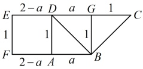
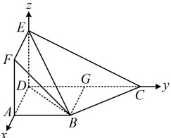

图1

图2

【变式1】如图1，在直角梯形EFBC中，BF∥CE，EC⊥EF，EF=1，FB=2，EC=3，现沿平行于EF的AD折叠，使得 $ ED \perp DC $且BC⊥平面BDE，如图2所示.

（1）求AB的长度；

（2）求二面角 F-EB-C 的大小.

图1

图2

解：（1）（由 $BC \perp$ 面 $BDE$ 可得到 $BC \perp BD$，故翻折前的图 1 中也应有 $BC \perp BD$，点 $D$ 的位置就确定了，分析图 1 即可算出 $AB$）因为 $BC \perp$ 平面 $BDE$，$BD \subset$ 平面 $BDE$，所以 $BC \perp BD$，由题意，$AD \perp AB$，

如图 3，作 $BG \perp CD$ 于点 $G$，则 $BG = AD = EF = 1$，设 $AB = a (a > 0)$，则 $BD = \sqrt{AB^2 + AD^2} = \sqrt{a^2 + 1}$，

$CG = CE - EG = CE - FB = 1$，$BC = \sqrt{BG^2 + CG^2} = \sqrt{2}$，$CD = DG + CG = AB + CG = a + 1$，

由 $BC \perp BD$ 可得 $BC^2 + BD^2 = CD^2$，所以 $2 + a^2 + 1 = (a + 1)^2$，解得：$a = 1$，故 $AB = 1$。

（2）（观察图2，结合条件 $ ED \perp DC $可发现几何体本身就有三条两两垂直的直线，故直接建系处理）由题意， $ ED \perp DC $， $ ED \perp AD $， $ AD \perp DC $，所以DA，DC，DE两两垂直，

 $$ \overrightarrow{EF}=(1,0,0) $$ 

 $$ \overrightarrow{EB}=(1,1,-1) $$ 

 $$ \overrightarrow{BC}=(-1,1,0) $$ 

设平面 FEB 和平面 EBC 的法向量分别为  $ \boldsymbol{m} = (x_1, y_1, z_1) $， $ \boldsymbol{n} = (x_2, y_2, z_2) $，则  $ \begin{cases} \boldsymbol{m} \cdot \overrightarrow{EF} = x_1 = 0 \\ \boldsymbol{m} \cdot \overrightarrow{EB} = x_1 + y_1 - z_1 = 0 \end{cases} $，令  $ y_1 = 1 $，则  $ x_1 = 0 $， $ z_1 = 1 $，所以  $ \boldsymbol{m} = (0, 1, 1) $ 是平面 FEB 的一个法向量，又  $ \begin{cases} \boldsymbol{n} \cdot \overrightarrow{EB} = x_2 + y_2 - z_2 = 0 \\ \boldsymbol{n} \cdot \overrightarrow{BC} = -x_2 + y_2 = 0 \end{cases} $，令  $ x_2 = 1 $，则  $ y_2 = 1 $， $ z_2 = 2 $，所以  $ \boldsymbol{n} = (1, 1, 2) $ 是平面 EBC 的一个法向量，故  $ \cos \langle \boldsymbol{m}, \boldsymbol{n} \rangle = \frac{\boldsymbol{m} \cdot \boldsymbol{n}}{|\boldsymbol{m}| \cdot |\boldsymbol{n}|} = \frac{0 \times 1 + 1 \times 1 + 1 \times 2}{\sqrt{0^2 + 1^2 + 1^2} \times \sqrt{1^2 + 1^2 + 2^2}} = \frac{\sqrt{3}}{2} $，

由图4可知二面角 F-EB-C 为钝角，所以其余弦值为  $ -\frac{\sqrt{3}}{2} $，故其大小为  $ \frac{5\pi}{6} $.

图3

图4

