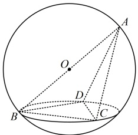
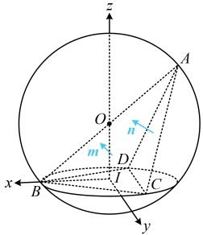

【变式2】如图，四面体ABCD的顶点都在以AB为直径的球面上，底面BCD是边长为 $ \sqrt{3} $的等边三角形，球心O到底面的距离为1.

（1）求球O的表面积；

（2）求二面角 B-AC-D 的余弦值.

解：（1）（已知球心 $O$ 到底面的距离 $d$，只需求出底面 $\triangle BCD$ 的外接圆半径 $r$，就能按 $R = \sqrt{r^2 + d^2}$ 算球 $O$ 的半径 $R$，故先求 $r$，涉及外接圆半径，可考虑正弦定理）

在 $\triangle BCD$ 中，由正弦定理，$2r = \frac{BC}{\sin \angle BDC} = \frac{\sqrt{3}}{\sin 60^\circ} = 2$，所以 $r = 1$，

又球心 $O$ 到平面 $BCD$ 的距离 $d = 1$，所以球 $O$ 的半径 $R = \sqrt{r^2 + d^2} = \sqrt{2}$，故球 $O$ 的表面积 $S = 4\pi R^2 = 8\pi$。

（2）（求二面角，考虑建系. 注意到$\triangle BCD$为正三角形，其中心与$O$的连线与平面$BCD$垂直，故不妨以该直线为$z$轴建系）设$I$为$\triangle BCD$的中心，以$I$为原点建立如图所示的空间直角坐标系，则$B(1,0,0)$，$C\left(-\frac{1}{2},\frac{\sqrt{3}}{2},0\right)$，$D\left(-\frac{1}{2},-\frac{\sqrt{3}}{2},0\right)$，（算平面$ACB$和$ACD$的法向量还需要点$A$的坐标，怎么写？注意到$O$为$AB$中点，而$O$的坐标容易写出，故先写$O$的坐标，再结合中点公式求$A$的坐标）

由图可知， $ O(0,0,1) $，设  $ A(a,b,c) $，则由中点公式， $ \left\{\begin{aligned}\frac{a+1}{2}&=0\\ \frac{b}{2}&=0\\ \frac{c}{2}&=1\end{aligned}\right. $，解得： $ \left\{\begin{aligned}a&=-1\\ b&=0\\ c&=2\end{aligned}\right. $，所以  $ A(-1,0,2) $，

 $$ \overrightarrow{CB}=\left(\frac{3}{2},-\frac{\sqrt{3}}{2},0\right),\quad\overrightarrow{CA}=\left(-\frac{1}{2},-\frac{\sqrt{3}}{2},2\right),\quad\overrightarrow{DC}=(0,\sqrt{3},0) $$ 

设平面 ACB 和平面 ACD 的法向量分别为  $ \boldsymbol{m}=(x_{1},y_{1},z_{1}) $， $ \boldsymbol{n}=(x_{2},y_{2},z_{2}) $。

则$\left\{\begin{array}{l}\boldsymbol{m}\cdot\overrightarrow{CB}=\frac{3}{2}x_{1}-\frac{\sqrt{3}}{2}y_{1}=0\\\boldsymbol{m}\cdot\overrightarrow{CA}=-\frac{1}{2}x_{1}-\frac{\sqrt{3}}{2}y_{1}+2z_{1}=0\end{array}\right.$，令$x_{1}=1$，则$y_{1}=\sqrt{3}$，$z_{1}=1$，

所以  $ m = (1, \sqrt{3}, 1) $ 是平面 ACB 的一个法向量，

同理， $ \begin{cases} \boldsymbol{n} \cdot \overrightarrow{CA} = -\frac{1}{2}x_2 - \frac{\sqrt{3}}{2}y_2 + 2z_2 = 0 \\ \boldsymbol{n} \cdot \overrightarrow{DC} = \sqrt{3}y_2 = 0 \end{cases} $，令 $ x_2 = 4 $，则 $ y_2 = 0 $， $ z_2 = 1 $，

所以  $ \boldsymbol{n}=(4,0,1) $ 是平面 ACD 的一个法向量，

 $$ \cos<\boldsymbol{m},\boldsymbol{n}>=\frac{\boldsymbol{m}\cdot\boldsymbol{n}}{\left|\boldsymbol{m}\right|\cdot\left|\boldsymbol{n}\right|}=\frac{1\times4+\sqrt{3}\times0+1\times1}{\sqrt{1^{2}+(\sqrt{3})^{2}+1^{2}}\times\sqrt{4^{2}+0^{2}+1^{2}}}=\frac{\sqrt{85}}{17} $$ 

（由图不易看出二面角 B-AC-D 的锐钝，可考虑通过分析法向量的指向来判断取正还是取负。如图，直观想象可发现法向量 m 朝外，法向量 n 朝内，所以它们的夹角等于二面角的平面角，作答的时候，由于不方便严谨地阐述法向量的指向，所以我们还是直接说“由图可知，…”，而省略具体的判断过程）

由图可知，二面角 B-AC-D 为锐角，所以其余弦值为  $ \frac{\sqrt{85}}{17} $.

类型IV：利用空间向量求空间距离

【例 18】已知点  $ A(2,1,1) $，若点  $ B(1,0,0) $ 和点  $ C(1,1,1) $ 在直线 l 上，则点 A 到直线 l 的距离为 ___.