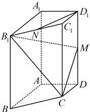
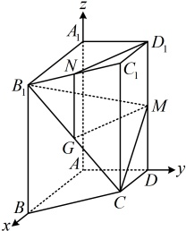

 $$ =\sqrt{\left(\frac{1}{2}\right)^{2}+1^{2}+\left(-\frac{1}{2}\right)^{2}-\left[\frac{1}{2}\times0+1\times\frac{2}{\sqrt{5}}+\left(-\frac{1}{2}\right)\times\frac{1}{\sqrt{5}}\right]^{2}}=\frac{\sqrt{105}}{10}. $$ 

【反思】设 $N$ 为直线 $l$ 外一点，$M$ 为直线 $l$ 上任意一点，$u$ 为直线 $l$ 的一个单位方向向量，则点 $N$ 到直线 $l$ 的距离 $d = \sqrt{\overrightarrow{MN}^2 - (\overrightarrow{MN} \cdot \boldsymbol{u})^2}$。

【例 20】在四棱柱 $ABCD - A_1B_1C_1D_1$ 中，底面 $ABCD$ 为梯形，$AB \parallel CD$，$A_1A$ ⊥ 平面 $ABCD$，$AD \perp AB$，且 $AB = AA_1 = 2$，$AD = DC = 1$，$M$，$N$ 分别是 $DD_1$，$B_1C_1$ 的中点。

（1）求证： $ D_{1}N $ //平面 $ CB_{1}M $；

（2）求点B到平面 $ CB_{1}M $的距离.

解：（1）证法1：（证线面平行，先找线线平行．观察图形可发现过M容易作 $ D_1N $的平行线，且作出来的D像平行四边形，且G像 $ B_1C $的中点，思路就有了）

如图，取 $ B_1C $中点G，连接NG，MG，因为N为 $ B_1C_1 $的中点，所以 $ NG \parallel CC_1 $且 $ NG = \frac{1}{2}CC_1 $，

又M为 $ DD_1 $的中点，所以由棱柱的性质， $ D_1M \parallel CC_1 $且 $ D_1M = \frac{1}{2}CC_1 $，从而 $ NG \parallel D_1M $且 $ NG = D_1M $，

故四边形 $ D_1MGN $是平行四边形，所以 $ D_1N \parallel MG $，

结合 $ D_1N \not\subset $平面 $ CB_1M $， $ MG \subset $平面 $ CB_1M $可得 $ D_1N \parallel $平面 $ CB_1M $。

 $$ D_{1}NGM $$ 

证法2：（由题设条件可发现，图中本身就有三条两两垂直的直线，故也可考虑建系，用向量法处理）

以  $ A $ 为原点建立如图所示的空间直角坐标系，则  $ D_1(0,1,2) $， $ B_1(2,0,2) $， $ C_1(1,1,2) $， $ C(1,1,0) $， $ M(0,1,1) $，

因为  $ N $ 是  $ B_1C_1 $ 的中点，所以  $ N\left(\frac{3}{2},\frac{1}{2},2\right) $，

故  $ \overrightarrow{D_1N} = \left(\frac{3}{2},-\frac{1}{2},0\right) $， $ \overrightarrow{B_1C} = (-1,1,-2) $， $ \overrightarrow{MC} = (1,0,-1) $，

设平面 $CB_1M$ 的法向量为 $\boldsymbol{m} = (x, y, z)$，则 $\begin{cases} \boldsymbol{m} \cdot \overrightarrow{B_1C} = -x + y - 2z = 0 \\ \boldsymbol{m} \cdot \overrightarrow{MC} = x - z = 0 \end{cases}$，

令 $x=1$，则 $y=3$，$z=1$，所以 $\boldsymbol{m} = (1, 3, 1)$ 是平面 $CB_1M$ 的一个法向量，

因为 $\overrightarrow{D_1N} \cdot \boldsymbol{m} = \frac{3}{2} \times 1 + \left(-\frac{1}{2}\right) \times 3 + 0 \times 1 = 0$，所以 $\overrightarrow{D_1N} \perp \boldsymbol{m}$，

又 $D_1N \not\subset$ 平面 $CB_1M$，所以 $D_1N \parallel$ 平面 $CB_1M$。

（2）（求点 $B$ 到平面 $CB_1M$ 的距离，可以套用公式 $d = \frac{|BC \cdot m|}{|m|}$，已有 $m$ 的坐标，下面先求 $\overrightarrow{BC}$）

由图可知，$B(2,0,0)$，所以 $\overrightarrow{BC} = (-1,1,0)$，由（1）的证法 2 可知平面 $CB_1M$ 的一个法向量为 $\boldsymbol{m} = (1,3,1)$，

所以由点到平面的距离公式，点 $B$ 到平面 $CB_1M$ 的距离 $d = \frac{| \overrightarrow{BC} \cdot \boldsymbol{m} |}{| \boldsymbol{m} |} = \frac{| -1 \times 1 + 1 \times 3 + 0 \times 1 |}{\sqrt{1^2 + 3^2 + 1^2}} = \frac{2\sqrt{11}}{11}$。

【反思】设 $P$ 在平面 $\alpha$ 外，$Q$ 在 $\alpha$ 内，$n$ 为 $\alpha$ 的法向量，则 $P$ 到 $\alpha$ 的距离 $d = \frac{|PQ \cdot n|}{|n}$，我们常用此公式来求点到平面的距离。除此之外，异面直线的距离（公垂线段的长）也可用此公式计算，我们来看下面的变式。

【变式】在长方体 $ABCD-A_1B_1C_1D_1$ 中，$AA_1=1$，$AB=2$，$AD=3$，$E$ 为 $AB$ 的中点，则异面直线