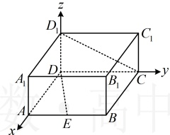
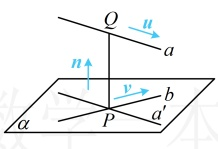
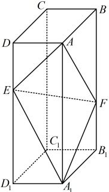

DE 与  $ D_{1}C $ 的距离为 ___.

解析：如图1，可以想象，不方便作出异面直线DE与 $ D_1C $的公垂线段，再计算其长度，怎么办呢？我们把问题的模型单独拿出来看看。如图2，设异面直线 $ a $， $ b $的公垂线段是 $ PQ $，过 $ P $作 $ a $的平行线 $ a' $，由相交直线 $ a' $和 $ b $确定的平面记作 $ \alpha $，则异面直线 $ a $， $ b $之间的距离 $ PQ $等于直线 $ a $上任意一点到平面 $ \alpha $的距离，故可由此将异面直线之间的距离转化为点到平面的距离来算。下面我们套用此方法计算 $ DE $与 $ D_1C $的距离，

如图1建系，则 $ D(0,0,0) $， $ E(3,1,0) $， $ D_1(0,0,1) $， $ C(0,2,0) $，所以 $ \overrightarrow{DE}=(3,1,0) $， $ \overrightarrow{D_1C}=(0,2,-1) $，

在图2中，计算直线 $ a $上的点到平面 $ \alpha $的距离需要 $ \alpha $的法向量 $ n $，怎么求？由图2可知法向量 $ n $与直线 $ a' $和 $ b $的方向向量都垂直，而 $ a' $的方向向量显然也是 $ a $的方向向量，故可由 $ \begin{cases}n\cdot u=0\\n\cdot v=0\end{cases} $求 $ n $，于是在图1中，也应寻找与直线 $ DE $和 $ D_1C $的方向向量都垂直的向量 $ m $，

设与 $ \overrightarrow{DE} $， $ \overrightarrow{D_1C} $都垂直的向量为 $ \boldsymbol{m}=(x,y,z) $，则 $ \begin{cases}\boldsymbol{m}\cdot\overrightarrow{DE}=3x+y=0\\\boldsymbol{m}\cdot\overrightarrow{D_1C}=2y-z=0\end{cases} $，令 $ x=1 $，则 $ y=-3 $， $ z=-6 $，

所以与 $ \overrightarrow{DE} $， $ \overrightarrow{D_1C} $都垂直的一个向量为 $ \boldsymbol{m}=(1,-3,-6) $，

有了向量 $m$ 的坐标，再到两直线上各选一个点，构造一个向量，就能代点到平面的距离公式了，

又 $\overrightarrow{DC} = (0,2,0)$，所以异面直线 $DE$ 与 $D_1C$ 之间的距离 $d = \frac{|\overrightarrow{DC} \cdot \boldsymbol{m}|}{|\boldsymbol{m}|} = \frac{|0 \times 1 + 2 \times (-3) + 0 \times (-6)|}{\sqrt{1^2 + (-3)^2 + (-6)^2}} = \frac{3\sqrt{46}}{23}$。

图1

图2

答案： $ \frac{3\sqrt{46}}{23} $

【反思】求异面直线  $ a $,  $ b $ 之间距离的步骤是：①在直线  $ a $,  $ b $ 上各取 1 个向量  $ u $,  $ v $，求出一个满足  $ \begin{cases} m \cdot u = 0 \\ m \cdot v = 0 \end{cases} $ 的非零向量  $ m $；②在  $ a $,  $ b $ 上分别任取一点  $ P $,  $ Q $，求出  $ \overrightarrow{PQ} $；③按  $ d = \frac{|\overrightarrow{PQ} \cdot m|}{|m|} $ 计算  $ a $,  $ b $ 之间的距离。

## 补充、拓展

除了本节前面那几类常见的立体几何问题外，利用空间向量还能解决一些其它问题，下面我们给大家拓展判断点、直线是否在平面内这类问题的向量处理方法。

类型V：用向量方法判断点、直线是否在平面内

【例 21】（2020·新课标Ⅲ卷（节选））如图，在长方体 $ABCD-A_1B_1C_1D_1$ 中，点 $E$，$F$ 分别在棱 $DD_1$，$BB_1$ 上，且 $2DE = ED_1$，$BF = 2FB_1$，证明：点 $C_1$ 在平面 $AEF$ 内。

证法1：（观察图形发现  $ EC_1 \parallel AF $，故可通过证明这一平行关系来证结论成立）

如图，在  $ AA_1 $ 上取点  $ G $，使得  $ A_1G = 2AG $，连接  $ B_1G $， $ EG $， $ EC_1 $，

