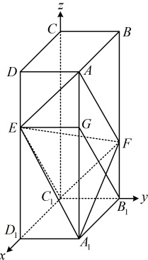
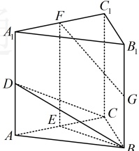
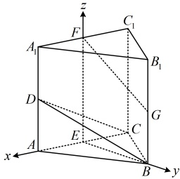

则  $ AG \parallel B_{1}F $ 且  $ AG = B_{1}F $，所以四边形  $ AGB_{1}F $ 为平行四边形，故  $ AF \parallel B_{1}G $，

又  $ 2DE = ED_{1} $，所以  $ EG \parallel A_{1}D_{1} \parallel B_{1}C_{1} $ 且  $ EG = A_{1}D_{1} = B_{1}C_{1} $，故  $ EGB_{1}C_{1} $ 为平行四边形，

所以  $ EC_{1} \parallel B_{1}G $ ，从而  $ EC_{1} \parallel AF $ ，故 A，E， $ C_{1} $，F 四点共面，

所以点  $ C_{1} $ 在平面 AEF 内.

证法2：（点 $ C_1 $在平面 $ AEF $内 $ \Leftrightarrow C_1\overrightarrow{A} $是平面 $ AEF $内的向量 $ \Leftrightarrow \overrightarrow{C_1A}\perp $平面 $ AEF $的法向量，故也可通过证明 $ \overrightarrow{C_1A}\perp $平面 $ AEF $的法向量来证点 $ C_1 $在平面 $ AEF $内）

以 $ C_1 $为原点建立如图所示的空间直角坐标系，设 $ AD=1 $， $ CD=a $， $ CC_1=3b $，

则 $ A(a,1,3b) $， $ E(a,0,2b) $， $ F(0,1,b) $， $ C_1(0,0,0) $，

所以 $ \overrightarrow{C_1A}=(a,1,3b) $， $ \overrightarrow{EA}=(0,1,b) $， $ \overrightarrow{FA}=(a,0,2b) $，

设平面 $ AEF $的法向量为 $ \boldsymbol{m}=(x,y,z) $，则 $ \begin{cases}\boldsymbol{m}\cdot\overrightarrow{EA}=y+bz=0\\\boldsymbol{m}\cdot\overrightarrow{FA}=ax+2bz=0\end{cases} $，

令 $ x=2b $，则 $ \begin{cases}y=ab\\z=-a\end{cases} $，所以 $ \boldsymbol{m}=(2b,ab,-a) $是平面 $ AEF $的一个法向量，

从而 $ \overrightarrow{C_1A}\cdot\boldsymbol{m}=a\cdot2b+1\cdot ab+3b\cdot(-a)=0 $，故点 $ C_1 $在平面 $ AEF $内.

【反思】判断空间中的点 $P$ 是否在平面 $\alpha$ 内，可在 $\alpha$ 内另取一点 $Q$，看看 $\overrightarrow{PQ}$ 是不是 $x$ 是 $\alpha$ 内的向量。若是，则应有 $\overrightarrow{PQ} \cdot n = 0$；否则，$\overrightarrow{PQ} \cdot n \neq 0$，其中 $n$ 为平面 $\alpha$ 的法向量。

【例 22】（2018·北京卷）如图，三棱柱 $ABC-A_1B_1C_1$ 中，$CC_1 \perp$ 平面 $ABC$，$D$，$E$，$F$，$G$ 分别为 $AA_1$，$AC$，$A_1C_1$，$BB_1$ 的中点，$AB = BC = \sqrt{5}$，$AC = AA_1 = 2$。

（1）求证： $ AC \perp $ 平面 BEF；

（2）求二面角 B-CD-C_{1} 的余弦值：

（3）证明：直线FG与平面BCD相交.

解：(1)（证 $AC \perp$ 面 $BEF$，需要证明 $AC$ 垂直于面 $BEF$ 内的两条相交直线，选哪两条？

结合图形和已知条件可发现，容易证明 $AC \perp EF$ 和 $AC \perp BE$，故选 $EF$ 和 $BE$）

在三棱柱 $ABC-A_1B_1C_1$ 中，$E$，$F$ 分别为 $AC$，$A_1C_1$ 的中点，所以 $EF \parallel CC_1$，

因为 $CC_1 \perp$ 平面 $ABC$，所以 $EF \perp$ 平面 $ABC$，又 $AC \subset$ 平面 $ABC$，所以 $AC \perp EF$，

因为 $AB = BC = \sqrt{5}$，所以 $AC \perp BE$，因为 $BE$，$EF \subset$ 平面 $BEF$ 且 $BE \cap EF = E$，所以 $AC \perp$ 平面 $BEF$

（2）（求二面角，考虑建系。已有 $EA$，$EB$，$EF$ 两两垂直，可直接建系处理）

以 $E$ 为原点建立如图所示的空间直角坐标系，则 $C(-1,0,0)$，$D(1,0,1)$，

在 $\triangle AEB$ 中，$EB = \sqrt{AB^2 - AE^2} = \sqrt{(\sqrt{5})^2 - 1^2} = 2$，所以 $B(0,2,0)$，故 $\overrightarrow{CB} = (1,2,0)$，$\overrightarrow{CD} = (2,0,1)$，

设平面 $BCD$ 的法向量为 $\boldsymbol{m} = (x,y,z)$，则 $\begin{cases} \boldsymbol{m} \cdot \overrightarrow{CB} = x + 2y = 0 \\ \boldsymbol{m} \cdot \overrightarrow{CD} = 2x + z = 0 \end{cases}$，令 $x = 2$，则 $y = -1$，$z = -4$，

所以 $\boldsymbol{m} = (2, -1, -4)$ 是平面 $BCD$ 的一个法向量，由图可知 $\boldsymbol{n} = (0,1,0)$ 是平面 $CDC$ 的一个法向量，

 $$ \cos<\boldsymbol{m},\boldsymbol{n}>=\frac{\boldsymbol{m}\cdot\boldsymbol{n}}{\left|\boldsymbol{m}\right|\cdot\left|\boldsymbol{n}\right|}=\frac{2\times0+(-1)\times1+(-4)\times0}{\sqrt{2^{2}+(-1)^{2}+(-4)^{2}}\times1}=-\frac{\sqrt{21}}{21}. $$ 

由图可知，二面角 B-CD-C_{1} 为钝角，故其余弦值为  $ -\frac{\sqrt{21}}{21} $

（3）（怎样证直线与平面相交？直线与平面相交意味着直线上的向量不在平面内，那么它与平面的法向量不垂直，故可按此证明直线与平面相交）

