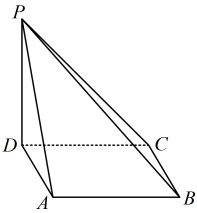
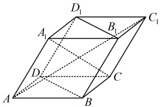

### 4. （2025·新疆模拟）

如图，在四棱锥  $ P-ABCD $ 中， $ PD \perp $ 平面  $ ABCD $，底面  $ ABCD $ 为菱形，且  $ \angle ABC = 60^\circ $

（1）求证： $ AC \perp PB $；

（2）若 AB = 2，当平面  $ PAB \perp $ 平面 PBC 时，求 PD 的长.

## 一 数·高中数学一本通

### 5. （2025·浙江温州期末）

如图，在平行六面体  $ ABCD-A_{1}B_{1}C_{1}D_{1} $ 中，AB=

 $$ AD=AA_{1}=1，\angle A_{1}AB=\angle A_{1}AD=\angle BAD=60^{\circ}． $$ 

（1）求 $ AC_{1} $的长；

（2）求证： $ A_{1}C\perp $ 平面 $ BDD_{1}B_{1} $

