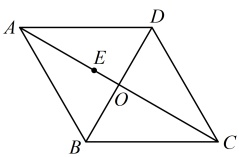
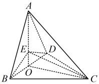
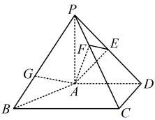

### 10. （2024·陕西模拟）

已知边长为4的菱形 $ABCD$（如图1），$\angle BAD=\frac{\pi}{3}$，$AC$ 与 $BD$ 相交于点 $O$，$E$ 为线段 $AO$ 上一点，将 $\triangle ABD$ 沿 $BD$ 折叠成三棱锥 $A-BCD$（如图2）。

图1

图2

（1）证明： $ BD \perp CE $；

（2）若三棱锥 A-BCD 的体积为 8，二面角 B-CE-O 的余弦值为  $ \frac{\sqrt{15}}{10} $，求 OE 的长.

## 一 数·高中数学一本通

### 11. (2019 · 北京卷)

如图，在四棱锥 P-ABCD 中， $ PA \perp $ 平面 ABCD， $ AD \perp CD $， $ AD \parallel BC $，PA = AD = CD = 2，BC = 3，E 为 PD 的中点，点 F 在 PC 上，且  $ \frac{PF}{PC} = \frac{1}{3} $.

（1）求证： $ CD \perp $ 平面 PAD；

（2）求二面角 F-AE-P 的余弦值；

（3）设点 G 在 PB 上，且  $ \frac{PG}{PB} = \frac{2}{3} $，判断直线 AG 是否在平面 AEF 内，说明理由.

