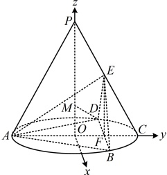
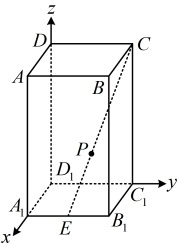

则  $ \sin \theta = \left| \cos < \overrightarrow{DM}, \boldsymbol{m} > \right| = \frac{\left| \overrightarrow{DM} \cdot \boldsymbol{m} \right|}{\left| \overrightarrow{DM} \right| \cdot \left| \boldsymbol{m} \right|} = \frac{\left| 2 + \sqrt{3}a \right|}{\sqrt{1 + a^2} \times \sqrt{7}} $，由题意， $ \sin \theta = \frac{2\sqrt{7}}{7} $，

所以  $ \frac{\left| 2 + \sqrt{3}a \right|}{\sqrt{1 + a^2} \times \sqrt{7}} = \frac{2\sqrt{7}}{7} $，解得： $ a = 0 $ 或  $ 4\sqrt{3} $（不满足  $ 0 \leq a \leq \sqrt{3} $，舍去）

从而点  $ M $ 的坐标为  $ (0, 0, 0) $，故  $ \overrightarrow{AM} = (0, 1, 0) $，

由点到平面的距离公式，点  $ M $ 到平面  $ ABE $ 的距离  $ d = \frac{\left| \overrightarrow{AM} \cdot \boldsymbol{m} \right|}{\left| \boldsymbol{m} \right|} = \frac{\sqrt{7}}{7} $。

【反思】当点在直线上运动时，若直线较特殊（如本题的  $ M $ 在  $ z $ 轴上），则可直接设动点的坐标；若直线不特殊，那么就需要用共线向量定理，把动点的坐标化为单变量形式，方便后续计算，我们来看下面的变式。

【变式】已知正四棱柱 $ABCD-A_1B_1C_1D_1$ 中，$AB=1$，$AA_1=\sqrt{3}$，$E$ 为棱 $A_1B_1$ 的中点，$P$ 为直线 $EC$ 上一动点，求当点 $P$ 到直线 $BB_1$ 距离最短时，线段 $EP$ 的长。

解法1：（正四棱柱是特殊的长方体，容易建系，故考虑建系，用向量法计算点P到直线 $ BB_1 $的距离）

以 $ D_1 $为原点建立如图所示的空间直角坐标系，则 $ B(1,1,\sqrt{3}) $， $ B_1(1,1,0) $，

所以 $ \overrightarrow{B_1B}=(0,0,\sqrt{3}) $，故直线 $ BB_1 $的单位方向量可以为 $ \boldsymbol{u}=(0,0,1) $，

（求 $P$ 到直线 $BB_1$ 的距离还需要 $P$ 的坐标，$P$ 在直线 $EC$ 上运动，显然无法直接看出其坐标的规律，怎么处理？

由于 $P$ 在 $EC$ 上，所以 $\overrightarrow{EP}$ 与 $\overrightarrow{EC}$ 必共线，故可设 $\overrightarrow{EP} = \lambda \overrightarrow{EC}$，并由此将 $P$ 的坐标用 $\lambda$ 表示）

设 $P(a, b, c)$，由图可知，$E\left(1, \frac{1}{2}, 0\right)$，$C(0, 1, \sqrt{3})$，所以 $\overrightarrow{EP} = \left(a-1, b-\frac{1}{2}, c\right)$，$\overrightarrow{EC} = \left(-1, \frac{1}{2}, \sqrt{3}\right)$，

因为 $P$ 在直线 $EC$ 上，所以 $\overrightarrow{EP} \parallel \overrightarrow{EC}$，故可设 $\overrightarrow{EP} = \lambda \overrightarrow{EC} (\lambda \in \mathbf{R})$，则 $\begin{cases} a-1 = -\lambda \\ b-\frac{1}{2} = \frac{1}{2}\lambda \end{cases}$，所以 $\begin{cases} a=1-\lambda \\ b=\frac{1+\lambda}{2} \\ c=\sqrt{3}\lambda \end{cases}$，

从而 $P\left(1-\lambda, \frac{1+\lambda}{2}, \sqrt{3}\lambda\right)$，故 $\overrightarrow{B_1P} = \left(-\lambda, \frac{\lambda-1}{2}, \sqrt{3}\lambda\right)$，由点到直线的距离公式，点 $P$ 到直线 $BB_1$ 的距离 $d = \sqrt{\overrightarrow{B_1P}^2 - (\overrightarrow{B_1P} \cdot \mathbf{u})^2} = \sqrt{(-\lambda)^2 + \left(\frac{\lambda-1}{2}\right)^2 + (\sqrt{3}\lambda)^2} - \left[-\lambda \times 0 + \left(\frac{\lambda-1}{2}\right) \times 0 + \sqrt{3}\lambda \times 1\right]^2$

$=\frac{\sqrt{5\lambda^2 - 2\lambda + 1}}{2} = \frac{\sqrt{5\left(\lambda - \frac{1}{5}\right)^2 + \frac{4}{5}}}{2}$，所以当 $\lambda = \frac{1}{5}$ 时，$d$ 取得最小值，此时 $\overrightarrow{EP} = \frac{1}{5} \overrightarrow{EC}$，

所以 $EP = \frac{1}{5}EC = \frac{1}{5} \left| \overrightarrow{EC} \right| = \frac{1}{5} \sqrt{(-1)^2 + \left(\frac{1}{2}\right)^2 + (\sqrt{3})^2} = \frac{\sqrt{17}}{10}$。

解法 2：（建系的过程同解法 1，对于点 $P$ 的处理，注意到我们需要的是 $\overrightarrow{B_1P}$ 的坐标，故

也可考虑利用向量的线性运算规则直接求 $\overrightarrow{B_1P}$ 的坐标，而不用先求 $P$ 的坐标，这样可以一定程度简化计算）

$\overrightarrow{B_1P} = \overrightarrow{B_1E} + \overrightarrow{EP} = \overrightarrow{B_1E} + \lambda\overrightarrow{EC} = \left(0, -\frac{1}{2}, 0\right) + \lambda\left(-1, \frac{1}{2}, \sqrt{3}\right) = \left(-\lambda, \frac{\lambda-1}{2}, \sqrt{3}\lambda\right)$，接下来同解法 1.

【反思】当点在不特殊的直线上运动时（以本题的  $ P $ 在  $ EC $ 上运动为例），常考虑设  $ \overrightarrow{EP} = \lambda \overrightarrow{EC} $，由此将点  $ P $ 的坐标表示成关于  $ \lambda $ 的单变量形式，再进行后续的计算。