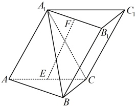

类型Ⅱ：点的坐标难写时的处理方法

【例 2】（2019·浙江卷）如图，已知三棱柱  $ ABC-A_1B_1C_1 $ 中，平面  $ AA_1C_1C \perp $ 平面  $ ABC $， $ \angle ABC = 90^\circ $， $ \angle BAC = 30^\circ $， $ A_1A = A_1C = AC $， $ E $， $ F $ 分别是  $ AC $， $ A_1B_1 $ 的中点。

（1）证明： $ EF \perp BC $；

（2）求直线 EF 与平面  $ A_{1}BC $ 所成角的余弦值.

解法1：（1）（条件中有面  $ AA_1C_1C \perp $ 面  $ ABC $，容易用面垂直的性质定理构造出面  $ ABC $ 的垂线，又有  $ \angle ABC = 90^\circ $，所以建系比较方便，故可考虑建立空间直角坐标系，通过证明  $ \overrightarrow{EF} \cdot \overrightarrow{BC} = 0 $ 来证明  $ EF \perp BC $）连接  $ A_1E $，因为  $ A_1A = A_1C = AC $， $ E $ 为  $ AC $ 的中点，所以  $ A_1E \perp AC $，又因为平面  $ AA_1C_1C \perp $ 平面  $ ABC $， $ A_1E \subset $ 平面  $ AA_1C_1C $，平面  $ AA_1C_1C \cap $ 平面  $ ABC = AC $，所以  $ A_1E \perp $ 平面  $ ABC $，以  $ A $ 为原点建立如图1所示的空间直角坐标系，其中  $ \overrightarrow{AE} = \overrightarrow{AC} $

不妨设 $AC=2$，则 $B\left(\frac{\sqrt{3}}{2},\frac{3}{2},0\right)$，$C(0,2,0)$，$E(0,1,0)$，所以 $\overrightarrow{BC}=\left(-\frac{\sqrt{3}}{2},\frac{1}{2},0\right)$，

（要求 $\overrightarrow{EF}$ 的坐标，还差 $F$ 的坐标，$F$ 是 $A_1B_1$ 的中点，要写出 $A_1$，$B_1$ 的坐标，再用中点公式写 $F$ 的坐标吗？这样做可行，但写 $B_1$ 的坐标偏麻烦，注意到斜棱柱中 $\overrightarrow{A_1F}=\frac{1}{2}\overrightarrow{AB}$，所以 $\overrightarrow{EF}=\overrightarrow{EA_1}+\overrightarrow{A_1F}=\overrightarrow{EA_1}+\frac{1}{2}\overrightarrow{AB}$，按此可回避写 $B_1$ 的坐标，转化为用 $E$，$A_1$，$A$，$B$ 的坐标直接求得 $\overrightarrow{EF}$ 的坐标）

由图可知，$A(0,0,0)$，$A_1(0,1,\sqrt{3})$，所以 $\overrightarrow{EF}=\overrightarrow{EA_1}+\overrightarrow{A_1F}=\overrightarrow{EA_1}+\frac{1}{2}\overrightarrow{AB}=(0,0,\sqrt{3})+\frac{1}{2}\left(\frac{\sqrt{3}}{2},\frac{3}{2},0\right)=\left(\frac{\sqrt{3}}{4},\frac{3}{4},\sqrt{3}\right)$，

从而 $\overrightarrow{EF}\cdot\overrightarrow{BC}=\frac{\sqrt{3}}{4}\times\left(-\frac{\sqrt{3}}{2}\right)+\frac{3}{4}\times\frac{1}{2}+\sqrt{3}\times0=0$，故 $\overrightarrow{EF}\perp\overrightarrow{BC}$，所以 $EF\perp BC$。

(2) (已有 $ \overrightarrow{EF} $，求直线EF与平面 $ A_{1}BC $所成的角只差平面 $ A_{1}BC $的法向量，下面先求此法向量)

由（1）可得  $ \overrightarrow{A_1B} = \left( \frac{\sqrt{3}}{2}, \frac{1}{2}, -\sqrt{3} \right) $，设平面  $ A_1BC $ 的法向量  $ \boldsymbol{m} = (x, y, z) $，则  $ \begin{cases} \boldsymbol{m} \cdot \overrightarrow{A_1B} = \frac{\sqrt{3}}{2}x + \frac{1}{2}y - \sqrt{3}z = 0 \\ \boldsymbol{m} \cdot \overrightarrow{BC} = -\frac{\sqrt{3}}{2}x + \frac{1}{2}y = 0 \end{cases} $，

令  $ x = 1 $，则  $ \begin{cases} y = \sqrt{3} \\ z = 1 \end{cases} $，所以  $ \boldsymbol{m} = (1, \sqrt{3}, 1) $ 是平面  $ A_1BC $ 的一个法向量，设直线  $ EF $ 与平面  $ A_1BC $ 所成的角为  $ \theta $，

则  $ \sin \theta = \left| \cos < \overrightarrow{EF}, \boldsymbol{m} > \right| = \frac{\left| \overrightarrow{EF} \cdot \boldsymbol{m} \right|}{\left| \overrightarrow{EF} \right| \cdot \left| \boldsymbol{m} \right|} = \frac{\left| \frac{\sqrt{3}}{4} \times 1 + \frac{3}{4} \times \sqrt{3} + \sqrt{3} \times 1 \right|}{\sqrt{\left( \frac{\sqrt{3}}{4} \right)^2 + \left( \frac{3}{4} \right)^2 + (\sqrt{3})^2} \times \sqrt{1^2 + (\sqrt{3})^2 + 1^2}} = \frac{4}{5} $，

所以直线  $ EF $ 与平面  $ A_1BC $ 所成角的余弦值  $ \cos \theta = \sqrt{1 - \sin^2 \theta} = \sqrt{1 - \left( \frac{4}{\pi} \right)^2} = \frac{3}{\pi} $。

解法2：（1）（EF和BC是异面直线，证异面直线垂直，常考虑找线面垂直，怎么找？若无思路，可尝试逆推假设EF⊥BC，条件还给出面 $ AA_1C_1C $⊥面ABC，由此不难证明 $ BC \perp A_1E $，两者结合可得出BC⊥平面 $ A_1EF $，故可通过证此线面垂直来证明 $ EF \perp BC $）

如图2，连接 $ A_1E $，因为 $ A_1A = A_1C = AC $，且E为AC的中点，所以 $ A_1E \perp AC $，

又平面 $ AA_1C_1C \perp $平面 $ ABC $， $ A_1E \subset $平面 $ AA_1C_1C $，平面 $ AA_1C_1C \cap $平面 $ ABC = AC $，所以 $ A_1E \perp $平面 $ ABC $，

因为 $ BC \subset $平面 $ ABC $，所以 $ BC \perp A_1E $，由题意， $ \angle ABC = 90^\circ $，所以 $ AB \perp BC $，又 $ A_1B_1 \parallel AB $，所以 $ BC \perp A_1B_1 $