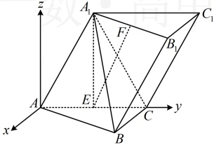
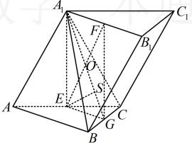
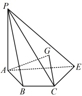

结合  $ A_1B_1 $， $ A_1E \subset $ 平面  $ A_1EF $， $ A_1B_1 \cap A_1E = A_1 $ 可得  $ BC \perp $ 平面  $ A_1EF $，因为  $ EF \subset $ 平面  $ A_1EF $，所以  $ EF \perp BC $。

（2）（第（1）问已证  $ BC \perp $ 面  $ A_1EF $，故面  $ A_1BC \perp $ 面  $ A_1EF $，由此容易结合面面垂直的性质定理过  $ E $ 作面  $ A_1BC $ 的垂线，故也可考虑用几何法处理。要对面  $ A_1BC \perp $ 面  $ A_1EF $ 用面面垂直的性质定理，需先找到交线，观察图形发现只要过  $ E $ 作  $ A_1F $ 的平行线，就能把面  $ A_1EF $ 扩大，从而看出它与面  $ A_1BC $ 的交线）

如图2，取  $ BC $ 中点  $ G $，连接  $ EG $， $ FG $，因为  $ E $ 为  $ AC $ 中点，所以  $ EG \parallel AB $ 且  $ EG = \frac{1}{2}AB $，

又  $ F $ 为  $ A_1B_1 $ 中点，所以  $ A_1F \parallel AB $ 且  $ A_1F = \frac{1}{2}AB $，从而  $ A_1F \parallel EG $ 且  $ A_1F = EG $，故  $ A_1EG $ 为平行四边形，

由（1）知  $ A_1E \perp $ 平面  $ ABC $，又  $ EG \subset $ 平面  $ ABC $，所以  $ A_1E \perp EG $，故  $ A_1EG $ 为矩形，

连接  $ A_1G $ 交  $ EF $ 于  $ O $，过  $ E $ 作  $ ES \perp A_1G $ 于点  $ S $，由（1）知  $ BC \perp $ 平面  $ A_1EG $，又  $ ES \subset $ 平面  $ A_1EG $，

所以  $ ES \perp BC $，结合  $ ES \perp A_1G $，且  $ BC $， $ A_1G \subset $ 平面  $ A_1BC $， $ BC \cap A_1G = G $ 可得  $ ES \perp $ 平面  $ A_1BC $，

所以  $ \angle EOS $ 即为直线  $ EF $ 与平面  $ A_1BC $ 所成角，

（故只需求$\cos\angle EOS$，需要$OS$和$OE$的长，可到矩形$A_1EGF$中来分析几何关系，计算它们）

不妨设$AA_1=A_1C=AC=2$，则$A_1E=\sqrt{3}$，$AB=AC\cdot\cos\angle BAC=2\cos30^\circ=\sqrt{3}$，$EG=\frac{1}{2}AB=\frac{\sqrt{3}}{2}$，$EF=A_1G=\sqrt{A_1E^2+EG^2}=\sqrt{(\sqrt{3})^2+\left(\frac{\sqrt{3}}{2}\right)^2}=\frac{\sqrt{15}}{2}$，$OE=\frac{1}{2}EF=\frac{\sqrt{15}}{4}$，

由  $ S_{\triangle A_1EG} = \frac{1}{2} A_1E \cdot EG = \frac{1}{2} A_1G \cdot ES $ 可得  $ ES = \frac{A_1E \cdot EG}{A_1G} = \frac{\sqrt{3} \times \frac{\sqrt{3}}{2}}{\frac{\sqrt{15}}{2}} = \frac{\sqrt{15}}{5} $，所以  $ OS = \sqrt{OE^2 - ES^2} = \frac{3\sqrt{3}}{4\sqrt{5}} $，从而  $ \cos \angle EOS = \frac{OS}{OE} = \frac{3}{5} $，故直线 EF 与平面  $ A_1BC $ 所成角的余弦值为  $ \frac{3}{5} $。

图1

图2

【反思】在斜棱柱中，由于侧棱与底面不垂直，所以往往存在着一些顶点在另一底面上的射影不好找，导致这些点的坐标不好写（例如本题的 $ B_1 $），此时常不写这些点的坐标，而利用向量的共线以及线性运算直接求与之相关的向量的坐标，从而化繁为简（例如本题的 $ \overrightarrow{EF} $就是按 $ \overrightarrow{EF} = \overrightarrow{EA_1} + \frac{1}{2}\overrightarrow{AB} $求出的，而不是通过写 $ B_1 $的坐标来得到 $ F $的坐标，再求 $ \overrightarrow{EF} $的坐标）。若图形不是斜棱柱，不方便用上述方法解决点的坐标不好写的问题，又怎么办呢？我们来看下面的例3。

【例3】如图，已知四棱锥 $ P-ABCE $中， $ AB=1 $， $ BC=2 $， $ BE=2\sqrt{2} $， $ PA\perp $平面 $ ABCE $，平面 $ PAB\perp $平面 $ PBC $。

（1）证明： $ AB \perp BC $

（2）若  $ PA = 2\sqrt{2} $，且 AC = AE，G 为  $ \triangle PCE $ 的重心，求直线 CG 与平面 PBC 所成角的正弦值.

