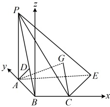
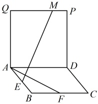
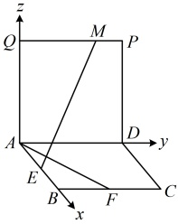

解：（1）（证线线垂直，往往先找线面垂直，若无思路，可尝试逆推. 假设  $ AB \perp BC $，由  $ PA \perp $ 平面  $ ABCE $ 可得出  $ BC \perp PA $，两者结合可得到  $ BC \perp $ 面  $ PAB $，故可通过证此线面垂直来证  $ AB \perp BC $）

如图，作  $ AD \perp PB $ 于  $ D $，因为平面  $ PAB \perp $ 平面  $ PBC $， $ AD \subset $ 平面  $ PAB $，平面  $ PAB \cap $ 平面  $ PBC = PB $，

所以  $ AD \perp $ 平面  $ PBC $，因为  $ BC \subset $ 平面  $ PBC $，所以  $ BC \perp AD $ ①，

又  $ PA \perp $ 平面  $ ABCE $， $ BC \subset $ 平面  $ ABCE $，所以  $ BC \perp PA $ ②，

由①②结合  $ AD $， $ PA \subset $ 平面  $ PAB $， $ AD \cap PA = A $ 可得  $ BC \perp $ 平面  $ PAB $，因为  $ AB \subset $ 平面  $ PAB $，所以  $ AB \perp BC $。

（2）以 $B$ 为原点建立如图所示的空间直角坐标系，则 $B(0,0,0)$，$C(2,0,0)$，$P(0,1,2\sqrt{2})$，

所以 $\overrightarrow{BC} = (2,0,0)$，$\overrightarrow{BP} = (0,1,2\sqrt{2})$，设平面 $PBC$ 的法向量为 $\boldsymbol{m} = (x,y,z)$，则 $\begin{cases} \boldsymbol{m} \cdot \overrightarrow{BC} = 2x = 0 \\ \boldsymbol{m} \cdot \overrightarrow{BP} = y + 2\sqrt{2}z = 0 \end{cases}$，

令 $y = 2\sqrt{2}$，则 $x = 0$，$z = -1$，所以 $\boldsymbol{m} = (0,2\sqrt{2},-1)$ 是平面 $PBC$ 的一个法向量，

（还需 $G$ 的坐标，$G$ 为 $\triangle PCE$ 的重心，可由 $P, C, E$ 的坐标求出，故先找 $E$ 的坐标，怎么找？含 $E$ 的条件是 $AC = AE$ 和 $BE = 2\sqrt{2}$，不易由此通过分析几何关系找 $E$ 的坐标，可考虑直接设 $E$ 的坐标，用它们建立关于所设坐标的方程组并求解）

由图可知，$A(0,1,0)$，$AC = \sqrt{AB^2 + BC^2} = \sqrt{5}$，设 $E(a,b,0) (a > 0, b > 0)$，

因为 $\begin{cases} AC = AE \\ BE = 2\sqrt{2} \end{cases}$，所以 $\begin{cases} \sqrt{5} = \sqrt{a^2 + (b-1)^2} \\ \sqrt{a^2 + b^2} = 2\sqrt{2} \end{cases}$，解得：$\begin{cases} a = 2 \\ b = 2 \end{cases}$，故 $E(2,2,0)$，

由重心坐标公式，$x_G = \frac{x_P + x_C + x_E}{3} = \frac{4}{3}$，$y_G = \frac{y_P + y_C + y_E}{3} = 1$，$z_G = \frac{z_P + z_C + z_E}{3} = \frac{2\sqrt{2}}{3}$，

所以 $G\left(\frac{4}{3},1,\frac{2\sqrt{2}}{3}\right)$，故 $\overrightarrow{CG} = \left(-\frac{2}{3},1,\frac{2\sqrt{2}}{3}\right)$，设直线 $CG$ 与平面 $PBC$ 所成的角为 $\theta$，

则 $\sin \theta = \left|\cos < \boldsymbol{m}, \overrightarrow{CG} > \right| = \frac{\left|\boldsymbol{m} \cdot \overrightarrow{CG}\right|}{\left|\boldsymbol{m}\right| \cdot \left|\overrightarrow{CG}\right|} = \frac{4\sqrt{42}}{63}$，所以直线 $CG$ 与平面 $PBC$ 所成角的正弦值为 $\frac{4\sqrt{42}}{63}$。

【反思】①通过本题我们给出了另一种找不好写的点的坐标的思路，即当建系后有点坐标不好找且无法像上面例2解法1的处理方法那样回避时，可直接设该点的坐标，翻译已知的各种条件（本题是长度）建立方程组，求解所设坐标；②在空间中，若 $ G $为 $ \triangle ABC $的重心，则点 $ G $的坐标为 $ \left(\frac{x_A+x_B+x_C}{3},\frac{y_A+y_B+y_C}{3},\frac{z_A+z_B+z_C}{3}\right) $。

## 类型III：利用空间向量解决立体几何综合题

【例4】（2015·四川卷）如图，四边形ABCD和ADPQ均为正方形，它们所在的平面互相垂直，动点M在线段PQ上，E，F分别为AB，BC的中点.设异面直线EM与AF所成的角为 $ \theta $，则 $ \cos\theta $的最大值为___.

解析：图中本身就有  $ AB $， $ AD $， $ AQ $ 两两垂直，故可考虑建系，用向量法计算  $ \cos\theta $，以  $ A $ 为原点建立如图所示的空间直角坐标系，设  $ AB = 2 $，则  $ A(0,0,0) $， $ F(2,1,0) $， $ E(1,0,0) $，

M是线段  $ PQ $ 上的动点，由图可知其坐标只有  $ y $ 分量会变，故可直接设坐标，设  $ M(0,a,2)(0 \leq a \leq 2) $，则  $ \overrightarrow{EM} = (-1,a,2) $， $ \overrightarrow{AF} = (2,1,0) $，

 $$ \cos\theta=\left|\cos<\overrightarrow{E M},\overrightarrow{A F}>\right|=\frac{\left|\overrightarrow{E M}\cdot\overrightarrow{A F}\right|}{\left|\overrightarrow{E M}\right|\cdot\left|\overrightarrow{A F}\right|}=\frac{\left|-2+a\right|}{\sqrt{a^{2}+5}\cdot\sqrt{5}}=\frac{2-a}{\sqrt{5(a^{2}+5)}} $$ 

上式结构较复杂，怎样分析其最大值？仔细观察会发现当 $ 0 \leq a \leq 2 $时，分子和分母都非负，且二者都是单调的，故可尝试直接分析单调性，看能否得出最大值，

