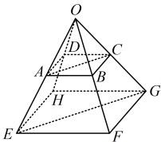

【例 11】已知向量  $ \boldsymbol{a} $,  $ \boldsymbol{b} $,  $ \boldsymbol{c} $ 不共面， $ \overrightarrow{AB}=4\boldsymbol{a}+5\boldsymbol{b}+3\boldsymbol{c} $,  $ \overrightarrow{AC}=2\boldsymbol{a}+3\boldsymbol{b}+\boldsymbol{c} $,  $ \overrightarrow{AD}=6\boldsymbol{a}+7\boldsymbol{b}+5\boldsymbol{c} $, 求证： $ \boldsymbol{B} $,  $ \boldsymbol{C} $,  $ \boldsymbol{D} $ 三点共线.

证明：（要证 $B$, $C$, $D$ 三点共线，只需证 $\overrightarrow{BC}$ 与 $\overrightarrow{CD}$ 共线，条件没给 $\overrightarrow{BC}$ 和 $\overrightarrow{CD}$，故先求它们，怎么求？观察所给的向量发现可按 $\overrightarrow{BC} = \overrightarrow{AC} - \overrightarrow{AB}$ 求 $\overrightarrow{BC}$，按 $\overrightarrow{CD} = \overrightarrow{AD} - \overrightarrow{AC}$ 求 $\overrightarrow{CD}$）

由题意，$\overrightarrow{BC} = \overrightarrow{AC} - \overrightarrow{AB} = (2a + 3b + c) - (4a + 5b + 3c) = 2a + 3b + c - 4a - 5b - 3c = -2a - 2b - 2c$，

$\overrightarrow{CD} = \overrightarrow{AD} - \overrightarrow{AC} = (6a + 7b + 5c) - (2a + 3b + c) = 6a + 7b + 5c - 2a - 3b - c = 4a + 4b + 4c$，

所以 $\overrightarrow{CD} = -2\overrightarrow{BC}$，从而 $\overrightarrow{BC}$ 与 $\overrightarrow{CD}$ 共线，故 $B$, $C$, $D$ 三点共线。

【反思】证三点共线，一种常用方法是转化为证明向量共线。本题没有图形背景，只给出了有关向量的代数表达式，若是在具体的图形下证明某三点共线，其处理方法也是类似的，但可能需要结合图形的一些几何特征来分析，我们来看下面的变式1。

【变式1】如图，在正方体  $ ABCD-A_1B_1C_1D_1 $ 中，点  $ E $， $ F $ 满足  $ \overrightarrow{A_1E} = 2\overrightarrow{ED_1} $， $ \overrightarrow{A_1F} = \frac{2}{3}\overrightarrow{FC} $。

（1）将 $ \overrightarrow{EF} $用 $ \overrightarrow{A_{1}A} $， $ \overrightarrow{A_{1}B_{1}} $， $ \overrightarrow{A_{1}D_{1}} $表示；

（2）证明：E，F，B三点共线.

解：（1）由题意， $ \overrightarrow{EF} = \overrightarrow{EA_1} + \overrightarrow{A_1F} = -\frac{2}{3}\overrightarrow{A_1D_1} + \overrightarrow{A_1F} $ ①，（还需将  $ \overrightarrow{A_1F} $ 也化为用  $ \overrightarrow{A_1A} $， $ \overrightarrow{A_1B_1} $， $ \overrightarrow{A_1D_1} $ 表示的结果，观察图形可发现  $ \overrightarrow{A_1C} $ 容易用上述三个向量表示，故先把  $ \overrightarrow{A_1F} $ 换算成  $ \overrightarrow{A_1C} $）

由题意， $ \overrightarrow{A_1F} = \frac{2}{3}\overrightarrow{FC} = \frac{2}{5}\overrightarrow{A_1C} = \frac{2}{5}(\overrightarrow{A_1A} + \overrightarrow{AB} + \overrightarrow{BC}) = \frac{2}{5}(\overrightarrow{A_1A} + \overrightarrow{A_1B_1} + \overrightarrow{A_1D_1}) $，

所以代入①得  $ \overrightarrow{EF} = -\frac{2}{3}\overrightarrow{A_1D_1} + \frac{2}{5}(\overrightarrow{A_1A} + \overrightarrow{A_1B_1} + \overrightarrow{A_1D_1}) = \frac{2}{5}\overrightarrow{A_1A} + \frac{2}{5}\overrightarrow{A_1B_1} - \frac{4}{15}\overrightarrow{A_1D_1} $。

（2）（要证  $ E $， $ F $， $ B $ 三点共线，只需证  $ \overrightarrow{EF} $ 与  $ \overrightarrow{EB} $ 共线，怎么证？第（1）问已将  $ \overrightarrow{EF} $ 用  $ \overrightarrow{A_1A} $， $ \overrightarrow{A_1B_1} $， $ \overrightarrow{A_1D_1} $ 表示，若能将  $ \overrightarrow{EB} $ 也用上述三个向量表示，就能看出它与  $ \overrightarrow{EF} $ 的倍数关系，从而证得  $ \overrightarrow{EB} $ 与  $ \overrightarrow{EF} $ 共线）

 $ \overrightarrow{EB} = \overrightarrow{EA_1} + \overrightarrow{A_1A} + \overrightarrow{AB} = -\frac{2}{3}\overrightarrow{A_1D_1} + \overrightarrow{A_1A} + \overrightarrow{A_1B_1} = \overrightarrow{A_1A} + \overrightarrow{A_1B_1} - \frac{2}{3}\overrightarrow{A_1D_1} $，

又由（1）可知  $ \overrightarrow{EF} = \frac{2}{5}\overrightarrow{A_1A} + \frac{2}{5}\overrightarrow{A_1B_1} - \frac{4}{15}\overrightarrow{A_1D_1} = \frac{2}{5}\left(\overrightarrow{A_1A} + \overrightarrow{A_1B_1} - \frac{2}{3}\overrightarrow{A_1D_1}\right) $，所以  $ \overrightarrow{EF} = \frac{2}{5}\overrightarrow{EB} $，

从而  $ \overrightarrow{EF} $ 与  $ \overrightarrow{FR} $ 共线。故  $ F $、 $ F $、 $ R $ 三点共线

【变式 2】已知  $ O $， $ A $， $ B $， $ C $， $ D $， $ E $， $ F $， $ G $， $ H $ 为空间的 9 个点（如图所示），并且  $ \overrightarrow{OE} = k\overrightarrow{OA} $， $ \overrightarrow{OF} = k\overrightarrow{OB} $， $ \overrightarrow{OH} = k\overrightarrow{OD} $， $ \overrightarrow{AC} = \overrightarrow{AD} + m\overrightarrow{AB} $， $ \overrightarrow{EG} = \overrightarrow{EH} + m\overrightarrow{EF} $，求证： $ AC \parallel EG $。

证明：（要证  $ AC \parallel EG $，只需证  $ \overrightarrow{AC} \parallel \overrightarrow{EG} $，即证存在实数  $ \lambda $，使  $ \overrightarrow{EG} = \lambda\overrightarrow{AC} $，怎么证？条件已给出  $ \overrightarrow{AC} $ 和  $ \overrightarrow{EG} $，且其它几个条件涉及的向量都以  $ O $ 为起点，故尝试把  $ \overrightarrow{EG} $ 往  $ O $ 转化，看能否找到它与  $ \overrightarrow{AC} $ 的倍数关系）

由题意， $ \overrightarrow{EG} = \overrightarrow{EH} + m\overrightarrow{EF} = \overrightarrow{OH} - \overrightarrow{OE} + m(\overrightarrow{OF} - \overrightarrow{OE}) = k\overrightarrow{OD} - k\overrightarrow{OA} + m(k\overrightarrow{OB} - k\overrightarrow{OA}) $

 $ = k(\overrightarrow{OD} - \overrightarrow{OA}) + mk(\overrightarrow{OB} - \overrightarrow{OA}) = k\overrightarrow{AD} + mk\overrightarrow{AB} = k(\overrightarrow{AD} + m\overrightarrow{AB}) = k\overrightarrow{AC} $，所以  $ \overrightarrow{AC} \parallel \overrightarrow{EG} $，

又由图可知，直线  $ EG $ 与直线  $ AC $ 不重合，所以  $ AC \parallel EG $。

