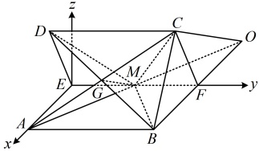

同理， $ \begin{cases} \boldsymbol{n} \cdot \overrightarrow{MB} = x_2 + y_2 = 0 \\ \boldsymbol{n} \cdot \overrightarrow{MC} = x_2 \cos \theta + y_2 + z_2 \sin \theta = 0 \end{cases} $，

令  $ x_{2}=\sin\theta $，则  $ y_{2}=-\sin\theta $， $ z_{2}=1-\cos\theta $，

所以  $ \boldsymbol{n} = (\sin\theta, -\sin\theta, 1 - \cos\theta) $ 是平面 BCM 的一个法向量，

 $$ \begin{aligned}& 故 \left|\cos<\boldsymbol{m},\boldsymbol{n}>\right|=\frac{\left|\boldsymbol{m}\cdot\boldsymbol{n}\right|}{\left|\boldsymbol{m}\right|\cdot\left|\boldsymbol{n}\right|}=\frac{\left|\sin^{2}\theta+(-\sin\theta)^{2}+(-\cos\theta-1)(1-\cos\theta)\right|}{\sqrt{2\sin^{2}\theta+(-\cos\theta-1)^{2}}\cdot\sqrt{2\sin^{2}\theta+(1-\cos\theta)^{2}}}\\ &=\frac{\left|2\sin^{2}\theta+\cos^{2}\theta-1\right|}{\sqrt{2\sin^{2}\theta+\cos^{2}\theta+2\cos\theta+1}\cdot\sqrt{2\sin^{2}\theta+\cos^{2}\theta-2\cos\theta+1}}=\frac{1}{\sqrt{(\sin^{2}\theta+2}}\\ &\\ &=\frac{\sin^{2}\theta}{\sqrt{(\sin^{2}\theta+2)^{2}-4\cos^{2}\theta}}=\frac{\sin^{2}\theta}{\sqrt{\sin^{4}\theta+4\sin^{2}\theta+4-4\cos^{2}\theta}}=\frac{\sin^{2}\theta}{\sqrt{\sin^{4}\theta+8\sin^{2}\theta}}\\ \end{aligned} $$ 

因为平面 BDM 与平面 BCM 所成的锐二面角的余弦值为  $ \frac{1}{3} $，所以  $ \frac{\sin\theta}{\sqrt{\sin^2\theta+8}} = \frac{1}{3} $，解得： $ \sin\theta = 1 $，结合  $ 0 < \theta < \pi $ 可得  $ \theta = \frac{\pi}{2} $，所以二面角 A-EF-D 的大小为  $ \frac{\pi}{7} $。

## 强化训练

考虑到本节涉及的题型都有一定的综合性和难度，故不设 A 组题，只设计了 B 组和 C 组题.

## B组 强化能力

如图，在棱长为4的正方体  $ ABCD-A_{1}B_{1}C_{1}D_{1} $ 中，点 E，F 分别在棱  $ AA_{1} $ 和 AB 上，且  $ C_{1}E \perp EF $，则 AF 的最大值为（ ）

A.  $ \frac{1}{2} $ B. 1 C.  $ \frac{3}{2} $ D. 2

