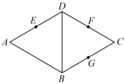
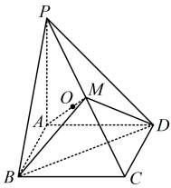

2.（2024·山东模拟）（多选）

如图所示，在菱形  $ ABCD $ 中， $ \angle BAD = \frac{\pi}{3} $， $ E $， $ F $， $ G $ 分别是线段  $ AD $， $ CD $， $ BC $ 的中点，将  $ \triangle ABD $ 沿直线  $ BD $ 折起得到三棱锥  $ A-BCD $，则在该三棱锥中，下列说法正确的是（ ）

A. 直线  $ EF \parallel $ 平面  $ ABC $

B. 直线  $ BE $ 与  $ DG $ 是异面直线

C. 直线  $ BE $ 与  $ DG $ 可能垂直

D. 若  $ EG = \frac{\sqrt{7}}{4}AB $，则二面角  $ A-BD-C $ 的大小为  $ \frac{\pi}{3} $

## 一 数·高中数学一本通

3.（2025·福建泉州期中）

如图，四棱锥 P-ABCD 的底面为正方形，PA⊥平面 ABCD，M 是 PC 的中点，PA=AB.

（1）求证： $ AM \perp $ 平面 PBD；

（2）设直线 EM 与平面 PBD 交于 O，求证： $ AO = 2OM $

