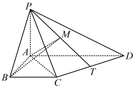
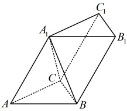

6.（2025·河北模拟）

如图，在四棱锥  $ P-ABCD $ 中， $ PA \perp $ 平面  $ ABCD $， $ PB $ 与底面  $ ABCD $ 所成角为  $ 45^\circ $，四边形  $ ABCD $ 是梯形， $ AD \perp AB $， $ BC \parallel AD $， $ AD = 2 $， $ PA = BC = 1 $。

（1）证明：平面  $ PAC \perp $ 平面 PCD;

（2）若点 T 是 CD 的中点，点 M 是 PT 的中点，求点 P 到平面 ABM 的距离；

（3）点 T 是线段 CD 上的动点，PT 上是否存在一点 M，使 PT⊥平面 ABM？若存在，求出点 M 的坐标；若不存在，请说明理由.

### 7. （2025·陕西模拟）数·高中数学一本通

如图，三棱柱  $ ABC-A_{1}B_{1}C_{1} $ 中， $ \triangle ABC $ 是边长为 2 的正三角形， $ AA_{1}=A_{1}C $

（1）证明： $ A_{1}C_{1}\perp A_{1}B $

（2）若三棱柱  $ ABC-A_{1}B_{1}C_{1} $ 的体积为 3，且二面角  $ A_{1}-BC-A $ 的余弦值为  $ \frac{\sqrt{5}}{5} $，求直线  $ AA_{1} $ 与平面 ABC 所成角的正弦值.

