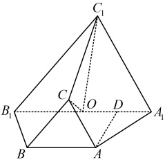

8.（2024·浙江模拟）

如图，已知三棱台  $ ABC-A_1B_1C_1 $ 中， $ AB=BC=CA=AA_1=BB_1=2 $， $ A_1B_1=4 $，点  $ O $ 为线段  $ A_1B_1 $ 的中点，点  $ D $ 为线段  $ OA_1 $ 的中点。

（1）证明：直线AD∥平面 $ OCC_{1} $;

（2）若平面  $ BCC_{1}B_{1}\perp $ 平面  $ ACC_{1}A_{1} $，求直线  $ AA_{1} $ 与平面  $ BCC_{1}B_{1} $ 所成线面角的大小.

