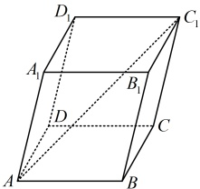

答案：A

【反思】极化恒等式是我们在平面向量数量积问题中学过的方法，如上图，设  $ G $ 为  $ AD $ 中点，则  $ \overrightarrow{PA} \cdot \overrightarrow{PD} = (\overrightarrow{PG} + \overrightarrow{GA}) \cdot (\overrightarrow{PG} + \overrightarrow{GD}) = \overrightarrow{PG}^2 + \overrightarrow{PG} \cdot \overrightarrow{GD} + \overrightarrow{GA} \cdot \overrightarrow{PG} + \overrightarrow{GA} \cdot \overrightarrow{GD} = \overrightarrow{PG}^2 + \overrightarrow{PG} \cdot (\overrightarrow{GD} + \overrightarrow{GA}) + \overrightarrow{GA} \cdot (-\overrightarrow{GA}) = \overrightarrow{PG}^2 + \overrightarrow{PG} \cdot \mathbf{0} - \overrightarrow{GA}^2 = |\overrightarrow{PG}|^2 - |\overrightarrow{GA}|^2 $。

## 类型V：利用空间向量求长度、距离

【例 15】如图，四棱锥的底面  $ ABCD $ 为平行四边形， $ \angle APB = \angle APC = \angle BPC = \frac{\pi}{3} $， $ PA = 3 $， $ PB = $

PC=2，M是PD的中点.

（1）若 $ \overrightarrow{BD}=m\overrightarrow{PA}+n\overrightarrow{PB}+p\overrightarrow{PC} $，求 $ m+n+p $的值；

（2）求线段 BM 的长.

解：（1）由题意， $ \overrightarrow{BD} = \overrightarrow{BA} + \overrightarrow{BC} = \overrightarrow{PA} - \overrightarrow{PB} + \overrightarrow{PC} - \overrightarrow{PB} = \overrightarrow{PA} - 2\overrightarrow{PB} + \overrightarrow{PC} $ ①，

又 $ \overrightarrow{BD} = m\overrightarrow{PA} + n\overrightarrow{PB} + p\overrightarrow{PC} $，所以与①对比得  $ m=1 $， $ n=-2 $， $ p=1 $，故  $ m+n+p=0 $。

（2）（由于  $ \overrightarrow{PA} $， $ \overrightarrow{PB} $， $ \overrightarrow{PC} $ 已知长度和两两夹角，故若能将  $ \overrightarrow{BM} $ 用它们表示，就能通过平方转化为数量积，从而求得  $ |\overrightarrow{BM}| $）由（1）可知  $ \overrightarrow{BD} = \overrightarrow{PA} - 2\overrightarrow{PB} + \overrightarrow{PC} $，因为  $ M $ 是  $ PD $ 中点，所以  $ \overrightarrow{BM} = \frac{1}{2}\overrightarrow{BP} + \frac{1}{2}\overrightarrow{BD} = -\frac{1}{2}\overrightarrow{PB} + \frac{1}{2}(\overrightarrow{PA} - 2\overrightarrow{PB} + \overrightarrow{PC}) = \frac{1}{2}\overrightarrow{PA} - \frac{3}{2}\overrightarrow{PB} + \frac{1}{2}\overrightarrow{PC} $，

从而  $ \overrightarrow{BM}^2 = \left(\frac{1}{2}\overrightarrow{PA} - \frac{3}{2}\overrightarrow{PB} + \frac{1}{2}\overrightarrow{PC}\right)^2 = \frac{1}{4}\overrightarrow{PA}^2 + \frac{9}{4}\overrightarrow{PB}^2 + \frac{1}{4}\overrightarrow{PC}^2 - \frac{3}{2}\overrightarrow{PA} \cdot \overrightarrow{PB} + \frac{1}{2}\overrightarrow{PA} \cdot \overrightarrow{PC} - \frac{3}{2}\overrightarrow{PB} \cdot \overrightarrow{PC} $

 $ = \frac{1}{4}\left|\overrightarrow{PA}\right|^2 + \frac{9}{4}\left|\overrightarrow{PB}\right|^2 + \frac{1}{4}\left|\overrightarrow{PC}\right|^2 - \frac{3}{2}\left|\overrightarrow{PA}\right| \cdot \cos \angle APB + \frac{1}{2}\left|\overrightarrow{PA}\right| \cdot \left|\overrightarrow{PC}\right| \cdot \cos \angle APC - \frac{3}{2}\left|\overrightarrow{PB}\right| \cdot \left|\overrightarrow{PC}\right| \cdot \cos \angle BPC $

 $ = \frac{1}{4} \times 3^2 + \frac{9}{4} \times 2^2 + \frac{1}{4} \times 2^2 - \frac{3}{2} \times 3 \times 2 \times \cos \frac{\pi}{3} + \frac{1}{2} \times 3 \times 2 \times \cos \frac{\pi}{3} - \frac{3}{2} \times 2 \times 2 \times \cos \frac{\pi}{3} = \frac{25}{4} $，

故  $ \left|\overrightarrow{BM}\right| = \frac{5}{2} $，所以线段  $ BM $ 的长为  $ \frac{5}{2} $。

【反思】在空间中求长度，可将长度看成向量的模，而求向量模，又可选择若干已知长度和两两夹角的向量来表示该向量，再通过平方将模转化为数量积来计算。

【变式1】如图，平行六面体  $ ABCD-A_1B_1C_1D_1 $ 中， $ \angle BAA_1 = \angle DAA_1 = 30^\circ $， $ AB = AD = 1 $， $ AA_1 = \sqrt{3} $，若  $ AC_1 = 2\sqrt{3} $，则  $ \angle BAD = $ ___。

解析：由题设条件可知， $ \overrightarrow{AB} $， $ \overrightarrow{AD} $， $ \overrightarrow{AA_1} $知道长度，两两夹角只差 $ \angle BAD $，又已知 $ AC_1 $，可以仿照上面例15第（2）问的做法，把 $ \overrightarrow{AC_1} $用 $ \overrightarrow{AB} $， $ \overrightarrow{AD} $， $ \overrightarrow{AA_1} $表示，再平方，从而建立方程，求出 $ \cos\angle BAD $，进而得到 $ \angle BAD $，

由图可知， $ \overrightarrow{AC_1} = \overrightarrow{AB} + \overrightarrow{BC} + \overrightarrow{CC_1} = \overrightarrow{AB} + \overrightarrow{AD} + \overrightarrow{AA_1} $，所以  $ \overrightarrow{AC_1}^2 = (\overrightarrow{AB} + \overrightarrow{AD} + \overrightarrow{AA_1})^2 $

 $$ =\overrightarrow{AB}^{2}+\overrightarrow{AD}^{2}+\overrightarrow{AA_{1}}^{2}+2\overrightarrow{AB}\cdot\overrightarrow{AD}+2\overrightarrow{AB}\cdot\overrightarrow{AA_{1}}+2\overrightarrow{AD}\cdot\overrightarrow{AA_{1}}. $$ 

故 $ |\overrightarrow{AC_1}|^2 = |\overrightarrow{AB}|^2 + |\overrightarrow{AD}|^2 + |\overrightarrow{AA_1}|^2 + 2|\overrightarrow{AB}|\cdot|\overrightarrow{AD}|\cdot\cos\angle BAD + 2|\overrightarrow{AB}|\cdot|\overrightarrow{AA_1}|\cdot\cos\angle BAA_1 + 2|\overrightarrow{AD}|\cdot|\overrightarrow{AA_1}|\cdot\cos\angle DAA_1 $，将已知条件代入得 $ (2\sqrt{3})^2 = 1^2 + 1^2 + (\sqrt{3})^2 + 2 \times 1 \times 1 \times \cos\angle BAD + 2 \times 1 \times \sqrt{3} \times \cos 30^\circ + 2 \times 1 \times \sqrt{3} \times \cos 30^\circ $，