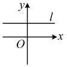
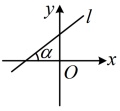
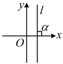
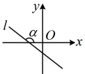
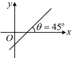
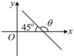
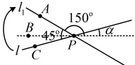

## 第二章 直线和圆的方程

# 2.1 直线的倾斜角与斜率

习题：P1

知识梳理

## 知识点 1：直线的倾斜角

### 1. 直线的方向

在平面直角坐标系中，我们规定水平直线的方向向右，其他直线向上的方向为这条直线的方向。这些直线相对 x 轴的倾斜程度不同，也就是它们与 x 轴所成的角不同，所以我们可以利用直线与 x 轴所成的角来表示直线的方向。

### 2. 倾斜角的概念

当直线 l 与 x 轴相交时，我们以 x 轴为基准，x 轴正向与直线 l 向上的方向之间所成的角  $ \alpha $ 叫做直线 l 的倾斜角.

### 3. 倾斜角的范围

当直线 $l$ 与 $x$ 轴平行或重合时，我们规定它的倾斜角为 $0^\circ$，所以直线的倾斜角 $\alpha$ 的取值范围为 $0^\circ \leq \alpha < 180^\circ$，具体如下：

注：①可以用倾斜角表示平面直角坐标系中一条直线的倾斜程度，也就表示了直线的方向.

 $$ 90^{\circ}<\alpha<180^{\circ} $$ 

②确定直线位置的几何要素：(i)直线上的两点；(ii)直线上的一个点以及它的倾斜角（方向）.

③不同类型的角的取值范围：

<table border=1 style='margin: auto; word-wrap: break-word;'><tr><td style='text-align: center; word-wrap: break-word;'>直线的倾斜角  $ \alpha_1 $ 的范围</td><td style='text-align: center; word-wrap: break-word;'>$ \{\alpha_1 | 0^\circ \le \alpha_1 &lt; 180^\circ\} $</td></tr><tr><td style='text-align: center; word-wrap: break-word;'>向量夹角  $ \alpha_2 $ 的范围</td><td style='text-align: center; word-wrap: break-word;'>$ \{\alpha_2 | 0^\circ \le \alpha_2 \le 180^\circ\} $</td></tr><tr><td style='text-align: center; word-wrap: break-word;'>异面直线所成角  $ \alpha_3 $ 的范围</td><td style='text-align: center; word-wrap: break-word;'>$ \{\alpha_3 | 0^\circ &lt; \alpha_3 \le 90^\circ\} $</td></tr><tr><td style='text-align: center; word-wrap: break-word;'>直线和平面所成角  $ \alpha_4 $ 的范围</td><td style='text-align: center; word-wrap: break-word;'>$ \{\alpha_4 | 0^\circ \le \alpha_4 \le 90^\circ\} $</td></tr><tr><td style='text-align: center; word-wrap: break-word;'>二面角  $ \alpha_5 $ 的范围</td><td style='text-align: center; word-wrap: break-word;'>$ \{\alpha_5 | 0^\circ \le \alpha_5 \le 180^\circ\} $</td></tr><tr><td style='text-align: center; word-wrap: break-word;'>面面夹角  $ \alpha_6 $ 的范围（不含平行）</td><td style='text-align: center; word-wrap: break-word;'>$ \{\alpha_6 | 0^\circ &lt; \alpha_6 \le 90^\circ\} $</td></tr></table>

## 知识点1

【例 1】已知直线  $ l $ 与  $ x $ 轴的夹角为  $ 45^\circ $，则直线  $ l $ 的倾斜角  $ \theta $ 为___。

解析：直线  $ l $ 与  $ x $ 轴的夹角为  $ 45^\circ $ 有图 1 和图 2 所示的两种情况，

对于图 1， $ \theta = 45^\circ $；

对于图2， $ \theta=180^{\circ}-45^{\circ}=135^{\circ} $

图2

答案： $ 45^{\circ} $ 或  $ 135^{\circ} $

【例2】若直线 $l$ 绕它上面一点 $P$ 按顺时针方向旋转 $45^{\circ}$ 得到直线 $l_{1}$，且直线 $l_{1}$ 的倾斜角为 $150^{\circ}$，那么直线 $l$ 的倾斜角为 ___.

解析：如图，直线 $l$ 的倾斜角 $\alpha = \angle BPC$

$=\angle APC - \angle APB = 45^\circ - \angle APB$

$=45^\circ - (180^\circ - 150^\circ) = 15^\circ$

答案：

 $$ 15^{\circ} $$ 

## 知识点2

【例3】对下面直线的倾斜角和斜率进行转化：

（1） $ \alpha=30^{\circ} $；（2） $ \alpha=\frac{3\pi}{4} $

 $ k = \sqrt{3} $; (4) k = -1.