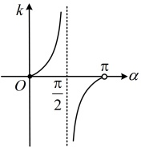
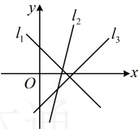

知识点2：直线的斜率

### 1. 斜率的概念

我们把一条直线的倾斜角  $ \alpha (\alpha \neq 90^\circ) $ 的正切值叫做这条直线的斜率。斜率常用小写字母 k 表示，即  $ k = \tan \alpha $。

### 2. 斜率与倾斜角的关系

<table border=1 style='margin: auto; word-wrap: break-word;'><tr><td style='text-align: center; word-wrap: break-word;'>$ \alpha $的大小</td><td style='text-align: center; word-wrap: break-word;'>0</td><td style='text-align: center; word-wrap: break-word;'>$ 0 &lt; \alpha &lt; \frac{\pi}{2} $</td><td style='text-align: center; word-wrap: break-word;'>$ \frac{\pi}{2} $</td><td style='text-align: center; word-wrap: break-word;'>$ \frac{\pi}{2} &lt; \alpha &lt; \pi $</td></tr><tr><td style='text-align: center; word-wrap: break-word;'>斜率的范围</td><td style='text-align: center; word-wrap: break-word;'>0</td><td style='text-align: center; word-wrap: break-word;'>$ (0,+\infty) $</td><td style='text-align: center; word-wrap: break-word;'>/</td><td style='text-align: center; word-wrap: break-word;'>$ (-\infty,0) $</td></tr><tr><td style='text-align: center; word-wrap: break-word;'>斜率的增减性</td><td style='text-align: center; word-wrap: break-word;'>/</td><td style='text-align: center; word-wrap: break-word;'>随 $ \alpha $的增大而增大</td><td style='text-align: center; word-wrap: break-word;'>/</td><td style='text-align: center; word-wrap: break-word;'>随 $ \alpha $的增大而增大</td></tr></table>

注：①每条直线都有唯一的倾斜角，但不是所有直线都有斜率，倾斜角为 $ \frac{\pi}{2} $的直线没有斜率.

②当倾斜角不是 $ \frac{\pi}{2} $时，倾斜角的正切值就是斜率，它们之间是一一对应的关系.因此，确定一条不垂直于x轴的直线，只要知道直线上的一个点和直线的斜率即可.

③当直线的倾斜角由0逐渐增大到 $ \pi $时，其斜率如何变化？

如下图为正切函数  $ k = \tan \alpha $ 在  $ \alpha \in \left[0, \frac{\pi}{2}\right) \cup \left(\frac{\pi}{2}, \pi\right) $ 的图象，当  $ \alpha \in \left[0, \frac{\pi}{2}\right) $ 时，随着  $ \alpha $ 的增大，直线的斜率  $ k \geq 0 $ 且逐渐增大；当  $ \alpha \in \left(\frac{\pi}{2}, \pi\right) $ 时，随着  $ \alpha $ 的增大，直线的斜率  $ k < 0 $ 且逐渐增大。

## 知识点 3：过两点的直线的斜率公式

1. 公式

经过两点  $ P_1(x_1, y_1) $， $ P_2(x_2, y_2)(x_1 \neq x_2) $ 的直线的斜率公解：（1）当  $ \alpha = 30^\circ $ 时， $ \tan \alpha = \frac{\sqrt{3}}{3} $，

所以直线的斜率  $ k = \frac{\sqrt{3}}{3} $。

（2）当  $ \alpha = \frac{3\pi}{4} $ 时， $ \tan \alpha = -1 $，

所以直线的斜率  $ k = -1 $。

（3）设该直线的倾斜角为  $ \alpha $，则  $ \tan \alpha = k = \sqrt{3} $，结合  $ \alpha \in [0, \pi) $ 可得  $ \alpha = \frac{\pi}{3} $。

（4）设该直线的倾斜角为  $ \alpha $，则  $ \tan \alpha = k = -1 $，结合  $ \alpha \in [0, \pi) $ 可得  $ \alpha = \frac{3\pi}{4} $。

【例4】如图所示，直线 $ l_{1} $， $ l_{2} $， $ l_{3} $的斜率分别为 $ k_{1} $， $ k_{2} $， $ k_{3} $，则下列结论正确的是（）

A.  $ k_{1}>k_{2}>k_{3} $ B.  $ k_{2}>k_{3}>k_{1} $

C.  $ k_{2}>k_{1}>k_{3} $ D.  $ k_{3}>k_{2}>k_{1} $

解析：记 $ l_{1} $， $ l_{2} $， $ l_{3} $的倾斜角分别为 $ \alpha_{1} $， $ \alpha_{2} $， $ \alpha_{3} $，则 $ 0^{\circ}<\alpha_{3}<\alpha_{2}<90^{\circ} $， $ 90^{\circ}<\alpha_{1}<180^{\circ} $，所以 $ k_{1}<0 $， $ k_{2}>k_{3}>0 $，故 $ k_{2}>k_{3}>k_{1} $。

答案：B

【例 5】已知直线  $ l $ 的倾斜角  $ \alpha $ 满足  $ \frac{\pi}{3} < \alpha \leq \frac{3\pi}{4} $，则  $ l $ 的斜率  $ k $ 的取值范围是（ ）

A.  $ [-1, \sqrt{3}) $

B.  $ [-\sqrt{3}, 1] $

C.  $ (-\infty, -1] \cup (\sqrt{3}, +\infty) $

D.  $ (-\infty, -\sqrt{3}] \cup (-1, +\infty) $