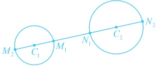
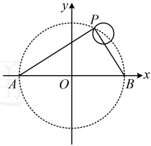
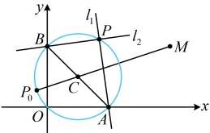

## 补充、拓展

到此，高中数学中与圆有关的知识层面的内容就学完了，但有时我们也会遇到这种情况，题干并没有提及圆，圆是隐含在题设条件或问题中的，这类问题一般称之为隐圆问题，我们通过下面的类型V来给大家作详细的分析。另外，本节我们还会给大家拓展通过设圆系方程来巧妙地解决一些特定问题的方法，请看后面的类型VI。

## 类型V：隐圆问题

【例 8】已知圆  $ C:(x-3)^2+(y-4)^2=1 $ 和两点  $ A(-m,0) $， $ B(m,0)(m>0) $，若圆  $ C $ 上存在点  $ P $，使得  $ \angle APB=90^\circ $，则  $ m $ 的取值范围是___。

解析：若直接到圆  $ C $ 上去找满足  $ \angle APB = 90^\circ $ 的点  $ P $，则较为困难，怎么办呢？由  $ \angle APB = 90^\circ $ 联想到点  $ P $ 在以  $ AB $ 为直径的圆上，下面我们先求该圆的圆心和半径，

 $ \angle APB = 90^\circ \Rightarrow $ 点  $ P $ 在以  $ AB $ 为直径的圆上，该圆的圆心为  $ O $，半径  $ r_1 = m $

圆 C 上存在点 P 使  $ \angle APB = 90^\circ $ 意味着圆 C 上存在点 P 也在圆 O 上，即两圆有交点，故可按圆与圆的位置关系处理，

圆 $C$ 的圆心为 $C(3,4)$，半径 $r_2=1$，所以两圆的圆心距 $|OC|=\sqrt{3^2+4^2}=5$。

由题意，圆 C 和圆 O 有公共点，所以  $ \left|r_{1}-r_{2}\right|\leq\left|OC\right|\leq r_{1}+r_{2} $

故 $ |m-1|\leq5\leq m+1 $，解得： $ 4\leq m\leq6 $。

答案：[4,6]

【反思】本题的  $ \angle APB = 90^{\circ} $ 隐含了点 P 在以 AB 为直径的圆上，发现这一点，是解决问题的关键。隐圆的模型较多，本题的圆隐藏的不深，相对容易发现，我们再来看两个变式。

【变式 1】若直线  $ l_1: x + my - 2 = 0 $ 与  $ l_2: mx - y + 2 = 0 (m \in \mathbb{R}) $ 相交于点  $ P $，点  $ M(4,2) $，则  $ |PM| $ 的最大值为___。

解析：可以想象，若先求交点  $ P $，再分析  $ \left|PM\right| $ 的最大值，则较为麻烦，怎么办呢？观察发现两直线含参，它们可能过定点，故尝试先找定点，再分析图形的变化特征，

由题意，直线 $ l_1 $过定点 $ A(2,0) $，直线 $ l_2 $过定点 $ B(0,2) $，且当 $ m=0 $时， $ l_1:x=2 $， $ l_2:y=2 $，所以 $ l_1 \perp l_2 $当 $ m\neq0 $时， $ l_1:y=-\frac{1}{m}x+\frac{2}{m} $， $ l_2:y=mx+2 $，所以两直线的斜率之积为 $ -\frac{1}{m}\cdot m=-1 $，故 $ l_1 \perp l_2 $，

直线 $ l_{1} $， $ l_{2} $都过定点，它们又始终垂直，由此联想到圆，我们画图来看看，

如图，因为  $ PA \perp PB $，所以点 P 在以 AB 为直径的圆上运动，

该圆的圆心为  $ C(1,1) $，半径  $ r = \frac{1}{2}|AB| = \frac{1}{2}\sqrt{(0-2)^2 + (2-0)^2} = \sqrt{2} $，

由于直线 $ l_1 $不能表示 $ x $轴， $ l_2 $不能表示 $ y $轴，所以点 $ P $的轨迹不包含原点 $ O $，故接下来只需求圆外定点 $ M $到圆上动点 $ P $的距离的最大值，直接套模型即可，由图可知， $ \left|PM\right| \leq \left|CM\right| + r = \sqrt{(4-1)^2 + (2-1)^2} + \sqrt{2} = \sqrt{10} + \sqrt{2} $，

