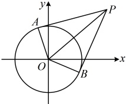

取等条件是 $P$ 与图中 $P_0$（不是原点）重合，所以 $|PM|$ 的最大值为 $\sqrt{10} + \sqrt{2}$

答案： $ \sqrt{10} + \sqrt{2} $

【反思】本题点 P 的轨迹为圆隐藏在了直线  $ l_1 $ 和  $ l_2 $ 的方程中，隐蔽性较强，要发现这一点，需要我们对直线的方程有一定的敏感性。

【变式 2】已知圆  $ O: x^2 + y^2 = 1 $，圆  $ M: (x - a)^2 + (y - a + 4)^2 = 1 $，若圆  $ M $ 上存在点  $ P $，过点  $ P $ 作圆  $ O $ 的两条切线，切点为  $ A $， $ B $，且  $ \angle APB = 60^\circ $，则  $ a $ 的取值范围为___。

解析：与前两题不同，这里  $ \angle APB $ 不再是  $ 90^\circ $ 了，但仍是定角，如何研究  $ P $ 的轨迹？注意到  $ PA, PB $ 是圆的切线，故  $ \angle APB $ 的大小会影响  $ PO $ 的长，于是考虑用  $ \angle APB = 60^\circ $ 来求  $ \left|PO\right| $，

如图， $ \angle APB = 60^\circ \Rightarrow \angle APO = 30^\circ $，所以  $ \left|OP\right| = 2\left|OA\right| = 2 $，故点  $ P $ 在圆心为  $ O(0,0) $，半径  $ r_1 = 2 $ 的圆  $ x^2 + y^2 = 4 $ 上运动，由题意，圆  $ M $ 的圆心为  $ M(a,a-4) $，半径  $ r_2 = 1 $，

题设条件等价于圆  $ O: x^2 + y^2 = 4 $ 与圆  $ M $ 有交点，所以  $ \left|r_1 - r_2\right| \leq \left|OM\right| \leq r_1 + r_2 $，

又  $ \left|OM\right| = \sqrt{a^2 + (a-4)^2} $， $ \left|r_1 - r_2\right| = \left|2-1\right| = 1 $， $ r_1 + r_2 = 2 + 1 = 3 $，

所以  $ 1 \leq \sqrt{a^2 + (a-4)^2} \leq 3 $，解得： $ 2 - \frac{\sqrt{2}}{2} \leq a \leq 2 + \frac{\sqrt{2}}{2} $。

答案： $ \left[2 - \frac{\sqrt{2}}{2}, 2 + \frac{\sqrt{2}}{2}\right] $

【反思】从上面的三道题可以看出，当一段定长线段所对的角为定值时，角的顶点的运动轨迹是圆，这一模型常被称为“定长对定角”模型，所以在具体的问题中，只要识别出了定长、定角这两个特征，就要联想到圆。

【例 9】在平面直角坐标系 xOy 中，已知  $ M(2,0) $， $ N(0,-1) $，若圆  $ M:(x-2)^2 + y^2 = r^2 (r > 0) $ 上有且仅有一点  $ P $ 满足  $ |PM| = \sqrt{2}|PN| $，则  $ r $ 的值为___。

解析： $ |PM|=\sqrt{2}|PN| $ 怎样翻译？注意到 M，N 都是定点，故只需设 P 的坐标，就能直接用它建立关于所设坐标的方程，找到点 P 的轨迹，设  $ P(x,y) $，则由  $ \left|PM\right|=\sqrt{2}\left|PN\right| $ 得  $ \sqrt{(2-x)^2+(0-y)^2}=\sqrt{2}\cdot\sqrt{(0-x)^2+(-1-y)^2} $，化简得： $ (x+2)^2+(y+2)^2=10 $，所以满足  $ \left|PM\right|=\sqrt{2}\left|PN\right| $ 的点 P 在圆心为  $ T(-2,-2) $，半径  $ r'=\sqrt{10} $ 的圆上，因为圆 M 上有且仅有一点 P 满足  $ \left|PM\right|=\sqrt{2}\left|PN\right| $，所以圆 M 与圆 T 有且仅有一个公共点，即两圆外切或内切，故  $ \left|MT\right|=r+r' $ 或  $ \left|MT\right|=\left|r-r'\right| $，由题意， $ M(2,0) $，所以  $ \left|MT\right|=\sqrt{(-2-2)^2+(-2-0)^2}=2\sqrt{5} $，故  $ 2\sqrt{5}=\left|r-\sqrt{10}\right| $ 或  $ 2\sqrt{5}=r+\sqrt{10} $，解得： $ r=2\sqrt{5}+\sqrt{10} $ 或  $ 2\sqrt{5}-\sqrt{10} $。

答案： $ 2\sqrt{5}+\sqrt{10} $ 或  $ 2\sqrt{5}-\sqrt{10} $

【反思】本题的条件 $ \left|PM\right|=\sqrt{2}\left|PN\right| $隐含了点 $ P $的轨迹是圆，一般地，设 $ M $， $ N $是平面上的两个定点，则平面上满足 $ \left|PM\right|=\lambda\left|PN\right|(\lambda>0,\lambda\neq1) $的点 $ P $的轨迹都是圆，该圆常被称为“阿氏圆”。本题的 $ \left|PM\right|=\sqrt{2}\left|PN\right| $是直接给出的，有时这类条件会给得更隐蔽一些，我们来看一个变式。

【变式】在$\triangle ABC$中，内角$A$，$B$，$C$的对边分别为$a$，$b$，$c$，若$b=2$，$a=2c$，则$\triangle ABC$的面积的最大值为___.

解法1：如何表示  $ S_{\triangle ABC} $？条件涉及三边，可考虑先用余弦定理推论求角，再用角求  $ S_{\triangle ABC} $，

由余弦定理推论， $ \cos B = \frac{a^2 + c^2 - b^2}{2ac} = \frac{(2c)^2 + c^2 - b^2}{2 \times 2c \times c} = \frac{5c^2 - 4}{4c^2} $，所以  $ \sin B = \sqrt{1 - \cos^2 B} = \sqrt{1 - \left(\frac{5c^2 - 4}{4c^2}\right)^2} $