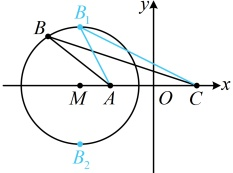

故  $ S_{\triangle ABC} = \frac{1}{2}ac\sin B = \frac{1}{2} \times 2c \times c \times \sqrt{1 - \left(\frac{5c^2 - 4}{4c^2}\right)^2} = \sqrt{c^4 - \frac{(5c^2 - 4)^2}{16}} = \sqrt{\frac{-9c^4 + 40c^2 - 16}{16}} $

 $ = \frac{\sqrt{-9\left(c^2 - \frac{20}{9}\right)^2 + \frac{256}{9}}}{4} \leq \frac{4}{3} $，取等条件是  $ c^2 = \frac{20}{9} $，即  $ c = \frac{2\sqrt{5}}{3} $，所以  $ \triangle ABC $ 的面积的最大值为  $ \frac{4}{3} $。

解法 2：已知  $ b $，又有  $ a $， $ c $ 的倍数关系，可考虑将  $ A $， $ C $ 两点固定，建立平面直角坐标系，研究  $ B $ 的轨迹，有了该轨迹，分析  $ S_{\triangle ABC} $ 的最大值就方便了，

以  $ AC $ 中点  $ O $ 为原点建立如图所示的平面直角坐标系，则  $ A(-1,0) $， $ C(1,0) $，

设  $ B(x,y) $， $ y \neq 0 $，由题意， $ a = 2c $，所以  $ |BC| = 2|AB| $，

故  $ \sqrt{(1-x)^2 + (0-y)^2} = 2\sqrt{[x-(-1)]^2 + (y-0)^2} $，化简得： $ \left(x + \frac{5}{3}\right)^2 + y^2 = \frac{16}{9} $，

所以点  $ B $ 在圆心为  $ M\left(-\frac{5}{3},0\right) $，半径  $ r = \frac{4}{3} $ 的圆上运动（不含该圆与  $ x $ 轴的交点），

可以看到， $ \triangle ABC $ 的底边  $ AC $ 不变，那么高最大时， $ S_{\triangle ABC} $ 也最大，显然当  $ B $ 与  $ M $ 正上方的  $ B_1 $ 或正下方的  $ B_2 $ 重合时，高最大，如图， $ \triangle ABC $ 的边  $ AC $ 上的高  $ h_{\max} = r = \frac{4}{3} $，所以  $ (S_{\triangle ABC})_{\max} = \frac{1}{2} \times |AC| \times h_{\max} = \frac{1}{2} \times 2 \times \frac{4}{3} = \frac{4}{3} $。

答案： $ \frac{4}{3} $

【反思】可以看到，只要建立起坐标系，条件中的 $a=2c$ 就和例 9 的 $|PM|=\sqrt{2}|PN|$ 类似了，它们都隐含了动点的轨迹为圆，但本题以解三角形的外壳来包装，更具隐蔽性。

## 类型VI：两类圆系方程的应用

【例 10】设直线  $ l: 2x + y + 4 = 0 $ 与圆  $ C: x^2 + y^2 + 2x - 4y + 1 = 0 $ 交于  $ P $， $ Q $ 两点，圆  $ M $ 过  $ P $， $ Q $ 两点，则当圆  $ M $ 半径最小时，圆  $ M $ 的方程为___。

解法1：如图1，可以想象，若圆经过P，Q两点，则圆的直径不小于$|PQ|$，于是所求半径最小的圆就是以$PQ$为直径的圆，怎样求该圆的方程？可先用圆的弦长公式$L=2\sqrt{r^2-d^2}$求$|PQ|$，得到所求圆的半径，$x^2+y^2+2x-4y+1=0\Leftrightarrow(x+1)^2+(y-2)^2=4$，所以圆C的圆心为$C(-1,2)$，半径$r=2$，圆心C到直线l的距离$d=\frac{|2\times(-1)+2+4|}{\sqrt{2^2+1^2}}=\frac{4}{\sqrt{5}}$，所以$|PQ|=2\sqrt{r^2-d^2}=2\sqrt{2^2-\left(\frac{4}{\sqrt{5}}\right)^2}=\frac{4}{\sqrt{5}}$，

故所求圆  $ M $ 的半径  $ r' = \frac{1}{2}|PQ| = \frac{2}{\sqrt{5}} $，有了半径，还差圆心，如图2，圆心  $ M $ 为  $ PQ $ 中点，它也是直线  $ l $ 与  $ PQ $ 中垂线  $ l' $ 的交点。故可通过求出  $ l' $ 的方程。与直线  $ l $ 联立来求圆心  $ M $ 的坐标。

如图2，线段  $ PQ $ 的中垂线即  $ l' $ 为过点  $ C $ 且与  $ l $ 垂直的直线，因为直线  $ l $ 的斜率为 -2，所以  $ l' $ 的斜率为  $ \frac{1}{2} $，故  $ l' $ 的方程为  $ y - 2 = \frac{1}{2}[x - (-1)] $，即  $ x - 2y + 5 = 0 $，联立  $ \begin{cases} x - 2y + 5 = 0 \\ 2x + y + 4 = 0 \end{cases} $ 解得： $ x = -\frac{13}{5} $， $ y = \frac{6}{5} $，所以  $ PQ $ 中点为  $ M\left(-\frac{13}{5}, \frac{6}{5}\right) $，故当圆  $ M $ 半径最小时，圆  $ M $ 的方程为  $ \left(x + \frac{13}{5}\right)^2 + \left(y - \frac{6}{5}\right)^2 = \frac{4}{5} $。