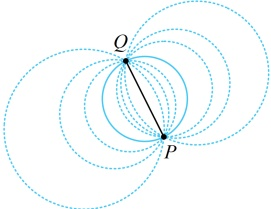
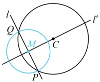
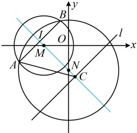

图1

图2

解法2：当所求圆经过直线与另一圆的两个交点时，也可统一设圆系方程，怎么设？还记得前面小节的过两直线 $ A_{1}x+B_{1}y+C_{1}=0 $和 $ A_{2}x+B_{2}y+C_{2}=0 $交点的直线系方程的设法吗？当时我们设的是 $ A_{1}x+B_{1}y+C_{1}+\lambda(A_{2}x+B_{2}y+C_{2})=0 $，类似的，这里也可设圆系方程为 $ x^{2}+y^{2}+2x-4y+1+\lambda(2x+y+4)=0 $①，为什么呢？可以这么来看，一方面，方程①整理后，可以化为 $ x^{2}+y^{2}+Dx+Ey+F=0 $的形式，它能表示圆；另一方面，P，Q是直线l与圆C的交点，它们的坐标必定同时满足 $ x^{2}+y^{2}+2x-4y+1=0 $和 $ 2x+y+4=0 $，也就满足方程①，即方程①表示的圆必过P，Q两点，所以可以将经过P，Q两点的圆的方程设为方程①，

由题意，经过直线 l 与圆 C 的交点 P，O 的圆系方程为  $ x^{2} + y^{2} + 2x - 4y + 1 + \lambda(2x + y + 4) = 0 $，

整理得： $ x^2 + y^2 + (2\lambda + 2)x + (\lambda - 4)y + 4\lambda + 1 = 0 $，配方得： $ (x + \lambda + 1)^2 + \left(y + \frac{\lambda - 4}{2}\right)^2 = \frac{5\left(\lambda - \frac{8}{5}\right)^2 + \frac{16}{5}}{4} $ ②，

要使圆  $ M $ 的半径最小，应有  $ \lambda = \frac{8}{5} $，代入②整理得： $ \left(x + \frac{13}{5}\right)^2 + \left(y - \frac{6}{5}\right)^2 = \frac{4}{5} $。

答案： $ \left(x+\frac{13}{5}\right)^{2}+\left(y-\frac{6}{5}\right)^{2}=\frac{4}{5} $

【反思】当所求的圆经过直线  $ Ax + By + C = 0 $ 与圆  $ x^2 + y^2 + Dx + Ey + F = 0 $ 的交点  $ P $,  $ Q $ 时，可设经过  $ P $,  $ Q $ 两点的圆系方程为  $ x^2 + y^2 + Dx + Ey + F + \lambda(Ax + By + C) = 0 $，再用其它条件求出  $ \lambda $，从而得到所求圆的方程。

【变式】已知圆 C 经过圆  $ M: x^2 + y^2 + 6x - 4 = 0 $ 与圆  $ N: x^2 + y^2 + 6y - 28 = 0 $ 的交点 A, B，且圆心 C 在直线  $ l: x - y - 4 = 0 $ 上，则圆 C 的方程为___。

解法 1： $ x^2 + y^2 + 6x - 4 = 0 \Leftrightarrow (x + 3)^2 + y^2 = 13 $，所以圆  $ M $ 的圆心为  $ M(-3,0) $，半径  $ r_1 = \sqrt{13} $，

 $ x^2 + y^2 + 6y - 28 = 0 \Leftrightarrow x^2 + (y + 3)^2 = 37 $，所以圆  $ N $ 的圆心为  $ N(0, -3) $，半径  $ r_2 = \sqrt{37} $，

如图，所求的圆 C 经过圆 M 与圆 N 的交点 A，B，则 AB 是圆 C 的一条弦，圆心 C 在弦 AB 的中垂线上，由图不难发现 AB 的中垂线就是直线 MN，故先求直线 MN，再与直线 l 的方程联立，可求出圆心 C 的坐标， $ k_{MN} = \frac{-3 - 0}{0 - (-3)} = -1 $，所以直线 MN 的方程为 y = -x - 3，

联立 $ \left\{\begin{aligned}y&=-x-3\\ x-y-4&=0\end{aligned}\right. $ 解得： $ x=\frac{1}{2} $， $ y=-\frac{7}{2} $，所以 $ C\left(\frac{1}{2},-\frac{7}{2}\right) $，

有了圆心，还差半径，半径即为  $ |CA| $ 或  $ |CB| $，怎样求  $ |CA| $？可到  $ \triangle AIC $ 中用勾股定理计算（I 为 AB 中点），下面先求圆 M 和圆 N 的公共弦 AB 的长，可先用两圆的方程作差，求出直线 AB 的方程，再按直线被圆截得的弦长计算，

 $ x^2 + y^2 + 6x - 4 - (x^2 + y^2 + 6y - 28) = 0 $ 整理得直线  $ AB $ 的

所以  $ M $ 到直线  $ AB $ 的距离  $ d = \frac{|-3 - 0 + 4|}{\sqrt{1^2 + (-1)^2}} = \frac{\sqrt{2}}{2} $，所以  $ |AB| = 2\sqrt{r_1^2 - d^2} = 2\sqrt{(\sqrt{13})^2 - \left(\frac{\sqrt{2}}{2}\right)^2} = 5\sqrt{2} $，

