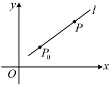
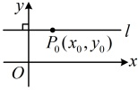
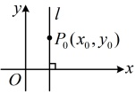

### 2.2 直线的方程

习题：P1

## 知识梳理

## 知识点 1：直线的点斜式方程

### 1. 直线的点斜式方程的定义

如图，直线 $l$ 经过点 $P_0(x_0, y_0)$，且斜率为 $k$。设 $P(x, y)$ 是直线 $l$ 上不同于 $P_0$ 的任意一点，因为直线 $l$ 的斜率为 $k$，由斜率公式得 $k = \frac{y - y_0}{x - x_0}$，即 $y - y_0 = k(x - x_0)$。

方程  $ y - y_{0} = k(x - x_{0}) $ 由直线上一个定点  $ (x_{0}, y_{0}) $ 及该直线的斜率 k 确定，我们把它叫做直线的点斜式方程，简称点斜式.

注：①已知直线上一点的坐标与直线的斜率，就可以将该直线用点斜式方程表示；反之，由点斜式方程 $ y-y_{0}=k(x-x_{0}) $可观察到直线过点 $ (x_{0},y_{0}) $，直线的斜率为k.

②由于倾斜角为 $ 90^{\circ} $时直线斜率不存在，因此点斜式方程不能表示垂直于x轴的直线方程.

### 2. 垂直于坐标轴的直线方程

<table border=1 style='margin: auto; word-wrap: break-word;'><tr><td style='text-align: center; word-wrap: break-word;'>倾斜角</td><td style='text-align: center; word-wrap: break-word;'>图形特征</td><td style='text-align: center; word-wrap: break-word;'>斜率</td><td style='text-align: center; word-wrap: break-word;'>直线方程</td></tr><tr><td style='text-align: center; word-wrap: break-word;'>0°</td><td style='text-align: center; word-wrap: break-word;'></td><td style='text-align: center; word-wrap: break-word;'>0</td><td style='text-align: center; word-wrap: break-word;'>$ y = y_0 $</td></tr><tr><td style='text-align: center; word-wrap: break-word;'>90°</td><td style='text-align: center; word-wrap: break-word;'></td><td style='text-align: center; word-wrap: break-word;'>不存在</td><td style='text-align: center; word-wrap: break-word;'>$ x = x_0 $</td></tr></table>

### 3. 直线的斜截式方程

我们把直线 l 与 y 轴的交点  $ (0,b) $ 的纵坐标 b 叫做直线 l 在 y 轴上的截距，这样，方程  $ y=kx+b $ 由直线的斜率 k

## 知识点1

【例1】经过点 $ (1,\sqrt{3}) $且倾斜角为 $ 60^{\circ} $

的直线的点斜式方程为___.

解析：所求直线的斜率  $ k = \tan 60^\circ = \sqrt{3} $，

又所求直线过点  $ (1, \sqrt{3}) $，所以直线的点斜式

方程为  $ y - \sqrt{3} = \sqrt{3}(x - 1) $.

答案： $ y - \sqrt{3} = \sqrt{3}(x - 1) $

【例2】（多选）在平面直角坐标系中，

下列四个结论中正确的是（ ）

A. 每一条直线都有点斜式方程

B. 过原点的直线没有点斜式方程

C. 直线  $ y+1=k(x-2) $ 恒过点  $ (2,-1) $

D. 过点  $ P_0(x_0, y_0) $ 且倾斜角为  $ 90^\circ $ 的直线方程为  $ x=x_0 $

解析：A 项，点斜式方程不能表示斜率不存在的直线，故 A 项错误；

B 项，当直线过原点，且斜率为 k 时，

直线的点斜式方程为  $ y - 0 = k(x - 0) $，

所以过原点的直线可能存在点斜式方程，

故 B 项错误；

C 项， $ y + 1 = k(x - 2) \Leftrightarrow y - (-1) = k(x - 2) $，

直线斜率为 k 且过点  $ (2, -1) $，故 C 项正确；

D 项，当倾斜角为  $ 90^\circ $ 时，该直线的方程为

 $ x = x_0 $，故 D 项正确。

答案：CD

【例 3】若直线的倾斜角为 $ 135^{\circ} $且过点 $ (0,-2) $，则该直线的方程为___。

解析：因为直线过点 $ (0,-2) $，所以该直线的纵截距为-2，又因为倾斜角为 $ 135^{\circ} $，

所以斜率 $ k=\tan135^{\circ}=-1 $，故该直线的斜截式方程为 $ y=-1\cdot x-2 $，即 $ y=-x-2 $。

答案： $ y=-x-2 $