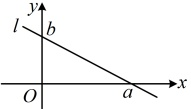

与它在 y 轴上的截距 b 确定，我们把方程  $ y = kx + b $ 叫做直线的斜截式方程，简称斜截式.

注：①直线的斜截式方程可看成点斜式方程在  $ x_{0}=0 $ 时的特殊情况，所以和点斜式方程一样，斜截式方程也不能表示垂直于 x 轴的直线.

②注意，截距不是距离，而是一个实数。截距可正，可负，也可以为0。当直线$l$与$y$轴正半轴相交时，截距$b>0$；当直线$l$与$y$轴负半轴相交时，截距$b<0$；当直线$l$经过原点时，截距$b=0$；当直线$l$与$y$轴平行或重合时，直线$l$在$y$轴上没有截距。

## 知识点 2：直线的两点式方程

### 1. 直线的两点式方程的定义

 $ \frac{y-y_{1}}{y_{2}-y_{1}}=\frac{x-x_{1}}{x_{2}-x_{1}} $ 就是经过两点  $ P_{1}(x_{1},y_{1}) $， $ P_{2}(x_{2},y_{2}) $ （其中  $ x_{1}\neq x_{2} $， $ y_{1}\neq y_{2} $）的直线的方程，我们把它叫做直线的两点式方程，简称两点式.

注：当  $ x_1 = x_2 $ 时， $ P_1P_2 \perp x $ 轴，直线的方程为  $ x - x_1 = 0 $；当  $ y_1 = y_2 $ 时， $ P_1P_2 \perp y $ 轴，直线的方程为  $ y - y_1 = 0 $。因此两点式方程不能表示垂直于坐标轴的直线。

### 2. 直线的截距式方程

方程 $ \frac{x}{a}+\frac{y}{b}=1 $由直线l在两条坐标轴上的截距a与b确定，我们把方程 $ \frac{x}{a}+\frac{y}{b}=1 $叫做直线的截距式方程，简称截距式.

注：①截距式方程可看成是两点式中取直线上的 $ (a,0) $与 $ (0,b) $两点得到的，其中a称为直线的横截距，b称为直线的纵截距.

②由于两个截距都在方程中作为分母，所以它们必须都存在且不为0，故截距式方程不能表示垂直于坐标轴或经过原点的直线.

【例 4】求过下列两点的直线的方程.

（1） $ A(2,5) $， $ B(-3,-2) $;

（2） $ C(0,3) $， $ D(3,1) $.

解：（1）由题意，所求直线的两点式方程为 $ \frac{y-5}{-2-5}=\frac{x-2}{-3-2} $，整理得： $ 7x-5y+11=0 $。

（2）由题意，所求直线的两点式方程为 $ \frac{y-3}{1-3}=\frac{x-0}{3-0} $，整理得： $ 2x+3y-9=0 $。

【例 5】若直线  $ l: \frac{x}{2} - \frac{y}{3} = -1 $，则  $ l $ 的横截距为___，纵截距为___。

解析：将所给方程化为截距式方程，就能看出横截距和纵截距，

由  $ \frac{x}{2} - \frac{y}{3} = -1 $ 可得  $ \frac{x}{-2} + \frac{y}{3} = 1 $，

所以  $ l $ 的横截距为 -2，纵截距为 3。

答案：-2，3

【例6】（多选）直线 $ l:\frac{x}{a}+\frac{y}{b}=1 $中，已知a>0，b>0。若l与坐标轴围成的三角形的面积不小于10，则实数对 $ (a,b) $可以是（ ）

A.  $ (3,8) $ B.  $ (1,9) $

C.  $ (7,4) $ D.  $ (5,3) $

解析：a，b 分别是直线 l 的横、纵截距，

如图，因为 a, b > 0，所以 l 与坐标轴围成

的三角形面积  $ S = \frac{1}{2}ab \geq 10 $，故  $ ab \geq 20 $，

 $ 3 \times 8 = 24 > 20 $， $ 1 \times 9 = 9 < 20 $，

 $ 7 \times 4 = 28 > 20 $， $ 5 \times 3 = 15 < 20 $，

所以选项 A、C 正确。

答案：AC