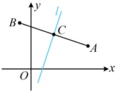

复杂，我们可根据自己的习惯，任选一种来判断，本书后续内容将采用斜截式来判断。

# 本节核心题型

本节的核心知识是直线的五种方程，为此，我们先设计了三组题，分别巩固同学们对直线的点斜式和斜截式方程（类型Ⅰ）、直线的两点式和截距式方程（类型Ⅱ）、直线的一般式方程（类型Ⅲ）有关概念的理解，又设计了类型Ⅳ来针对给出直线方程，利用直线的平行、垂直求参这类题。请同学们跟着例题和反思，去学习这些内容吧。

## 类型 I：直线的点斜式和斜截式方程

【例 9】直线  $ l $ 过点  $ (-1,2) $，且与直线  $ l': 2x - 3y + 9 = 0 $ 垂直，则  $ l $ 的方程为___。

解析：已有一点，只要再找到斜率，就能用点斜式写出直线 $l$ 的方程，怎样求斜率？可由 $l \perp l'$ 来求，

直线 $l'$ 的方程可化为 $y = \frac{2}{3}x + 3$，所以 $l'$ 的斜率为 $\frac{2}{3}$，设直线 $l$ 的斜率为 $k$，由 $l \perp l'$ 可得 $k \cdot \frac{2}{3} = -1 \Rightarrow k = -\frac{3}{2}$，

所以直线 $l$ 的方程为 $y - 2 = -\frac{3}{2}[x - (-1)]$，化简得：$y = -\frac{3}{2}x + \frac{1}{2}$。

答案： $ y = -\frac{3}{2}x + \frac{1}{2} $

【反思】由直线上一点和直线的斜率可写出其点斜式方程，所以求直线方程时，我们常根据已知条件寻找这两个要素，找到后，可先写出点斜式方程，但最终结果习惯于化为斜截式或一般式方程，我们来看两个变式.

【变式1】已知直线  $ l $ 过点  $ (0,5) $，且与直线  $ y = 2x $ 平行，则直线  $ l $ 的方程为（ ）

A.  $ y = 2x - 10 $      B.  $ y = -\frac{1}{2}x + 5 $      C.  $ y = 2x + 5 $      D.  $ y = 2x - 5 $

解析：因为直线 $l$ 与直线 $y=2x$ 平行，所以它们的斜率相等，故直线 $l$ 的斜率为 2，又因为直线 $l$ 过点 $(0,5)$，所以直线 $l$ 的斜截式方程为 $y=2x+5$。

答案：C

【变式2】已知 $ A(5,2) $， $ B(-1,4) $，则线段AB的垂直平分线l的方程为___。

设 $AB$ 中点为 $C(x_C, y_C)$，因为 $A(5,2)$，$B(-1,4)$，所以 $x_C = \frac{5 + (-1)}{2} = 2$，$y_C = \frac{2 + 4}{2} = 3$，故 $C(2,3)$，还差 $l$ 的斜率，注意到 $l \perp AB$，故可由 $AB$ 的斜率求 $l$ 的斜率，

由题意， $ k_{AB}=\frac{4-2}{-1-5}=-\frac{1}{3} $，设  $ l $ 的斜率为  $ k $，由  $ l \perp AB $ 得  $ k\cdot\left(-\frac{1}{3}\right)=-1 \Rightarrow k=3 $，

所以线段 AB 的垂直平分线 l 的方程为  $ y-3=3(x-2) $，整理得： y=3x-3.

答案： $ y=3x-3 $

【例 10】经过点(0,1)，且以 $ \overrightarrow{d}=(2,5) $为一个方向向量的直线 $ l $的斜截式方程为___.

解析：要求斜截式方程，需要斜率和在y轴上的截距，前者可由方向向量求得，后者可由l所过的点得到，