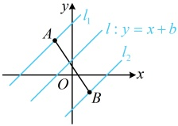

由题意，直线  $ l $ 的一个方向向量是  $ \vec{d} = (2,5) $，所以其斜率  $ k = \frac{5}{2} $，

又因为直线  $ l $ 过点  $ (0,1) $，所以  $ l $ 在  $ y $ 轴上的截距为 1，故其斜截式方程为  $ y = \frac{5}{2}x + 1 $。

答案： $ y=\frac{5}{2}x+1 $

【反思】由直线的斜率和在 y 轴上的截距（纵截距）可写出直线的斜截式方程，故当由已知条件容易获得这两个要素时，也可直接由斜截式写出直线的方程。需注意，直线在 y 轴上的截距指的是直线与 y 轴交点的纵坐标，截距不是距离，它可正可负，也可以为 0，我们来看一个关于纵截距的变式。

【变式】设点  $ A(-1,2) $， $ B(1,-1) $，若直线  $ l: y = x + b $ 与线段 AB 相交，则 b 的取值范围是 ___.

解析：直线 y = x + b 斜率不变，所以改变 b，相当于对该直线进行上下平移，图形的运动过程比较清晰，故可考虑画出图形，分析该直线与线段 AB 相交的临界状态，

，之间运动时，直线 l 与线段 AB 相交，

如图，当且仅当直线 $ l $在 $ l_1 $与 $ l_2 $之间运动时，直线 $ l $与线段 $ AB $相交，注意到 $ b $是 $ l $在 $ y $轴上的截距，故只需求出 $ l_1 $和 $ l_2 $在 $ y $轴上的截距，怎么求？ $ l_1 $， $ l_2 $分别是 $ l $过 $ A $， $ B $的情况，故将 $ A $， $ B $的坐标分别代入 $ l $的方程，即可求得对应的 $ b $，将 $ A(-1,2) $代入 $ y = x + b $得 $ 2 = -1 + b \Rightarrow b = 3 $，将 $ B(1,-1) $代入 $ y = x + b $得 $ -1 = 1 + b \Rightarrow b = -2 $，所以 $ b $的取值范围是 $ [-2,3] $。

答案： $ [-2,3] $

## 类型Ⅱ：直线的两点式和截距式方程

【例 11】已知点  $ A(3,2) $， $ B(-1,4) $，则经过点  $ C(2,5) $ 和线段 AB 中点的直线的方程为（）

A.  $ 2x+y-1=0 $ B. 2x-y-1=0 C.  $ 2x-y+1=0 $ D.  $ 2x+y+1=0 $

解法1：线段$AB$中点坐标容易求得，结合点$C$，就知道所求直线上的两点坐标了，可先写出两点式方程，再化为一般式，设线段$AB$的中点为$D(x_D,y_D)$，则$x_D=\frac{3+(-1)}{2}=1$，$y_D=\frac{2+4}{2}=3$，所以$D(1,3)$，又因为所求直线还过点$C(2,5)$，所以其两点式方程为$\frac{y-3}{5-3}=\frac{x-1}{2-1}$，化为一般式方程得$2x-y+1=0$。

解法2：按解法1求得点D的坐标后，也可结合点C，先求目标直线的斜率，再写出点斜式方程，最后化为一般式，所求直线的斜率 $ k=\frac{5-3}{2-1}=2 $，所以其点斜式方程为 $ y-5=2(x-2) $，化为一般式方程得 $ 2x-y+1=0 $。

答案：C

【反思】已知两点求直线的方程，可以先写出两点式方程，再化为一般式方程；也可以先用这两点求出直线的斜率，结合其中任意一点写出点斜式方程，再化为一般式方程。本题写直线方程需要用到的两点容易获得，若要增加难度，可以让获得这两点的过程变得更复杂，我们来看一个变式。

【变式】已知$\triangle ABC$的顶点$A(5,1)$，$AB$边上的中线$CM$所在直线的方程为$2x - y - 5 = 0$，$AC$边上的高$BH$所在直线的方程为$x - 2y - 5 = 0$，则直线$BC$的方程为（ ）

A. $6x + 5y - 9 = 0$    B. $5x - 6y + 9 = 0$    C. $6x - 5y - 9 = 0$    D. $5x + 6y - 9 = 0$

解析：可以想象，由已知条件直接求 $BC$ 的斜率不易，考虑先求 $B$，$C$ 的坐标，怎么求？注意到 $B$，$C$ 分别在直线 $x-2y-5=0$ 和 $2x-y-5=0$ 上，由此可将 $B$，$C$ 的坐标设为单变量形式，

直线 $BH$ 的方程可化为 $x=2y+5$，所以可设点 $B$ 的纵坐标为 $a$，则其横坐标为 $2a+5$，即 $B(2a+5,a)$，