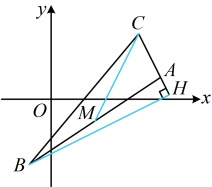

同理，直线  $ CM $ 的方程可化为  $ y = 2x - 5 $，所以可设  $ C(b, 2b - 5) $，

只要能建立两个关于  $ a $,  $ b $ 的方程，就能求出  $ a $ 和  $ b $，如何建立？一方面，由  $ AB $ 中点  $ M $ 在直线  $ CM $ 上可建立一个方程，另一方面，由  $ BH \perp AC $ 可建立一个方程，两个方程就有了，

因为  $ M $ 为  $ AB $ 的中点，所以  $ M $ 的坐标为  $ \left(a + 5, \frac{a + 1}{2}\right) $，代入  $ 2x - y - 5 = 0 $ 得  $ 2(a + 5) - \frac{a + 1}{2} - 5 = 0 \Rightarrow a = -3 $，

又  $ BH \perp AC $，所以  $ k_{BH} k_{AC} = -1 $，直线  $ BH $ 的方程可化为  $ y = \frac{1}{2}x - \frac{5}{2} \Rightarrow k_{BH} = \frac{1}{2} $，

而  $ k_{AC} = \frac{2b - 5 - 1}{b - 5} = \frac{2b - 6}{b - 5} $，代入  $ k_{BH} k_{AC} = -1 $ 得  $ \frac{1}{2} \cdot \frac{2b - 6}{b - 5} = -1 \Rightarrow b = 4 $，

所以  $ B(-1, -3) $， $ C(4, 3) $，故直线  $ BC $ 的两点式方程为  $ \frac{y - (-3)}{3 - (-3)} = \frac{x - (-1)}{4 - (-1)} $，

化为一般式方程得  $ 6x - 5y - 9 = 0 $。

答案：C

【例 12】直线 $l$ 过点 $(-3,1)$，且在两坐标轴上的截距相等，则直线 $l$ 的方程为 ___.

解法1：条件涉及直线在两坐标轴上的截距，可设截距式方程，但别忘了单独考虑两个截距都为0的情形

当直线 $l$ 过原点时，结合 $l$ 也过点 $(-3,1)$ 可得其斜率 $k = \frac{1-0}{-3-0} = -\frac{1}{3}$，所以 $l$ 的方程为 $y-0 = -\frac{1}{3}(x-0)$，

化简得：$x+3y=0$，满足直线 $l$ 在两坐标轴上的截距相等；

当直线 $l$ 不过原点时，因为 $l$ 在两坐标轴上的截距相等，所以可设其方程为 $\frac{x}{a} + \frac{y}{a} = 1 (a \neq 0)$ ①，

又因为 $l$ 过点 $(-3,1)$，所以代入①得 $\frac{-3}{a} + \frac{1}{a} = 1$，解得：$a = -2$，所以 $l$ 的方程为 $\frac{x}{-2} + \frac{y}{-2} = 1$，即 $x + y + 2 = 0$；

综上所述，直线 $l$ 的方程为 $x + 3y = 0$ 或 $x + y + 2 = 0$。

解法2：直观想象可发现，在两坐标轴上截距相等的直线，要么过原点、斜率存在且不为0，要么斜率为-1，故也可按这两种情况讨论，分别求直线$l$的方程，

当直线$l$过原点时，其斜率为$\frac{1-0}{-3-0}=-\frac{1}{3}$，所以$l$的方程为$y-0=-\frac{1}{3}(x-0)$，即$x+3y=0$；

当直线$l$斜率为-1时，结合$l$过点$(-3,1)$可得其方程为$y-1=-1\cdot[x-(-3)]$，即$x+y+2=0$；

综上所述，直线$l$的方程为$x+3y-0$或$x+y+2=0$。

综上所述，直线 l 的方程为  $ x + 3y = 0 $ 或  $ x + y + 2 = 0 $.

答案： $ x+3y=0 $ 或  $ x+y+2=0 $

【反思】①当条件涉及直线在两条坐标轴上的截距时，常考虑设直线的截距式方程处理，但别忘了单独考虑截距为0的情况，此时直线不存在截距式方程；②在两条坐标轴上截距相等的直线有两种：(i)过原点的直线（例如本题的 $ x+3y=0 $）；(ii)斜率为-1的直线（例如本题的 $ x+y+2=0 $）；③关于截距，除了本题的在两坐标轴上的截距相等之外，条件的形式可以多种多样，我们来看一个变式。

【变式】已知直线 l 过点  $ P(-1,2) $.

（1）若 l 不过原点，且在两坐标轴上的截距之和为 0，求 l 的方程；

（2）设  $ l $ 的斜率  $ k > 0 $， $ l $ 与两坐标轴的交点分别为  $ A $， $ B $，当  $ \triangle AOB $ 的面积最小时，求  $ l $ 的方程。

解：（1）（不过原点意味着截距不为 0，可考虑设直线  $ l $ 的截距式方程处理）

解：（1）（不过原点意味着截距不为0，可考虑设直线 $ l $的截距式方程处理）

因为直线 $ l $不过原点，且在两坐标轴上的截距之和为0，所以可设 $ l $的方程为 $ \frac{x}{a} + \frac{y}{-a} = l(a \neq 0) $ ①，

又因为 $ l $过点 $ P(-1,2) $，所以代入①得 $ \frac{-1}{a} + \frac{2}{-a} = 1 $，解得： $ a = -3 $，故 $ l $的方程为 $ \frac{x}{-3} + \frac{y}{3} = 1 $，即 $ x - y + 3 = 0 $。（2）（有点 $ P $的坐标和斜率）可穿山青龙线上斜率之和中距离

（2）（有点P的坐标和斜率k，可写出直线l的点斜式方程）由题意，l的方程为 $ y-2=k(x+1)(k>0) $②，