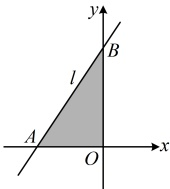

（如图，要计算  $ S_{\triangle OAB} $，需要 OA，OB 的长，这两段长可由直线 l 在两坐标轴上的截距求得，故先求截距）在②中令 x=0 得  $ y=k+2 $，所以  $ B(0,k+2) $，故  $ |OB|=k+2 $，

在②中令 $y=0$ 得 $x=-\frac{2}{k}-1$，所以 $A\left(-\frac{2}{k}-1,0\right)$，故 $|OA|=\left|-\frac{2}{k}-1\right|=\frac{2}{k}+1=\frac{k+2}{k}$，

所以 $S_{\triangle OAB}=\frac{1}{2}|OA|\cdot|OB|=\frac{1}{2}\times\frac{k+2}{k}\times(k+2)=\frac{k^{2}+4k+4}{2k}=\frac{1}{2}\left(k+\frac{4}{k}+4\right)$

$\geq\frac{1}{2}\left(2\sqrt{k\cdot\frac{4}{k}}+4\right)=4$，取等条件是 $k=\frac{4}{k}$，即 $k=2$，

所以当 $\triangle OAB$ 的面积最小时，直线 $l$ 的方程为 $y=2-2(x+1)$，即 $y=2x+4$

所以当 $ \triangle OAB $的面积最小时，直线 $ l $的方程为 $ y-2=2(x+1) $，即 $ y=2x+4 $。

【反思】求直线在x轴上的截距，只需在其方程中令y=0，解出x，即为直线在x轴上的截距；类似的，求直线在y轴上的截距，只需在其方程中令x=0，求出y，即为直线在y轴上的截距.

## 类型III：直线的一般式方程

【例 13】过点 $ \left(1,\frac{5}{2}\right) $且与直线 $ l:x+3y-6=0 $垂直的直线 $ l' $的一般式方程为___.

解析：涉及直线垂直，可先由已知直线  $ l $ 的斜率求目标直线的斜率，

设所求直线  $ l' $ 的斜率为  $ k $，直线  $ l $ 的方程可化为  $ y = -\frac{1}{3}x + 2 $，所以其斜率为  $ -\frac{1}{3} $，

由题意， $ l' \perp l $，所以  $ k \cdot \left(-\frac{1}{3}\right) = -1 $，故  $ k = 3 $，

有了斜率，结合过点  $ \left(1, \frac{5}{2}\right) $，可先写出  $ l' $ 的点斜式方程，再化为一般式方程，

又因为 $ l'' $过点 $ \left(1,\frac{5}{2}\right) $，所以其点斜式方程为 $ y-\frac{5}{2}=3(x-1) $，化为一般式方程得 $ 6x-2y-1=0 $。

答案：6x-2y-1=0

【反思】对于直线的一般式方程，有一些书写的习惯需注意。例如，书写的顺序依次为含x项、含y项、常数项，我们常让x的系数为正（若方程中不含x，则让y的系数为正），且将各系数化为不含分母的形式（例如本题的 $ y-\frac{5}{2}=3(x-1) $可化为 $ 3x-y-\frac{1}{2}=0 $，但为让系数不含分母，我们在等号两边同时乘以2，得到 $ 6x-2y-1=0 $）。直线的一般式方程是用得最多的直线方程之一，在本节其他题目中也常涉及，所以这里只举一道例题。

## 类型IV：由直线的平行、垂直求参

【例 14】已知直线  $ l_{1} $: (m-2)x - 3y - 1 = 0， $ l_{2} $: mx + (m+2)y + 1 = 0，则 “m = -4” 是 “直线  $ l_{1} \parallel l_{2} $” 的（）

A. 充分不必要条件

B. 必要不充分条件

C. 充要条件

D. 既不充分也不必要条件

解析：可先求出  $ l_1 \parallel l_2 $ 的充要条件，再判断选项，怎么求？观察发现  $ l_1 $ 的斜率一定存在，故可由两直线斜率相等建立方程，求出  $ m $，直线  $ l_1 $ 的方程可化为  $ y = \frac{m-2}{3}x - \frac{1}{3} $，所以其斜率  $ k_1 = \frac{m-2}{3} $，

从而要使  $ l_1 \parallel l_2 $，则  $ l_2 $ 的斜率  $ k_2 $ 必须存在，且  $ k_1 = k_2 $，故  $ m + 2 \ne 0 \Rightarrow m \ne -2 $，

此时  $ l_2 $ 的方程可化为  $ y = -\frac{m}{m+2}x - \frac{1}{m+2} $，所以  $ k_2 = -\frac{m}{m+2} $，故  $ k_1 = k_2 $ 即为  $ \frac{m-2}{3} = -\frac{m}{m+2} \Rightarrow m = -4 $ 或 1，