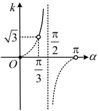
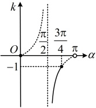

式为  $ k=\frac{y_{2}-y_{1}}{x_{2}-x_{1}} $

注：①从式子结构的角度分析， $ x_{1}=x_{2} $ 时， $ k=\frac{y_{2}-y_{1}}{x_{2}-x_{1}} $ 中的分母为0，故此时直线的斜率不存在；从图形的角度分析，当 $ x_{1}=x_{2} $ 时，直线 $ P_{1}P_{2} $ 与y轴平行，此时倾斜角为 $ 90^{\circ} $，仍可知直线的斜率不存在.

②斜率公式中的 $ P_{1} $， $ P_{2} $是直线上的任意两点，k的值与这两点的位置无关，所以斜率公式中的 $ x_{1} $与 $ x_{2} $， $ y_{1} $与 $ y_{2} $也可以同时交换位置，即 $ k=\frac{y_{2}-y_{1}}{x_{2}-x_{1}}=\frac{y_{1}-y_{2}}{x_{1}-x_{2}} $。

③当  $ y_1 = y_2 $ 且  $ x_1 \ne x_2 $ 时，直线  $ P_1P_2 $ 的斜率  $ k = 0 $，直线倾斜角  $ \alpha = 0^\circ $，直线与 x 轴平行或重合。

### 2. 直线斜率与方向向量的关系

设直线 $l$ 上有两点 $P_1(x_1, y_1)$，$P_2(x_2, y_2)$，直线 $l$ 上的向量 $\overrightarrow{P_1P_2}$ 以及与它平行的非零向量都是 $l$ 的方向向量，所以直线 $l$ 的一个方向向量为 $\overrightarrow{P_1P_2} = (x_2 - x_1, y_2 - y_1)$，当直线 $l$ 与 $x$ 轴不垂直时，$a = \frac{1}{x_2 - x_1} \overrightarrow{P_1P_2} = \left(1, \frac{y_2 - y_1}{x_2 - x_1}\right)$ 也是 $l$ 的一个方向向量，由于 $l$ 的斜率 $k = \frac{y_2 - y_1}{x_2 - x_1}$，所以 $a = (1, k)$，这就是由斜率求方向向量的方法。

反过来，若已知直线  $ l $ 的一个方向向量为  $ \boldsymbol{b} = (x, y) $，则  $ \boldsymbol{b} $ 与向量  $ \boldsymbol{a} = (1, k) $ 平行，所以  $ x \cdot k = y \cdot 1 $，故  $ k = \frac{y}{x} $。

## 知识点 4：两条直线平行和垂直的判定

1. 两条直线平行的判定

①如图，若 $ l_{1}\parallel l_{2} $，则 $ l_{1} $与 $ l_{2} $的倾斜角 $ \alpha_{1} $与 $ \alpha_{2} $相等，由 $ \alpha_{1}=\alpha_{2} $可得 $ \tan\alpha_{1}=\tan\alpha_{2} $，即 $ k_{1}=k_{2} $。反之，当 $ k_{1}=k_{2} $时，有 $ \tan\alpha_{1}=\tan\alpha_{2} $，则 $ \alpha_{1}=\alpha_{2} $，所以 $ l_{1}\parallel l_{2} $。

综上所述，对斜率分别为 $ k_1 $， $ k_2 $的两条直线 $ l_1 $，

解析：正切函数 $ k = \tan \alpha $在 $ \left[0, \frac{\pi}{2}\right) $和 $ \left(\frac{\pi}{2}, \pi\right) $

上分别单调递增，故想到以 $ \frac{\pi}{2} $为界来分类

考虑直线 $ l $斜率的取值范围，

当 $ \frac{\pi}{3} < \alpha < \frac{\pi}{2} $时， $ k = \tan \alpha $单调递增，

所以如图1， $ k > \tan \frac{\pi}{3} = \sqrt{3} $；

当 $ \alpha = \frac{\pi}{2} $时，斜率 $ k $不存在；

当 $ \frac{\pi}{2} < \alpha \leq \frac{3\pi}{4} $时， $ k = \tan \alpha $单调递增，

所以如图2， $ k \leq \tan \frac{3\pi}{4} = -1 $；

综上所述， $ k \in (-\infty, -1] \cup (\sqrt{3}, +\infty) $。

图1

图2

答案：C

## 知识点3

【例6】已知点 $ P(-2,1) $， $ Q(3,6) $，则直线PQ的倾斜角 $ \alpha $为（）

A.  $ \frac{\pi}{4} $ B.  $ \frac{\pi}{3} $

C.  $ \frac{2\pi}{3} $ D.  $ \frac{3\pi}{4} $

解析：已知直线上两点，想到用两点斜率公式求出直线斜率  $ k $，再由  $ k = \tan \alpha $ 求  $ \alpha $，由题意， $ PQ $ 的斜率  $ k = \frac{6 - 1}{3 - (-2)} = 1 $，因为  $ k = \tan \alpha $，所以  $ \tan \alpha = 1 $，结合  $ \alpha \in [0, \pi) $ 可得  $ \alpha = \frac{\pi}{4} $。

答案：A

【例 7】若直线  $ l $ 的一个方向向量  $ \vec{n} = (1, -\sqrt{3}) $，则  $ l $ 的倾斜角为（ ）