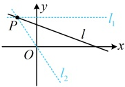
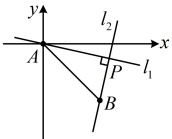

【变式 1】直线  $ l:(m+1)x+my+2-m=0 $ 经过平面直角坐标系的第一、第二与第四象限，则实数  $ m $ 的取值范围是___。

解析：观察发现直线 l 含有参数 m，为了分析直线 l 的运动过程，可尝试先看看 l 是否过定点，

直线 $l$ 的方程可化为 $m(x+y-1)+(x+2)=0$，令 $\begin{cases}x+y-1=0\\x+2=0\end{cases}$ 可得 $x=-2$，$y=3$，所以 $l$ 过定点 $P(-2,3)$，直线过定点，则其运动方式为绕定点旋转，故可由此画图分析，寻找

如图，当且仅当 $l$ 在 $l_1$ 和 $l_2$ 之间（不含 $l_1$，$l_2$）绕点 $P$ 旋转时，$l$ 过第一、二、四象限，只要找到直线 $l$ 斜率的变化范围，该斜率又能用 $m$ 表示，就能建立不等式 $m$ 的范围，直线 $l_1$ 的斜率为 0，直线 $l_2$ 过 $P$ 和原点 $O$，其斜率为 $\frac{3-0}{-2-0} = -\frac{3}{2}$，

直线 l 旋转过程中，不经过竖直线，所以其斜率的变化范围是  $ \left(-\frac{3}{2}, 0\right) $，

直线 $l$ 的方程可化为 $y = -\frac{m+1}{m}x + \frac{m-2}{m}$，其斜率为 $-\frac{m+1}{m}$，所以 $-\frac{3}{2} < -\frac{m+1}{m} < 0$，故 $0 < \frac{m+1}{m} < \frac{3}{2}$，由 $\frac{m+1}{m} > 0$ 可得 $m(m+1) > 0$，解得：$m < -1$ 或 $m > 0$ ①，

由 $\frac{m+1}{m} < \frac{3}{2}$ 得 $\frac{3}{2} - \frac{m+1}{m} = \frac{m-2}{2m} > 0$，所以 $2m(m-2) > 0$，解得：$m < 0$ 或 $m > 2$，

结合①得 $m < -1$ 或 $m > 2$，所以实数 $m$ 的取值范围是 $(-\infty, -1) \cup (2, +\infty)$。

答案： $ (-\infty,-1)\cup(2,+\infty) $

【变式 2】（多选）已知过定点  $ A $ 的直线  $ l_1: mx + y = 0 $ 与过定点  $ B $ 的直线  $ l_2: x - my - 2m - 2 = 0 $ 相交于点  $ P(x_0, y_0) $，则下列选项正确的是（ ）

A.  $ A(0,0) $          B.  $ B(2,2) $          C.  $ l_1 \perp l_2 $          D.  $ \left|PA\right| \cdot \left|PB\right| \leq 4 $

解析：A 项，将 $ (0,0) $代入 $ l_1 $的方程得 $ m\times0+0=0 $，成立，所以直线 $ l_1 $过的定点是 $ A(0,0) $，故 A 项正确；

B 项， $ l_2 $的方程可化为 $ (x-2)-m(y+2)=0 $，令 $ \begin{cases}x-2=0\\y+2=0\end{cases} $得 $ \begin{cases}x=2\\y=-2\end{cases} $，所以 $ l_2 $过定点 $ B(2,-2) $，故 B 项错误；

C 项，判断两直线是否垂直，就看 $ k_1k_2=-1 $是否成立，但需单独考虑其中一条直线斜率不存在的情况，

当 $ m=0 $时， $ l_1:y=0 $， $ l_2:x=2 $，满足 $ l_1\perp l_2 $；当 $ m\neq0 $时， $ l_1 $的方程可化为 $ y=-mx $，所以 $ k_1=-m $，

 $ l_2 $的方程可化为 $ y=\frac{1}{m}x-\frac{2m+2}{m} $，所以 $ k_2=\frac{1}{m} $，从而 $ k_1k_2=-m\cdot\frac{1}{m}=-1 $，故 $ l_1\perp l_2 $；

综上所述， $ l=l $总成立，故 C 项正确。

综上所述， $ l_{1}\perp l_{2} $ 总成立，故 C 项正确；

D 项，如图，已有  $ PA \perp PB $，结论叉涉及  $ |PA| $ 和  $ |PB| $，想到勾股定理，

由 C 项的分析可知  $ I_1 \perp I_2 $，所以  $ PA \perp PB $，故  $ \left|PA\right|^2 + \left|PB\right|^2 = \left|AB\right|^2 $ ①，

又  $ \left|AB\right| = \left|\overline{AB}\right| = \sqrt{2^2 + (-2)^2} = 2\sqrt{2} $，所以代入①得  $ \left|PA\right|^2 + \left|PB\right|^2 = 8 $，

从而  $ \left|PA\right| \cdot \left|PB\right| \leq \frac{\left|PA\right|^2 + \left|PB\right|^2}{2} = 4 $，取等条件是  $ \left|PA\right| = \left|PB\right| = 2 $，故 D 项正确

答案：ACD