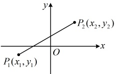
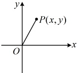
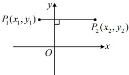
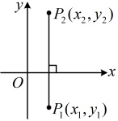

# 2.3 直线的交点坐标与距离公式

习题：P1

## 知识梳理

## 知识点 1：两条直线的交点坐标

### 1. 两条直线的交点

已知两条相交直线 $ l_1 $， $ l_2 $的交点为 $ P $，则 $ P $既在直线 $ l_1 $上，也在直线 $ l_2 $上，所以点 $ P $的坐标既满足直线 $ l_1 $的方程，也满足直线 $ l_2 $的方程，即点 $ P $的坐标是联立两直线的方程所得方程组的解。

### 2. 方程组解的数量与两条直线的位置关系

<table border=1 style='margin: auto; word-wrap: break-word;'><tr><td style='text-align: center; word-wrap: break-word;'>联立两直线方程所得方程组解的组数</td><td style='text-align: center; word-wrap: break-word;'>唯一解</td><td style='text-align: center; word-wrap: break-word;'>无数解</td><td style='text-align: center; word-wrap: break-word;'>无解</td></tr><tr><td style='text-align: center; word-wrap: break-word;'>两直线的公共点个数</td><td style='text-align: center; word-wrap: break-word;'>一个</td><td style='text-align: center; word-wrap: break-word;'>无数个</td><td style='text-align: center; word-wrap: break-word;'>零个</td></tr><tr><td style='text-align: center; word-wrap: break-word;'>两直线的位置关系</td><td style='text-align: center; word-wrap: break-word;'>相交</td><td style='text-align: center; word-wrap: break-word;'>重合</td><td style='text-align: center; word-wrap: break-word;'>平行</td></tr></table>

## 知识点2：平面两点间的距离

如图1， $ P_{1}(x_{1},y_{1}) $， $ P_{2}(x_{2},y_{2}) $两点间的距离公式 $ \left|P_{1}P_{2}\right|=\sqrt{(x_{2}-x_{1})^{2}+(y_{2}-y_{1})^{2}} $。

如图2，由该公式可知，原点 $ O(0,0) $与任意一点 $ P(x,y) $

之间的距离 $ \left|OP\right|=\sqrt{x^{2}+y^{2}} $

图1

图2

如图3，当 $ P_1P_2 \perp y $轴时， $ \left|P_1P_2\right| = \left|x_2 - x_1\right| $。

如图4，当 $ P_1P_2 \perp x $轴时， $ \left|P_1P_2\right| = \left|y_2 - y_1\right| $。

图3

图4

## 知识点1

(1)  $ l_{1}: 2x - y = 7 $,  $ l_{2}: 3x + 2y - 7 = 0 $;

(2)  $ l_{1}: x - 3y + 2 = 0 $,  $ l_{2}: y = \frac{1}{3}x + \frac{2}{3} $;

(3)  $ l_{1}: 4x + 2y + 4 = 0 $,  $ l_{2}: y = -2x + 3 $.

【例 1】分别判断下列直线的位置关系，若相交，求出它们的交点；若不相交，说明它们的位置关系.

解：（1）（判断两直线的位置关系，可联立

两直线的方程，根据解的个数得出结论）

联立 $ \begin{cases}2x-y=7\\3x+2y-7=0\end{cases} $解得： $ \begin{cases}x=3\\y=-1\end{cases} $，

所以直线 $ l_{1} $与 $ l_{2} $相交，交点坐标为(3,-1).

（2）直线 $ l_{2} $的方程可化为 $ x-3y+2=0 $，

所以直线 $ l_{1} $与 $ l_{2} $重合.

（3）联立 $ \begin{cases}4x+2y+4=0\textcircled{1}\\y=-2x+3\textcircled{2}\end{cases} $，

将②代入①可得 $ 4x+2(-2x+3)+4=0 $，

整理得：10=0，所以原方程组无解，

故直线 $ l_{1} $与 $ l_{2} $平行.

【例2】过直线 $ l_{1}:x+y+1=0 $与 $ l_{2}:2x-y-4=0 $的交点，且一个方向向量为 $ \boldsymbol{v}=(-1,3) $的直线 $ l $的方程为（ ）

A.  $ 3x+y-1=0 $ B.  $ x+3y-5=0 $

C.  $ 3x+y-3=0 $ D.  $ x+3y+5=0 $

解析：联立 $ \begin{cases}x+y+1=0\\2x-y-4=0\end{cases} $解得： $ \begin{cases}x=1\\y=-2\end{cases} $，

所以 $ l_{1} $与 $ l_{2} $的交点为 $ P(1,-2) $，

由 l 的一个方向向量为  $ \boldsymbol{v}=(-1,3) $ 得 l 的斜率

 $ k=\frac{3}{-1}=-3 $，所以直线 l 的方程为  $ y-(-2)=-3(x-1) $，整理得： $ 3x+y-1=0 $。

答案：A