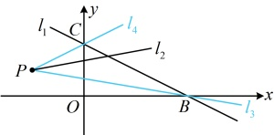

第一步：建立适当的平面直角坐标系，用坐标和方程表示问题中的几何要素，把平面几何问题转化为代数问题；

第二步：通过代数运算，解决代数问题：

第三步：把代数运算的结果“翻译”成几何结论.

（2）两直线方程 x，y 对应的系数不一致，

应先调整为一致，再代公式，

直线 $ l_{1} $的方程可化为6x-8y-4=0，

所以 $ l_{1} $与 $ l_{2} $的距离 $ d=\frac{\left|-4-1\right|}{\sqrt{6^{2}+(-8)^{2}}}=\frac{1}{2} $.

答案：（1） $ \frac{9}{5} $；（2） $ \frac{1}{2} $

## 本节核心题型

本节的核心知识点有求直线的交点坐标、两点间的距离公式、点到直线的距离公式、两条平行线间的距离公式，下面我们针对这几个知识点，分别设计了一组题，其目的是帮助大家巩固对知识的理解、公式的记忆和应用。请大家跟着例题、变式和反思去学习吧。

## 类型 I：直线的交点问题、过两直线交点的直线系方程的应用

【例 6】若直线  $ l_{1}: x + 2y - 4 = 0 $ 与直线  $ l_{2}: kx - y + 2k + 1 = 0 $ 的交点位于第一象限，则实数  $ k $ 的取值范围是（ ）

A.  $ \left(-\frac{1}{6}, \frac{1}{2}\right) $  B.  $ \left(-\frac{1}{2}, \frac{1}{6}\right) $  C.  $ \left(-\infty, -\frac{1}{2}\right) \cup \left(\frac{1}{2}, +\infty\right) $  D.  $ \left(-\infty, -\frac{1}{2}\right) \cup \left(-\frac{1}{6}, +\infty\right) $

解法1：题干给出两直线的交点在第一象限，故可考虑先由两条直线的方程求出它们的交点坐标

联立 $ \begin{cases}x+2y-4=0\①\\kx-y+2k+1=0\②\end{cases} $，由①得x=4-2y，代入②得 $ k(4-2y)-y+2k+1=0 $，

整理得： $ -(2k+1)y+6k+1=0 $，解得： $ y=\frac{6k+1}{2k+1} $，所以 $ x=4-2y=4-2\cdot\frac{6k+1}{2k+1}=\frac{2-4k}{2k+1} $，

故 $ l_1 $与 $ l_2 $的交点为 $ A\left(\frac{2-4k}{2k+1},\frac{6k+1}{2k+1}\right) $，由题意，A在第一象限，所以 $ \begin{cases}\frac{2-4k}{2k+1}>0\③\\\frac{6k+1}{2k+1}>0\④\end{cases} $，

由③得 $ (2-4k)(2k+1)>0 $，所以 $ (4k-2)(2k+1)<0 $，解得： $ -\frac{1}{2}<k<\frac{1}{2} $ ⑤，

由④得 $ (6k+1)(2k+1)>0 $，解得： $ k<-\frac{1}{2} $或 $ k>-\frac{1}{6} $，结合⑤得 $ -\frac{1}{6}<k<\frac{1}{2} $。

解法2：观察及现 $ l_2 $过定点，图形特征比较清晰，故也可考虑画图分析

寻找它与 $ l_1 $的交点在第一象限的临界状态，

直线 $ l_2 $的方程可化为 $ k(x+2)-(y-1)=0 $，令 $ \begin{cases}x+2=0\\y-1=0\end{cases} $得 $ \begin{cases}x=-2\\y=1\end{cases} $，

所以 $ l_2 $所过的定点为 $ P(-2,1) $，如图，要使 $ l_1 $与 $ l_2 $的交点在第一象限，

则 $ l_2 $绕点 $ P $从 $ l_3 $逆时针旋转至 $ l_4 $（不包括 $ l_3 $和 $ l_4 $），

由图可知， $ l_3 $， $ l_4 $分别过直线 $ l_1 $与x轴、y轴的交点 $ B $， $ C $，故接下来先求 $ B $， $ C $的坐标，

在 $ x+2y-4=0 $中令 $ y=0 $得x=4，所以 $ B(4,0) $，在 $ x+2y-4=0 $中令x=0得y=2，所以 $ C(0,2) $，

