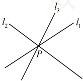
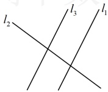
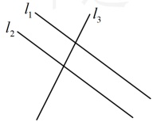

故直线 $ l_{3} $的斜率为 $ \frac{0-1}{4-(-2)}=-\frac{1}{6} $，直线 $ l_{4} $的斜率为 $ \frac{2-1}{0-(-2)}=\frac{1}{2} $，当 $ l_{2} $从 $ l_{3} $逆时针旋转至 $ l_{4} $时，其斜率k的变化范围是 $ \left(-\frac{1}{6},\frac{1}{2}\right) $.

答案：A

【反思】求两条直线的交点坐标是解析几何中的一个常用的操作，后面会反复用到，其方法是直接联立两直线的方程，解方程组即可. 本题涉及的是两条直线，问题的情境较简单，我们来看两个更复杂一点的变式.

【变式1】已知三条直线  $ mx + 2y - 8 = 0 $， $ 2x - y - 10 = 0 $， $ x + y - 2 = 0 $ 相交于一点，则  $ m =  $___。

【变式 1】已知三条直线  $ mx + 2y - 8 = 0 $， $ 2x - y - 10 = 0 $， $ x + y - 2 = 0 $ 相交于一点，则  $ m = $ ___.

解析：观察发现后两条直线不含参，它们的交点是确定的，故可先联立这两条直线的方程求出交点，再代入另一直线方程，联立  $ \begin{cases} 2x - y - 10 = 0 \\ x + y - 2 = 0 \end{cases} $ 解得： $ \begin{cases} x = 4 \\ y = -2 \end{cases} $，所以这两条直线的交点是  $ (4, -2) $，

由题意，该点也在  $ mx + 2y - 8 = 0 $ 上，所以  $ m \cdot 4 + 2 \times (-2) - 8 = 0 $，解得： $ m = 3 $。

答案：3

【变式2】（多选）若三条直线 $ l_{1}:ax+2y+8=0 $， $ l_{2}:4x+3y=10 $， $ l_{3}:2x-y=10 $不能构成三角形，则a的值为（）

A. -4 B. -1 C.  $ \frac{4}{2} $ D.  $ \frac{8}{2} $

解析：观察发现 $ l_{2} $与 $ l_{3} $不平行，故可想象，三条直线不能构成三角形，有两种情况：三条直线交于一点（如图1），或其中两条直线平行（如图2或图3），下面分别考虑，

图1

图2

图3

若为图1，联立 $ \begin{cases}4x+3y=10\\2x-y=10\end{cases} $解得： $ \begin{cases}x=4\\y=-2\end{cases} $，所以 $ l_2 $与 $ l_3 $的交点为 $ P(4,-2) $，

代入 $ l_{1} $的方程得 $ a\cdot4+2\times(-2)+8=0 $，解得：a=-1；

若为图2，则 $ l_{1}\parallel l_{3} $， $ l_{1} $的方程可化为 $ y=-\frac{a}{2}x-4 $， $ l_{3} $的方程可化为y=2x-10，

因为 $ l_{1} \parallel l_{3} $，所以它们斜率相等，即 $ -\frac{a}{2}=2 $，解得：a=-4；

若为图3，则 $ l_{1} \parallel l_{2} $， $ l_{2} $的方程可化为 $ y = -\frac{4}{3}x + \frac{10}{3} $，所以 $ l_{2} $的斜率为 $ -\frac{4}{3} $，从而 $ -\frac{a}{2} = -\frac{4}{3} $，故 $ a = \frac{8}{3} $；综上所述，a的值为-1，-4或 $ \frac{8}{3} $。

答案：ABD

【例 7】过直线  $ l_1: x + y + 1 = 0 $ 和  $ l_2: x - 2y + 7 = 0 $ 的交点，且与直线  $ l_3: x + 2y - 3 = 0 $ 垂直的直线  $ l $ 的方程是（ ）